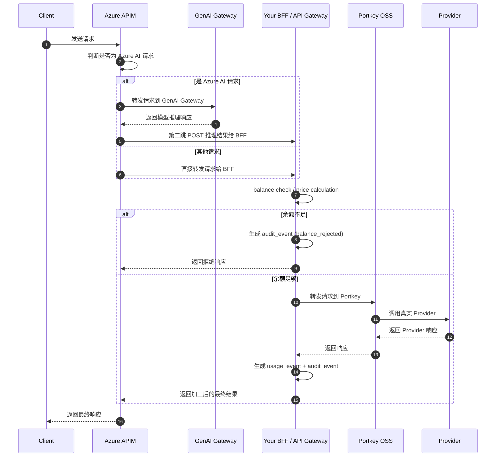

# Azure GenAI Gateway 支持的多Provider/Model

是指：**它有一套“可接入外部模型提供商的插件体系（model connector / backend connector）”。**

比如：

- OpenAI（global）
- Azure OpenAI
- Cohere
- Anthropic
- Mistral
- HuggingFace
- 一些 SaaS AI 服务
- 某些兼容 OpenAI API 的 LLM provider

**它支持“多模型接入”，但不是“多供应商智能路由”**

| 能力                                  | Azure GenAI Gateway  | Portkey Gateway/ 现有方案 |
| ------------------------------------- | -------------------- | ------------------------- |
| 根据 customer tier 改变 provider      | ❌ 不支持             | ✔ 支持                    |
| 实时根据价格/折扣路由                 | ❌ 不支持             | ✔ 支持                    |
| token-based cost-aware routing        | ❌ 不支持             | ✔ 支持                    |
| fallback 基于模型失败自动换 provider  | ⚠️ 有限支持           | ✔ 强支持                  |
| OpenAI-like 调用兼容（multi-backend） | ⚠️ 支持一些，但有限制 | ✔ 完全支持                |
| 动态注入 x-portkey-config             | ❌ 无法做到           | ✔ 已经做了                |
| 热更新 price matrix、动态策略         | ❌ 完全不支持         | ✔ 支持（Redis+pg_notify） |
| 实时余额判断/扣费                     | ❌ 无                 | ✔ 核心能力                |

➡️ **Azure 的 aggregation 不具备“业务动态路由”，只能做静态绑定 / 基于简单条件的切换。**

Azure 不能帮你管理这些 Provider 的成本、折扣、计费

Azure GenAI Gateway：

- **不感知价格矩阵**
- **不感知平台与 provider 的折扣**
- **不感知 token usage（除 Azure 自己的）**
- **不会把 provider 的 token 用量转成成本**
- **不会按业务规则做 Reject（余额不足）**

# 🔹 Azure APIM / GenAI Gateway 计费特点

1. **APIM 本身的计费**
   - 按 **请求数（request count）** 或 **带宽/流量** 计费
   - 不按 LLM token 使用量计费
   - 配额（quota）/限流（rate-limit）都是基于调用次数或时间窗口，不是 token 消耗
2. **Azure GenAI Gateway / Azure OpenAI 模型调用**
   - Azure OpenAI 自家模型有 token-based 计费，但 **只对 Azure 自家模型**
   - 对外部插件 / Connector（例如 Cohere、Together、DeepSeek 等），GAG 不会统一提供 token usage，也不做 token × price_per_token 的计算
   - **没有统一、可计费的 usage metric** 来直接替代现有的 BFF 计费逻辑
3. **总结**
   - APIM + GAG **无法替代实时 token × cost 的扣费逻辑**
   - 只能提供：
     - 请求转发
     - 统一 Key / Subscription / 产品管理
     - 简单配额 / 限流

------

✅ 换句话说：即使所有请求都通过 Azure，**我们的实时扣费、余额判断、usage_log 仍必须在 BFF / API Gateway 层处理**，因为 Azure 提供的计费信息不是我们业务需要的 token-based granular usage。

# **Azure GenAI Gateway 并不能替代 BFF / Gateway，原因：**

我们必须做：

### **✔ 实时余额判断（Redis）**

Azure 无法连接我们的Redis，并做这样的 Reject。

### **✔ 动态读取 customer_type 的 price-tier**

Azure 不认识我们的 customer_type，也没法查数据库。

### **✔ token \* price_per_token 计算**

Azure 不算这个。

### ✔ **usage_log 异步写入数据库**

Azure 不能做

### ✔ **多 Provider 强业务策略路由**

Azure 只会简单 if-else，不会执行我们的策略树。

Azure 能做：

- 快速接入 Azure 自己的模型（Azure OpenAI、Phi family）
- 稍微简化统一 API 结构
- 提供 fallback / load balancing（模型层级的）

而不是：

- **一个带计费的 AI Aggregation**
- **一个 Multi-provider 智能调度平台**
- **一个 LLM-router**

| 能力 / 平台                        | Azure GenAI Gateway                                    | Portkey Gateway (OSS)                         | 自建 Gateway/BFF                       |
| ---------------------------------- | ------------------------------------------------------ | --------------------------------------------- | -------------------------------------- |
| **多 Provider 聚合**               | ✔ 支持几十~上百 Provider 插件，但多为 static connector | ✔ 强，原生支持 OpenAI 生态兼容的所有 Provider | ✔ 最强，完全按业务需求定制             |
| **智能路由（fallback、动态切换）** | ⚠️ 一般：静态策略，可做 retry/fallback                  | ✔ 强：真实 Provider-aware routing             | ✔ 最强：可按折扣、余额、成本做动态路由 |
| **Token usage 计量**               | ⚠️ 部分：仅对 Azure 自家模型有深度 usage                | ✔ 完整（OpenAI 兼容）                         | ✔ 自己定义，最灵活                     |
| **Token 成本计算**                 | ❌ 不支持                                               | ❌ 不支持（但返回 usage）                      | ✔ 核心逻辑：price matrix × usage       |
| **与客户套餐/折扣绑定**            | ❌ 不支持                                               | ❌ 不支持                                      | ✔ 强，业务独有能力                     |
| **实时余额判断 + 拒绝请求**        | ❌ 不支持                                               | ❌ 不支持                                      | ✔ Redis 实时扣费（核心竞争力）         |
| **usage_log 落库**                 | ❌ 无这种能力                                           | ❌ 无                                          | ✔ 完整（已有）                         |
| **可运营性（Products/Keys）**      | ✔ 很强（APIM 订阅）                                    | ❌ 无                                          | ✔ 自己定义，也可部分迁移至 APIM        |
| **维护成本**                       | ✔ 很低                                                 | ⚠️ 中等                                        | ⚠️ 高（但换来灵活）                     |

Azure = 标准化 + 安全合规；Portkey = 技术灵活；自建 = 商业价值核心

# 技术角度对比

## 多 Provider Aggregation

### Azure GenAI Gateway

- 支持上百家Provider
   但多通过 **connector**（相当于是一个可选插件）
- 但 **路由是静态的**
   例如：

```
if request.model == "cohere" → call cohere backend
if request.model == "gpt" → call OpenAI backend
```

👉 不能做 **“按价格/折扣动态选 Provider”**

------

## ② Routing / Fallback

### Azure

能力类似：

```
<Try>
    <SendRequest backend="deepseek" />
</Try>
<Catch>
    <SendRequest backend="openai" />
</Catch>
```

但不能写：

- 如果用户余额 > xxx 才走某模型
- 如果某 provider 变贵，自动切换.  
  - **只在模型层级**：也就是同一个 Provider 的不同实例
  - **不做跨 Provider 路由**，不能基于价格 /折扣 / customer_type 切换

- 如果 customer_type 为 enterprise 则优先 azure-openai

这些需要 **自建的 Gateway 实现**。

------

## ③ Token usage

Azure：

- 对 Azure 自家的模型（AOAI、Phi）能给你 usage metadata
- **但对外部 Provider 通常没有统一格式，无法保证可计费性**

Portkey：

- 返回 OpenAI 格式 usage（tokens）

我们：

- 使用 usage × price matrix → **成本计算**

Azure **无法对外部 provider 做计费逻辑**。

## Token-based Cost Routing

### Azure

❌ 不支持
 没有这种 API。

### Portkey

⚠️ 不支持（但提供 usage）

### 我们

✔ 已经实现，属于平台的核心价值。

------

## ⑤ 实时扣费 / 拒绝请求

Azure：
 ❌ 无能力读 Redis
 ❌ 无 per-request 动态拒绝
 只能：

- 限流（rate-limit）
- 配额（quota，粗颗粒度）

而我们：

✔ Redis 实时余额判断（毫秒级）
 ✔ 缺钱直接拒单
 ✔ usage_log 事后入库

这是 **Billing 平台** 的核心。

------

## ⑥ Key / Subscription 管理（Azure 的优势）

Azure APIM：
 ✔ 管用户/租户的 API Key
 ✔ 能关联产品/套餐
 ✔ 能自动禁用 Key
 ✔ 能强制配额
 ⚠️ 可以选择“外包给 APIM”，不用自己做 Key 管理。

# 一种可行的混合方案调用时序图



迁入Azure其他需要补齐的要点: (企业客户)

* (A) SSO / SAML / OAuth / Entra ID 集成
* SCIM = 用户和组的自动同步标准, 配合 SSO 使用，可以让企业客户快速接入，不需要人工建账号
