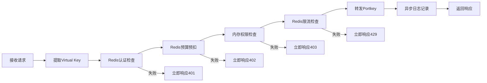

# Neuropia API Gateway 架构设计规范

## 1. 设计原则

### 1.1 性能优先原则
- **同步操作必须亚毫秒级**：所有请求路径上的操作必须在 1ms 内完成
- **零数据库同步操作**：请求处理过程中禁止直接访问数据库
- **内存和 Redis 优先**：所有实时检查必须使用内存或 Redis 原子操作

### 1.2 职责单一原则
- **只做必要控制**：API Gateway 只处理认证、鉴权、限流、计费四个核心功能
- **业务逻辑外移**：所有业务规则通过配置传递，不硬编码在网关中
- **数据采集最小化**：只记录最基础的必要数据，派生数据异步计算

### 1.3 故障安全原则
- **降级优于阻塞**：在控制组件故障时自动降级而非阻塞请求
- **异步优于同步**：非关键路径全部异步化
- **监控全覆盖**：所有关键操作必须有监控和告警

## 2. 核心控制规范

### 2.1 认证控制
```javascript
// ✅ 允许的操作
- Redis GET virtual_key:${key} → 用户信息
- 内存缓存用户状态（TTL 5分钟）

// ❌ 禁止的操作  
- 数据库查询用户信息
- 复杂的权限计算
```

### 2.2 预算控制
```javascript
// ✅ 允许的操作
- Redis DECRBY user_balance:${uid} ${estimated_cost}
- Redis INCRBY user_balance:${uid} ${refund_amount}  // 预扣退款

// ❌ 禁止的操作
- 数据库事务扣款
- 复杂的余额计算逻辑
```

### 2.3 权限控制  
```javascript
// ✅ 允许的操作
- 内存 Map 查找：allowed_models[user_tier][request_model]
- Redis HGET user_features:${uid} ${feature}

// ❌ 禁止的操作
- 数据库联表查询权限
- 动态权限计算
```

### 2.4 限流控制
```javascript
// ✅ 允许的操作
- Redis INCR rate_limit:${uid}:${window}
- Redis EXPIRE 自动清理
- Redis LUA 脚本原子操作

// ❌ 禁止的操作
- 数据库计数限流
- 复杂的时间窗口计算
```

## 3. 数据流规范

### 3.1 请求处理流水线


### 3.2 性能指标要求
| 操作             | 最大耗时 | 实现方式              |
| ---------------- | -------- | --------------------- |
| Virtual Key 验证 | ≤ 0.5ms  | Redis GET + 内存缓存  |
| 预算预扣         | ≤ 0.3ms  | Redis DECRBY 原子操作 |
| 模型权限检查     | ≤ 0.1ms  | 内存 Map 查找         |
| 限流检查         | ≤ 0.5ms  | Redis INCR + EXPIRE   |
| 总同步处理时间   | ≤ 2ms    | 以上操作总和          |

## 4. 配置管理规范

### 4.1 Metadata 配置结构
```json
{
  "metadata": {
    "_neuropia": {
      // 同步控制配置（必须高性能）
      "sync_controls": {
        "budget": {
          "balance": 100.0,
          "currency": "USD",
          "min_balance": 0.1
        },
        "model_access": {
          "allowed_models": ["gpt-4", "claude-3-sonnet"],
          "blocked_models": []
        },
        "rate_limits": {
          "max_concurrent": 5,
          "cost_per_minute": 10.0
        }
      },
      
      // 异步跟踪配置
      "async_tracking": {
        "enable_usage_tracking": true,
        "enable_cost_calculation": true,
        "batch_size": 100
      }
    }
  }
}
```

### 4.2 配置继承规则
- **系统默认配置** → **租户配置** → **用户配置** → **Virtual Key 配置**
- 每层只能覆盖特定字段，不能删除父级配置
- 配置变更通过 Redis Pub/Sub 实时生效

## 5. 异步处理规范

### 5.1 异步任务队列
```javascript
// 必须异步化的操作
const asyncTasks = [
  'precise_billing_calculation',    // 精确计费
  'token_counting',                 // Token 统计
  'usage_analytics',                // 使用量分析
  'cost_breakdown',                 // 成本分解
  'audit_logging'                   // 审计日志
];

// 异步处理要求
- 使用消息队列（Redis Streams/RabbitMQ）
- 允许数据最终一致性
- 必须有重试和死信队列机制
```

### 5.2 批量处理优化
```javascript
// 批量写入数据库
class BatchProcessor {
  constructor() {
    this.batch = [];
    this.batchSize = 100;
    this.flushInterval = 5000; // 5秒
  }
  
  // 批量记录使用量
  async trackUsage(usageData) {
    this.batch.push(usageData);
    if (this.batch.length >= this.batchSize) {
      await this.flush();
    }
  }
}
```

## 6. 监控和告警规范

### 6.1 关键监控指标
```yaml
# 性能指标
api_gateway_request_duration_ms: 
  - p50 < 10ms
  - p95 < 50ms  
  - p99 < 100ms

# 业务指标
user_balance_check_failure_rate: < 0.1%
model_permission_check_duration: < 1ms
rate_limit_rejection_rate: < 5%

# 系统指标
redis_connection_pool_usage: < 80%
nodejs_memory_usage: < 70%
async_queue_backlog: < 1000
```

### 6.2 告警规则
```yaml
critical:
  - api_gateway_5xx_error_rate > 1%
  - redis_connection_timeout > 10s
  - average_response_time > 100ms

warning:
  - user_balance_low < 10.0
  - rate_limit_rejection_rate > 10%
  - async_queue_delay > 30s
```

## 7. 代码实现约束

### 7.1 禁止的模式
```javascript
// ❌ 禁止的代码模式

// 1. 同步数据库操作
const user = await db.users.findByPk(userId);

// 2. 复杂计算在请求路径上
const cost = calculatePreciseCost(tokens, model, provider);

// 3. 阻塞操作
const result = heavyComputation(requestBody);

// 4. 未缓存的外部调用
const config = await http.get('http://config-service/config');
```

### 7.2 要求的模式
```javascript
// ✅ 要求的代码模式

// 1. Redis 原子操作
const balance = await redis.decrBy(`balance:${userId}`, estimatedCost);

// 2. 内存缓存查找
const allowed = modelWhitelistCache.get(userTier)?.includes(requestModel);

// 3. 异步非阻塞
queue.push({ type: 'usage_track', data: usageData });

// 4. 快速失败
if (!virtualKey) {
  throw new AuthenticationError('Invalid virtual key');
}
```

## 8. 部署和运维约束

### 8.1 资源要求
- **Redis 集群**：必须部署，用于所有实时操作
- **内存配置**：Node.js 堆内存 ≥ 2GB，用于缓存
- **连接池**：Redis 连接池 ≥ 100 连接
- **监控**：必须集成 Prometheus + Grafana

### 8.2 扩缩容策略
- **水平扩展**：无状态设计，支持多实例部署
- **垂直扩展**：根据 QPS 调整实例规格
- **缓存预热**：启动时预加载常用配置到内存

---

**文档版本**: 1.0  
**生效日期**: 2024-01-16  
**适用范围**: Neuropia API Gateway 所有版本

此文档作为 API Gateway 代码开发和优化的强制性规范，所有违反此规范的代码都不允许合并到主干。