## 📋 Neuropia AI 平台 MVP 设计文档

```markdown
# Neuropia AI 平台 - MVP 设计文档

## 🎯 核心业务模型
**AI 服务批发商模式**：
```
平台 API Keys (批发价) → Neuropia平台 (加价) → 客户 Virtual Keys (零售价)
```

## 🏗️ 系统架构

### 服务组件

```mermaid
graph TB
    C[客户端] --> G[API Gateway:3001]
    G --> CS[Config Service:3002]
    G --> P[Portkey Gateway:8787]
    CS --> R[Redis]
    CS --> PG[PostgreSQL+PostgREST:3000]
    P --> A[AI Providers]
```


### 数据流
1. **客户端** → `x-virtual-key` → **API Gateway**
2. **API Gateway** → 验证 → **Config Service** (获取配置)
3. **Config Service** → 生成 → **Portkey 配置**
4. **API Gateway** → 转发 → **Portkey Gateway** 
5. **Portkey Gateway** → 调用 → **AI 提供商**
6. **API Gateway** → 记录 → **使用量和计费**

## 🗄️ 核心数据库设计

### 关键表结构
```sql
-- 用户认证
auth.login (id, email, hashed_password, role)

-- 用户资料  
data.user_profile (user_id, username, tenant_id, status, balance)

-- 虚拟密钥
data.virtual_key (virtual_key, user_id, rate_limits, allowed_models, is_active)

-- 提供商费率
data.provider_rate (provider, model, input_rate, output_rate, currency)

-- Portkey 配置
data.portkey_configs (config_json, user_id, is_active)

-- 使用记录
data.usage_log (user_id, provider, model, tokens, cost)
```

## 🔐 认证与授权

### 三级权限体系
1. **平台认证** - JWT Token (`Authorization: Bearer <token>`)
2. **Virtual Key** - 客户标识 (`x-virtual-key: vk_xxx`)
3. **模型权限** - 基于 Virtual Key 的模型白名单

## 💰 计费系统

### 成本计算
```javascript
// 平台成本
platformCost = inputTokens * inputRate + outputTokens * outputRate

// 客户收费  
customerCharge = platformCost * (1 + markupPercent)

// 实时扣费
await deductBalance(userId, customerCharge)
```

### 状态管理
```
pending → (充值) → active → (余额≤0) → overdue → (充值≥阈值) → active
```

## 🔧 核心技术栈

### 后端服务
- **Node.js + Express** - 两个核心服务
- **PostgreSQL** - 主数据库
- **PostgREST** - 自动 REST API
- **Redis** - 配置缓存和会话

### AI 集成
- **Portkey Gateway** - AI 路由和聚合
- **阿里云百炼** - 主要 AI 提供商
- **OpenAI/Anthropic** - 备用提供商

## 🚀 MVP 核心功能

### 已实现功能
- [x] 用户注册和认证系统
- [x] Virtual Key 管理和验证
- [x] 动态 Portkey 配置生成
- [x] 阿里云百炼集成
- [x] 使用量追踪和计费
- [x] 多租户隔离
- [x] 速率限制

### 服务端点
```
POST /api/chat/completions      # AI 聊天（需 Virtual Key）
GET  /api/config/virtual-keys/:key  # 配置查询
POST /api/users/:userId/virtual-keys  # 密钥管理
GET  /health                   # 健康检查
```

## ⚙️ 配置管理

### Config Service 职责
- 生成 Portkey 配置 (`x-portkey-config`)
- 管理模型到提供商的映射
- 缓存热点数据到 Redis
- 监听数据库配置变更

### 动态配置示例
```json
{
  "strategy": {"mode": "fallback"},
  "targets": [{
    "provider": "dashscope",
    "virtual_key": "vk_client_123",
    "api_key": "平台密钥",
    "override_params": {"model": "qwen-turbo"}
  }],
  "metadata": {
    "user_id": "user_123",
    "virtual_key": "vk_client_123"
  }
}
```

## 🔄 关键业务流程

### 1. 用户注册流程
```
注册 → 充值 → 激活 → 创建 Virtual Key → 开始使用
```

### 2. AI 调用流程
```
验证 Virtual Key → 检查余额 → 生成配置 → 
调用 Portkey → 记录使用量 → 扣费 → 返回结果
```

### 3. 配置更新流程
```
数据库变更 → PG 通知 → Config Service → 
更新 Redis → 新请求使用新配置
```

## 📊 数据模型关系

```
用户 (1) ←→ (多) Virtual Keys
用户 (1) ←→ (1) 余额
Virtual Key (多) ←→ (多) 允许的模型
使用记录 (多) → (1) 用户
```

## 🎯 下一步重点

### 高优先级
1. 完整的端到端测试
2. 阿里云百炼 API 集成验证
3. 计费系统准确性测试
4. 错误处理和重试机制

### 中优先级  
1. 监控和日志系统
2. 管理后台功能
3. 更多 AI 提供商集成
4. 性能优化

## 💡 重要设计决策

1. **配置与业务分离** - Config Service 独立存在
2. **Virtual Key 作为业务标识** - 不暴露平台 API Keys
3. **实时计费** - 每次调用立即扣费
4. **负余额允许** - 用户体验优先，但限制后续调用
5. **数据库为中心** - 所有配置持久化，Redis 作为缓存

# portkey gateway 参考信息

https://github.com/Portkey-AI/gateway

https://deepwiki.com/Portkey-AI/gateway
