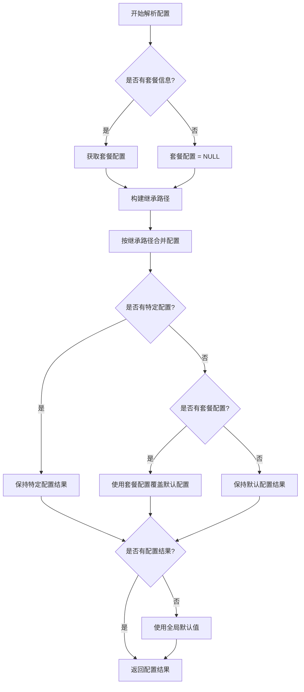

# portkey gateway 配置说明
Portkey Gateway（开源版）对 schema 有明确的要求和规则，主要涉及两个方面：一是 `x-portkey-config` header 中的 JSON 配置 schema（使用 Zod 进行验证），二是 `jsonSchema` 插件用于输出验证的 JSON Schema（基于标准 JSON Schema 规范）。这些规则确保配置的安全性、一致性和有效性。下面我基于文档详细说明，包括要求、规则、示例和潜在约束。

### 1. `x-portkey-config` 的 Schema 要求
这是 Portkey Gateway 的核心配置，通过 HTTP header 传递一个 JSON 字符串。Gateway 在请求处理管道的验证阶段使用 **Zod**（一个 TypeScript 类型安全的 schema 验证库）来解析和验证这个 JSON（具体在 `src/middlewares/requestValidator.ts` 中定义的 `configSchema`）。如果不符合 schema，请求会失败（通常返回错误响应）。

#### 主要规则和要求：
- **整体结构**：必须是一个有效的 JSON 对象，支持递归嵌套（例如 `targets` 可以嵌套策略）。
- **必填字段**：某些字段如 `targets[].provider` 是必需的，其他如 `retry.attempts` 有默认值。
- **类型严格**：Zod 强制类型检查（例如 `weight` 必须是 number）。
- **值约束**：
  - 枚举值：如 `strategy.mode` 必须是特定字符串。
  - 范围：如 `retry.attempts` 限制在 1–5。
  - 数组元素：如 `on_status_codes` 必须是 HTTP 状态码数组。
- **提供商白名单**：`targets[].provider` 必须在 `VALID_PROVIDERS` 常量中（例如 "openai"、"anthropic"、"azure-openai" 等），否则验证失败。
- **忽略未知字段**：Zod 通常宽松处理未知字段，但核心字段必须符合。
- **安全验证**：额外检查 SSRF（服务器端请求伪造）风险，例如：
  - 禁止元数据端点（如 "169.254.169.254"）。
  - 过滤私有 IP 范围（如 10.0.0.0/8）。
  - 拒绝内部 TLD（如 .local）。
- **Header 和 Content-Type**：必须有正确的 `Content-Type`（如 application/json），否则无法解析。

#### 详细 Schema 属性（表格形式，便于参考）：
| 属性                        | 类型          | 描述                   | 约束/默认值                                                 | 示例                                                        |
| --------------------------- | ------------- | ---------------------- | ----------------------------------------------------------- | ----------------------------------------------------------- |
| `strategy.mode`             | string        | 路由策略模式           | 必须是 "loadbalance"、"fallback"、"conditional" 或 "single" | "loadbalance"                                               |
| `targets`                   | array         | 目标提供商配置列表     | 每个元素必须有 `provider`；支持嵌套                         | [{"provider": "openai", "weight": 1}]                       |
| `targets[].provider`        | string        | AI 提供商名称          | 必须在白名单中                                              | "openai"                                                    |
| `targets[].weight`          | number        | 负载均衡权重           | 默认 1；用于随机选择                                        | 0.75                                                        |
| `targets[].override_params` | object        | 覆盖参数（如 api_key） | 可选；用于提供商特定设置                                    | {"api_key": "sk-..."}                                       |
| `retry.attempts`            | number        | 最大重试次数           | 范围 1–5；默认 0（禁用）                                    | 3                                                           |
| `retry.on_status_codes`     | array<number> | 触发重试的状态码       | 默认 [429, 500, 502, 503]                                   | [429, 502]                                                  |
| `request_timeout`           | number        | 请求超时（ms）         | 可选                                                        | 30000                                                       |
| `cache.mode`                | string        | 缓存模式               | "simple"（开源版支持）；"semantic"（企业版）                | "simple"                                                    |
| `before_request_hooks`      | array<object> | 输入验证钩子           | 每个对象指定插件（如 "regexMatch"）                         | [{"plugin": "modelWhitelist", "allowed_models": ["gpt-4"]}] |
| `after_request_hooks`       | array<object> | 输出验证钩子           | 类似 before hooks                                           | [{"plugin": "jsonSchema", "schema": {...}}]                 |
| `metadata`                  | object        | 自定义元数据           | 用于追踪或条件路由                                          | {"user_id": "123"}                                          |

#### 示例完整配置（符合 schema）：
```json
{
  "strategy": { "mode": "fallback" },
  "targets": [
    { "provider": "openai", "override_params": { "api_key": "sk-..." } },
    { "provider": "anthropic", "override_params": { "api_key": "sk-..." } }
  ],
  "retry": { "attempts": 3, "on_status_codes": [429, 502] },
  "cache": { "mode": "simple" },
  "before_request_hooks": [{ "plugin": "modelWhitelist", "allowed_models": ["gpt-4"] }],
  "after_request_hooks": [{ "plugin": "jsonSchema", "schema": { "type": "object", "properties": { "answer": { "type": "string" } } } }],
  "metadata": { "env": "prod" }
}
```

如果配置无效（如 mode 不是枚举值），Gateway 会返回错误，通常是 400 Bad Request 或类似。

- **开源版局限**：semantic 缓存或高级 schema 特性（如动态 schema）是企业版独有；开源版保持简单。
- **来源和调试**：这些规则来自 GitHub 仓库的 `requestValidator.ts`、`plugins/` 和 README。如果实现时出错，检查日志（设置 `LOG_LEVEL=debug`）或查看源代码。

## 

### 统计用户用量

关键在于用量统计（如 token 消耗、成本、请求次数），开源版 Gateway 提供了足够的钩子和输出，让你能在自己的平台层轻松实现按用户（或虚拟密钥）聚合统计，而不需要修改 Gateway 源代码。以下是详细方法：

#### 1. **利用 Gateway 的响应头进行实时统计**

Gateway 在每个响应中会自动添加以下 header，这些直接暴露了用量指标：

- x-portkey-tokens: token 用量（prompt + completion），格式如 "prompt:123,completion:456"。
- x-portkey-cost: 估计成本（USD），如果提供商支持。
- x-portkey-latency: 请求延迟（ms），用于性能统计。
- x-portkey-provider: 使用的提供商，方便按模型分类。

**实现方式**：

- 在你的平台层（API Gateway 或后端服务）作为代理：接收客户端请求，生成 x-portkey-config，转发到 Portkey Gateway，捕获响应。

- 解析这些 header，并关联到用户的 virtual_key（因为 virtual_key 是你在请求时已知的）。

- 示例代码（Node.js/Express 风格）：

  JavaScript

  ```
  app.post('/your-endpoint', async (req, res) => {
    const virtualKey = req.headers['x-your-virtual-key']; // 从客户端获取
    const realKey = await getRealKeyFromDB(virtualKey); // 你的映射逻辑
    const portkeyConfig = generatePortkeyConfig(virtualKey, req.body.userConfig, req.body.metadata);
  
    // 转发到 Portkey Gateway
    const gatewayResponse = await fetch('http://your-portkey-gateway/v1/chat/completions', {
      method: 'POST',
      headers: { 'x-portkey-config': JSON.stringify(portkeyConfig), ...otherHeaders },
      body: JSON.stringify(req.body)
    });
  
    // 捕获用量
    const tokens = gatewayResponse.headers.get('x-portkey-tokens');
    const cost = gatewayResponse.headers.get('x-portkey-cost');
    const latency = gatewayResponse.headers.get('x-portkey-latency');
  
    // 存储到你的数据库，按 virtual_key 聚合
    await logUsageToDB(virtualKey, { tokens, cost, latency, timestamp: Date.now() });
  
    // 返回响应给客户端
    res.json(await gatewayResponse.json());
  });
  ```

- **聚合统计**：在数据库（如 MongoDB 或 PostgreSQL）中，按 virtual_key 汇总（e.g., SQL: SELECT SUM(tokens) FROM usage WHERE virtual_key = 'vk-user-alice' GROUP BY date）。这可以实现每日/每月用量报告、限额检查（e.g., 如果超过阈值，拒绝新请求）。

#### 2. **可选：通过 metadata 增强追踪**

如果你想在 Gateway 的日志中记录 virtual_key（便于调试或集中日志），可以像你之前代码那样，将它放入 metadata 对象中：

JSON

```
"metadata": {
  "virtual_key": "vk-user-alice",
  "user_id": "123",
  "other_custom_data": "value"
}
```

- Gateway 会忽略这些自定义字段（不会影响处理），但它们会出现在：
  - 日志输出（设置 LOG_LEVEL=debug 时，日志包括完整 config）。
  - SSE 流（/log/stream endpoint，Node.js only）：实时 JSON 事件，包括 metadata。
  - Web 控制台（/public/）：可视化请求详情。
- 你可以从这些日志中提取数据，导入你的统计系统（e.g., 用 ELK Stack 或 Prometheus 监控）。但如果你的平台已经捕获了响应头，这步可选——不传 metadata 里的 virtual_key 也不会丢掉用量数据。

#### 3. **率限制和预算控制**

- 要防止用户超支，在你的平台层添加率限制器（e.g., 用 Redis + ioredis 或库如 rate-limiter-flexible），基于 virtual_key 检查历史用量。
- 示例：生成 config 前，查询累计 tokens，如果 > 限额，返回 429 错误。

#### 注意事项

- **性能开销**：捕获响应头几乎无额外成本，因为它是 HTTP 标准部分。
- **准确性**：token 和 cost 是 Gateway 基于提供商响应计算的，很可靠。但 cost 可能不总是可用（取决于提供商如 OpenAI 的支持）。
- **扩展**：如果用量统计复杂，可以集成外部工具如 Prometheus（监控指标）或 Datadog（日志分析），但保持在你的层处理。
- **开源版局限**：没有内置的用户仪表盘或虚拟密钥追踪（那是企业版功能），所以全靠你自建。但这也给你灵活性，按需定制。


# 基于portkey gateway 的配置系统设计
# 表

```postgresql
-- 核心元数据表（定义系统本身）
CREATE TABLE data.config_levels (
    level_name TEXT PRIMARY KEY,        -- 'global', 'tenant', 'user', 'virtual_key'
    display_name TEXT NOT NULL,         -- 显示名称
    parent_level TEXT REFERENCES data.config_levels(level_name), -- 父级层级
    inherit_priority INTEGER NOT NULL,  -- 继承优先级（数字越小优先级越高）
    description TEXT,
    is_system_level BOOLEAN DEFAULT false, -- 系统层级不可删除
    created_at TIMESTAMPTZ DEFAULT NOW()
);

-- 配置类型定义（所有可配置项）
CREATE TABLE data.config_types (
    type_name TEXT PRIMARY KEY,           -- 'rate_limits', 'model_access', 'billing_rules'
    display_name TEXT NOT NULL,           -- 显示名称
    value_schema JSONB NOT NULL,          -- JSON Schema验证规则
    default_value JSONB,                  -- 全局默认值
    merge_strategy TEXT NOT NULL,         -- 'override', 'deep_merge', 'array_append'
    description TEXT,
    is_system_type BOOLEAN DEFAULT false, -- 系统类型不可删除
    created_at TIMESTAMPTZ DEFAULT NOW(),
    supports_tier_entitlements boolean DEFAULT true
);

-- 合并策略定义（可扩展的合并逻辑）
CREATE TABLE data.merge_strategies (
    strategy_name TEXT PRIMARY KEY,       -- 'override', 'deep_merge', 'array_append'
    description TEXT NOT NULL,
    implementation_function TEXT,         -- 实现函数名（可自定义）
    is_builtin BOOLEAN DEFAULT true,
    created_at TIMESTAMPTZ DEFAULT NOW()
);

-- 动态继承规则系统
-- 层级间继承规则（完全可配置）
CREATE TABLE data.inheritance_rules (
    id UUID DEFAULT gen_random_uuid() PRIMARY KEY,
    parent_level TEXT NOT NULL REFERENCES data.config_levels(level_name),
    child_level TEXT NOT NULL REFERENCES data.config_levels(level_name),
    config_type TEXT NOT NULL REFERENCES data.config_types(type_name),
    
    -- 继承控制
    is_inheritance_enabled BOOLEAN DEFAULT true,
    custom_merge_strategy TEXT REFERENCES data.merge_strategies(strategy_name),
    conflict_resolution TEXT DEFAULT 'child_wins', -- 'parent_wins', 'child_wins', 'merge'
    
    -- 条件继承
    condition_expression JSONB, -- {"field": "tier_name", "operator": "in", "value": ["premium", "enterprise"]}
    condition_description TEXT,
    
    -- 生效控制
    is_active BOOLEAN DEFAULT true,
    effective_from TIMESTAMPTZ DEFAULT NOW(),
    effective_to TIMESTAMPTZ,
    
    UNIQUE(parent_level, child_level, config_type)
);
CREATE OR REPLACE TRIGGER prevent_inheritance_cycle_trigger
    BEFORE INSERT OR UPDATE 
    ON data.inheritance_rules
    FOR EACH ROW
    EXECUTE FUNCTION data.prevent_inheritance_cycle();

-- 套餐定义（业务模型核心）
CREATE TABLE data.tier_definitions (
    tier_name TEXT PRIMARY KEY,
    display_name TEXT NOT NULL,
    description TEXT,
    
    -- 定价信息
    pricing_model TEXT DEFAULT 'monthly', -- 'monthly', 'pay_as_you_go', 'custom'
    base_price NUMERIC(10,4),
    currency TEXT DEFAULT 'CNY',
    
    -- 业务逻辑
    is_public BOOLEAN DEFAULT true,
    is_active BOOLEAN DEFAULT true,
    display_order INTEGER DEFAULT 1,
    
    -- 元数据
    created_at TIMESTAMPTZ DEFAULT NOW(),
    updated_at TIMESTAMPTZ DEFAULT NOW()
);

-- 套餐特性映射（套餐与配置的关联）
CREATE TABLE data.tier_feature_mappings (
    id UUID DEFAULT gen_random_uuid() PRIMARY KEY,
    tier_name TEXT NOT NULL REFERENCES data.tier_definitions(tier_name),
    config_type TEXT NOT NULL REFERENCES data.config_types(type_name),
    
    -- 特性配置
    feature_value JSONB NOT NULL,           -- 该套餐的配置值
    is_default_for_tier BOOLEAN DEFAULT true, -- 是否套餐默认特性
    
    -- 条件特性
    condition_expression JSONB,             -- 满足条件时才生效
    condition_description TEXT,
    
    -- 生效控制
    is_active BOOLEAN DEFAULT true,
    effective_from TIMESTAMPTZ DEFAULT NOW(),
    effective_to TIMESTAMPTZ,
    
    UNIQUE(tier_name, config_type) -- 一个套餐一个配置类型只能有一条有效记录
);
CREATE OR REPLACE TRIGGER prevent_unsupported_tier_features_trigger
    BEFORE INSERT OR UPDATE 
    ON data.tier_feature_mappings
    FOR EACH ROW
    EXECUTE FUNCTION data.prevent_unsupported_tier_features();

-- 统一配置存储（所有配置都在这里）
CREATE TABLE IF NOT EXISTS data.unified_config_store
(
    id uuid NOT NULL DEFAULT gen_random_uuid(),
    config_type text COLLATE pg_catalog."default" NOT NULL,
    level_name text COLLATE pg_catalog."default" NOT NULL,
    scope_id uuid,
    config_value jsonb NOT NULL,
    version integer DEFAULT 1,
    version_notes text COLLATE pg_catalog."default",
    effective_from timestamp with time zone DEFAULT now(),
    effective_to timestamp with time zone,
    applied_tier text COLLATE pg_catalog."default",
    condition_context jsonb,
    created_by uuid,
    created_at timestamp with time zone DEFAULT now(),
    updated_at timestamp with time zone DEFAULT now(),
    CONSTRAINT unified_config_store_pkey PRIMARY KEY (id),
    CONSTRAINT unified_config_store_applied_tier_fkey FOREIGN KEY (applied_tier)
        REFERENCES data.tier_definitions (tier_name) MATCH SIMPLE
        ON UPDATE NO ACTION
        ON DELETE NO ACTION,
    CONSTRAINT unified_config_store_config_type_fkey FOREIGN KEY (config_type)
        REFERENCES data.config_types (type_name) MATCH SIMPLE
        ON UPDATE NO ACTION
        ON DELETE NO ACTION,
    CONSTRAINT unified_config_store_created_by_fkey FOREIGN KEY (created_by)
        REFERENCES auth.login (id) MATCH SIMPLE
        ON UPDATE NO ACTION
        ON DELETE NO ACTION,
    CONSTRAINT unified_config_store_level_name_fkey FOREIGN KEY (level_name)
        REFERENCES data.config_levels (level_name) MATCH SIMPLE
        ON UPDATE NO ACTION
        ON DELETE NO ACTION,
    CONSTRAINT scope_constraint CHECK ((level_name = ANY (ARRAY['global'::text, 'test_global'::text])) AND scope_id IS NULL OR (level_name <> ALL (ARRAY['global'::text, 'test_global'::text])) AND scope_id IS NOT NULL)
)
CREATE OR REPLACE TRIGGER check_scope_trigger
    BEFORE INSERT OR UPDATE 
    ON data.unified_config_store
    FOR EACH ROW
    EXECUTE FUNCTION data.check_scope_constraint();

-- Trigger: prevent_unsupported_tier_references_trigger
CREATE OR REPLACE TRIGGER prevent_unsupported_tier_references_trigger
    BEFORE INSERT OR UPDATE 
    ON data.unified_config_store
    FOR EACH ROW
    EXECUTE FUNCTION data.prevent_unsupported_tier_references();

-- Trigger: validate_config_effective_period_trigger
CREATE OR REPLACE TRIGGER validate_config_effective_period_trigger
    BEFORE INSERT OR UPDATE 
    ON data.unified_config_store
    FOR EACH ROW
    EXECUTE FUNCTION data.validate_config_effective_period();

-- Trigger: validate_config_schema_trigger
CREATE OR REPLACE TRIGGER validate_config_schema_trigger
    BEFORE INSERT OR UPDATE 
    ON data.unified_config_store
    FOR EACH ROW
    EXECUTE FUNCTION data.validate_config_schema();

-- 高性能索引
CREATE INDEX idx_unified_config_lookup ON data.unified_config_store(level_name, scope_id, config_type) 
WHERE effective_to IS NULL;

CREATE INDEX idx_unified_config_tier ON data.unified_config_store(applied_tier);
CREATE INDEX idx_unified_config_effective ON data.unified_config_store(effective_from, effective_to);


```

# 函数

```postgresql
-- 增强版配置解析函数（支持完整动态性）
CREATE OR REPLACE FUNCTION api.resolve_dynamic_config(
	p_config_type text,
	p_target_level text,
	p_target_scope_id uuid,
	p_context jsonb DEFAULT '{}'::jsonb)
    RETURNS jsonb
    LANGUAGE 'plpgsql'
    COST 100
    VOLATILE PARALLEL UNSAFE
AS $BODY$
DECLARE
    v_result JSONB;
    v_inheritance_path TEXT[];
    v_current_config JSONB;
    v_i INTEGER;
    v_found_any_config BOOLEAN := false;
    v_current_level TEXT;
    v_tier_config JSONB;
    v_has_specific_config BOOLEAN := false;
BEGIN
 
    -- 🟢 先获取套餐配置
IF p_context ? 'tier_name' THEN
    -- 🟢 新增检查
    IF EXISTS (
        SELECT 1 FROM data.config_types 
        WHERE type_name = p_config_type 
        AND supports_tier_entitlements = true
    ) THEN
        v_tier_config := api.get_tier_default_config(p_config_type, p_context->>'tier_name', p_context);
        RAISE NOTICE '🎯 套餐权益: %', v_tier_config;
    ELSE
        v_tier_config := NULL;
        RAISE NOTICE '⚠️ 配置类型"%s"不支持套餐权益', p_config_type;
    END IF;
ELSE
    v_tier_config := NULL;
END IF;

    -- 1. 构建继承路径
    RAISE NOTICE '📋 步骤1: 构建继承路径...';
    WITH RECURSIVE inheritance_path AS (
        SELECT 
            level_name,
            parent_level,
            inherit_priority,
            1 as depth,
            level_name as start_level
        FROM data.config_levels 
        WHERE level_name = p_target_level
        
        UNION ALL
        
        SELECT 
            parent.level_name,
            parent.parent_level,
            parent.inherit_priority,
            ip.depth + 1,
            ip.start_level
        FROM data.config_levels parent
        INNER JOIN inheritance_path ip ON parent.level_name = ip.parent_level
        WHERE ip.parent_level IS NOT NULL
          AND ip.depth < 10     -- 深度限制              -- 继承完整性保障
          AND EXISTS (          -- 确保继承规则存在且有效
            SELECT 1 FROM data.inheritance_rules ir
            WHERE ir.parent_level = parent.level_name
              AND ir.child_level = ip.level_name
              AND ir.config_type = p_config_type
              AND ir.is_inheritance_enabled = true
              AND ir.is_active = true
              AND (ir.effective_to IS NULL OR ir.effective_to > NOW())
          )
    )
    SELECT ARRAY_AGG(ip.level_name ORDER BY ip.inherit_priority ASC, ip.depth ASC) 
    INTO v_inheritance_path
    FROM inheritance_path ip;
    
    IF v_inheritance_path IS NULL THEN
        v_inheritance_path := ARRAY[p_target_level];
    END IF;
    
    RAISE NOTICE '✅ 继承路径: %', v_inheritance_path;

    -- 2. 按路径顺序合并配置
    RAISE NOTICE '🔄 步骤2: 合并配置...';
    v_result := NULL;
    v_found_any_config := false;
    v_has_specific_config := false;
    
    FOR v_i IN 1..array_length(v_inheritance_path, 1) LOOP
        v_current_level := v_inheritance_path[v_i];
        RAISE NOTICE '  处理层级 %/%: %', v_i, array_length(v_inheritance_path, 1), v_current_level;
        
        v_current_config := api.get_level_config_with_context(
            p_config_type,
            v_current_level,
            CASE 
                WHEN v_current_level = p_target_level THEN p_target_scope_id
                ELSE NULL
            END,
            p_context
        );
        
        RAISE NOTICE '  配置结果: %', v_current_config;
        
        IF v_current_config IS NOT NULL THEN
            v_found_any_config := true;
            
            IF v_current_level = p_target_level AND p_target_scope_id IS NOT NULL THEN
                v_has_specific_config := true;
                RAISE NOTICE '  🎯 找到特定配置，标记为已找到特定配置';
            END IF;
            
            IF v_result IS NULL THEN
                v_result := v_current_config;
                RAISE NOTICE '  初始配置: %', v_result;
            ELSE
                v_result := api.dynamic_merge_config(
                    v_result, 
                    v_current_config, 
                    p_config_type,
                    v_current_level,
                    p_context
                );
                RAISE NOTICE '  合并后结果: %', v_result;
            END IF;
        END IF;
    END LOOP;

    RAISE NOTICE '📊 合并完成结果: %, 找到配置: %, 有特定配置: %', v_result, v_found_any_config, v_has_specific_config;
    
    -- 🟢 步骤3: 简化的套餐应用逻辑
    IF v_tier_config IS NOT NULL THEN
        -- 情况1: 没有找到任何配置 → 直接使用套餐
        IF v_result IS NULL THEN
            RAISE NOTICE '🍰 情况1: 无任何配置，直接使用套餐';
            v_result := v_tier_config;
        
        -- 🟢 情况2: 有配置但没有特定配置 → 强制使用套餐配置
        ELSIF NOT v_has_specific_config THEN
            RAISE NOTICE '🍰 情况2: 有默认配置但无特定配置，强制使用套餐配置';
            v_result := v_tier_config;  -- 🟢 直接使用套餐，忽略默认配置
            RAISE NOTICE '  🎯 套餐配置覆盖默认配置: %', v_result;
        
        -- 情况3: 有特定配置 → 保持现有逻辑（特定配置优先）
        ELSE
            RAISE NOTICE '🍰 情况3: 有特定配置，保持现有结果（特定配置优先）';
            -- 不修改 v_result
        END IF;
    END IF;
    
    -- 4. 如果还是没有配置，使用全局默认值
    IF v_result IS NULL THEN
        RAISE NOTICE '🌍 步骤4: 使用全局默认值';
        SELECT default_value INTO v_result
        FROM data.config_types
        WHERE type_name = p_config_type;
        RAISE NOTICE '  全局默认值: %', v_result;
    END IF;
    
    RAISE NOTICE '🎯 最终结果: %', v_result;
    RETURN v_result;
END;
$BODY$;

CREATE OR REPLACE FUNCTION api.get_level_config_with_context(
	p_config_type text,
	p_level_name text,
	p_scope_id uuid DEFAULT NULL::uuid,
	p_context jsonb DEFAULT '{}'::jsonb)
    RETURNS jsonb
    LANGUAGE 'plpgsql'
    COST 100
    STABLE PARALLEL UNSAFE
AS $BODY$
DECLARE
    v_config JSONB;
    v_tier_name TEXT;
BEGIN
    v_tier_name := p_context->>'tier_name';
    
    RAISE NOTICE '    🔍 查询配置: type=%, level=%, scope_id=%, tier=%', 
        p_config_type, p_level_name, p_scope_id, v_tier_name;
    
    -- 🟢 明确区分两种情况：
    IF p_scope_id IS NOT NULL THEN
        -- 情况1：查询特定实体的配置（精确匹配 scope_id）
        SELECT ucs.config_value INTO v_config
        FROM data.unified_config_store ucs
        WHERE ucs.config_type = p_config_type
          AND ucs.level_name = p_level_name
          AND ucs.scope_id = p_scope_id  -- 🟢 精确匹配
          AND (ucs.effective_to IS NULL OR ucs.effective_to > NOW())
          AND (ucs.applied_tier IS NULL OR ucs.applied_tier = v_tier_name)
          AND (ucs.condition_context IS NULL OR api.evaluate_condition(ucs.condition_context, p_context))
        ORDER BY 
            CASE WHEN ucs.applied_tier = v_tier_name THEN 1 ELSE 2 END,
            ucs.version DESC
        LIMIT 1;
    ELSE
        -- 情况2：查询默认配置（用于继承），只找 scope_id IS NULL 的记录
        SELECT ucs.config_value INTO v_config
        FROM data.unified_config_store ucs
        WHERE ucs.config_type = p_config_type
          AND ucs.level_name = p_level_name
          AND ucs.scope_id IS NULL  -- 🟢 只找默认配置
          AND (ucs.effective_to IS NULL OR ucs.effective_to > NOW())
          AND (ucs.applied_tier IS NULL OR ucs.applied_tier = v_tier_name)
          AND (ucs.condition_context IS NULL OR api.evaluate_condition(ucs.condition_context, p_context))
        ORDER BY 
            CASE WHEN ucs.applied_tier = v_tier_name THEN 1 ELSE 2 END,
            ucs.version DESC
        LIMIT 1;
    END IF;
    
    RAISE NOTICE '    📦 找到配置: %', v_config;
    
    RETURN v_config;
END;
$BODY$;


CREATE OR REPLACE FUNCTION api.get_tier_default_config(
	p_config_type text,
	p_tier_name text,
	p_context jsonb DEFAULT '{}'::jsonb)
    RETURNS jsonb
    LANGUAGE 'plpgsql'
    COST 100
    STABLE PARALLEL UNSAFE
AS $BODY$
DECLARE
    v_config JSONB;
BEGIN
    RAISE NOTICE '    🍰 查询套餐默认配置: type=%, tier=%', p_config_type, p_tier_name;
    
    -- 查询套餐特性映射，考虑条件和生效时间
    SELECT tfm.feature_value INTO v_config
    FROM data.tier_feature_mappings tfm
    WHERE tfm.tier_name = p_tier_name
      AND tfm.config_type = p_config_type
      AND tfm.is_active = true
      AND (tfm.effective_to IS NULL OR tfm.effective_to > NOW())
      AND (
        -- 条件匹配
        tfm.condition_expression IS NULL 
        OR api.evaluate_condition(tfm.condition_expression, p_context)
      )
    ORDER BY 
        -- 优先级：有条件匹配的 > 无条件默认的
        CASE WHEN tfm.condition_expression IS NULL THEN 2 ELSE 1 END,
        tfm.effective_from DESC
    LIMIT 1;
    
    RAISE NOTICE '    📦 套餐配置结果: %', v_config;
    RETURN v_config;
END;
$BODY$;


CREATE OR REPLACE FUNCTION api.dynamic_merge_config(
	parent_config jsonb,
	child_config jsonb,
	p_config_type text,
	current_level text,
	context jsonb)
    RETURNS jsonb
    LANGUAGE 'plpgsql'
    COST 100
    STABLE PARALLEL UNSAFE
AS $BODY$
DECLARE
    v_merge_strategy TEXT;
    v_custom_strategy TEXT;
    v_default_strategy TEXT;
BEGIN
    -- 如果父配置为空，直接返回子配置
    IF parent_config IS NULL THEN
        RETURN child_config;
    END IF;
    
    -- 如果子配置为空，直接返回父配置
    IF child_config IS NULL THEN
        RETURN parent_config;
    END IF;
    
    -- 查找配置类型的默认合并策略
    SELECT merge_strategy INTO v_default_strategy
    FROM data.config_types
    WHERE type_name = p_config_type;
    
    -- 查找继承规则中的自定义策略
    SELECT ir.custom_merge_strategy INTO v_custom_strategy
    FROM data.inheritance_rules ir
    WHERE ir.config_type = p_config_type
      AND ir.child_level = current_level
      AND ir.is_active = true
      AND (ir.effective_to IS NULL OR ir.effective_to > NOW())
      AND (ir.condition_expression IS NULL OR api.evaluate_condition(ir.condition_expression, context));
    
    -- 确定使用的合并策略（优先使用自定义策略）
    v_merge_strategy := COALESCE(v_custom_strategy, v_default_strategy, 'override');
    
    RAISE NOTICE '    🎯 合并策略: % (自定义: %, 默认: %)', 
        v_merge_strategy, v_custom_strategy, v_default_strategy;
    
    -- 执行合并
    CASE v_merge_strategy
        WHEN 'override' THEN
            RAISE NOTICE '    🔄 使用覆盖策略';
            RETURN child_config;
            
        WHEN 'deep_merge' THEN
            RAISE NOTICE '    🔄 使用深度合并策略';
            RETURN parent_config || child_config;
            
        WHEN 'array_append' THEN
            RAISE NOTICE '    🔄 使用数组追加策略';
            -- 智能数组合并：合并所有数组字段，其他字段使用子配置
            RETURN jsonb_build_object(
                'allowed_models', 
                COALESCE(parent_config->'allowed_models', '[]'::jsonb) || 
                COALESCE(child_config->'allowed_models', '[]'::jsonb)
            ) || (child_config - 'allowed_models');
            
        WHEN 'array_merge' THEN
            RAISE NOTICE '    🔄 使用数组合并策略';
            -- 与 array_append 相同
            RETURN jsonb_build_object(
                'allowed_models', 
                COALESCE(parent_config->'allowed_models', '[]'::jsonb) || 
                COALESCE(child_config->'allowed_models', '[]'::jsonb)
            ) || (child_config - 'allowed_models');
            
        ELSE
            RAISE NOTICE '    ⚠️ 使用默认覆盖策略';
            RETURN child_config;
    END CASE;
END;
$BODY$;


CREATE OR REPLACE FUNCTION api.evaluate_condition(
	condition_expression jsonb,
	context jsonb)
    RETURNS boolean
    LANGUAGE 'plpgsql'
    COST 100
    STABLE PARALLEL UNSAFE
AS $BODY$
DECLARE
    v_field TEXT;
    v_operator TEXT;
    v_value JSONB;
    v_context_value JSONB;
    v_result BOOLEAN := false;
BEGIN
    -- 参数验证
    IF condition_expression IS NULL OR context IS NULL THEN
        RETURN false;
    END IF;
    
    -- 提取字段
    BEGIN
        v_field := condition_expression->>'field';
        v_operator := condition_expression->>'operator';
        v_value := condition_expression->'value';
        v_context_value := context->v_field;
    EXCEPTION
        WHEN OTHERS THEN
            RAISE NOTICE '    ⚠️ 条件表达式格式错误: %', condition_expression;
            RETURN false;
    END;
    
    -- 验证必需字段
    IF v_field IS NULL OR v_operator IS NULL THEN
        RAISE NOTICE '    ⚠️ 缺少必需字段: field=%, operator=%', v_field, v_operator;
        RETURN false;
    END IF;
    
    RAISE NOTICE '    🎯 条件评估: field=%, operator=%, value=%, context_value=%', 
        v_field, v_operator, v_value, v_context_value;
    
    -- 健壮的条件评估
    BEGIN
        CASE v_operator
            WHEN 'equals' THEN
                v_result := (v_context_value = v_value);
                
            WHEN 'in' THEN
                IF jsonb_typeof(v_value) = 'array' AND v_context_value IS NOT NULL THEN
                    v_result := EXISTS (
                        SELECT 1 
                        FROM jsonb_array_elements(v_value) AS elem
                        WHERE elem = v_context_value
                    );
                ELSE
                    v_result := false;
                END IF;
                
            WHEN 'not_in' THEN
                IF jsonb_typeof(v_value) = 'array' AND v_context_value IS NOT NULL THEN
                    v_result := NOT EXISTS (
                        SELECT 1 
                        FROM jsonb_array_elements(v_value) AS elem
                        WHERE elem = v_context_value
                    );
                ELSE
                    v_result := false;
                END IF;
                
            WHEN 'greater_than' THEN
                BEGIN
                    v_result := (v_context_value::NUMERIC) > (v_value::NUMERIC);
                EXCEPTION
                    WHEN OTHERS THEN
                        v_result := false;
                END;
                
            WHEN 'less_than' THEN
                BEGIN
                    v_result := (v_context_value::NUMERIC) < (v_value::NUMERIC);
                EXCEPTION
                    WHEN OTHERS THEN
                        v_result := false;
                END;
                
            WHEN 'exists' THEN
                v_result := (context ? v_field);
                
            ELSE
                RAISE NOTICE '    ⚠️ 未知操作符: %', v_operator;
                v_result := false;
        END CASE;
    EXCEPTION
        WHEN OTHERS THEN
            RAISE NOTICE '    ⚠️ 条件评估出错: %', SQLERRM;
            v_result := false;
    END;
    
    RETURN v_result;
END;
$BODY$;

```

# 测试函数

## 基础测试

```postgresql
CREATE OR REPLACE FUNCTION api.test_dynamic_config_system(
	)
    RETURNS TABLE(test_name text, config_type text, target_level text, scope_id uuid, context jsonb, result jsonb, status text) 
    LANGUAGE 'plpgsql'
    COST 100
    VOLATILE PARALLEL UNSAFE
    ROWS 1000

AS $BODY$
DECLARE
    v_global_config_ids UUID[];
    v_tenant_config_ids UUID[];
    v_user_config_ids UUID[];
    v_virtual_key_config_ids UUID[];
    v_tenant_id UUID := gen_random_uuid();
    v_user_id UUID := gen_random_uuid();
    v_virtual_key_id UUID := gen_random_uuid();
    v_count INTEGER;
BEGIN
    -- 1. 初始化测试数据
    RAISE NOTICE '初始化测试数据...';
    
    -- 清理可能存在的测试数据
    DELETE FROM data.unified_config_store WHERE level_name LIKE 'test_%';
    DELETE FROM data.inheritance_rules WHERE parent_level LIKE 'test_%' OR child_level LIKE 'test_%';
    DELETE FROM data.tier_feature_mappings WHERE tier_name LIKE 'test_%';
    DELETE FROM data.tier_definitions WHERE tier_name LIKE 'test_%';
    DELETE FROM data.merge_strategies WHERE strategy_name IN ('override', 'deep_merge', 'array_merge', 'array_append');
    DELETE FROM data.config_types WHERE type_name LIKE 'test_%';
    DELETE FROM data.config_levels WHERE level_name LIKE 'test_%';
    
    -- 初始化层级
    INSERT INTO data.config_levels (level_name, display_name, parent_level, inherit_priority, description, is_system_level) VALUES 
    ('test_global', '测试全局', NULL, 1, '测试全局配置', false),
    ('test_tenant', '测试租户', 'test_global', 2, '测试租户配置', false),
    ('test_user', '测试用户', 'test_tenant', 3, '测试用户配置', false),
    ('test_virtual_key', '测试密钥', 'test_user', 4, '测试密钥配置', false);
    
    -- 初始化合并策略（修复：添加 array_append）
    INSERT INTO data.merge_strategies (strategy_name, description, implementation_function, is_builtin) VALUES 
    ('override', '完全覆盖', 'override_merge', true),
    ('deep_merge', '深度合并', 'deep_merge_impl', true),
    ('array_merge', '数组合并', 'array_merge_impl', true),
    ('array_append', '数组追加', 'array_append_impl', true);
    
    -- 初始化配置类型（修复：使用正确的合并策略名称）
    INSERT INTO data.config_types (type_name, display_name, value_schema, default_value, merge_strategy, description, is_system_type) VALUES 
    ('test_rate_limits', '测试速率限制', '{"type":"object"}', '{"rpm": 100, "tpm": 10000}', 'override', '测试速率限制', false),
    ('test_model_access', '测试模型权限', '{"type":"object"}', '{"allowed_models": ["gpt-3.5-turbo"]}', 'array_append', '测试模型权限', false); -- 改为 array_append
    
    -- 初始化套餐
    INSERT INTO data.tier_definitions (tier_name, display_name, description, pricing_model, base_price, currency) VALUES 
    ('test_standard', '测试标准版', '测试基础套餐', 'monthly', 0.00, 'CNY'),
    ('test_premium', '测试专业版', '测试高级套餐', 'monthly', 299.00, 'CNY');
    
    -- 初始化套餐特性
    INSERT INTO data.tier_feature_mappings (tier_name, config_type, feature_value) VALUES 
    ('test_premium', 'test_rate_limits', '{"rpm": 5000, "tpm": 500000}'),
    ('test_premium', 'test_model_access', '{"allowed_models": ["gpt-4", "claude-2"]}'),
    ('test_standard', 'test_rate_limits', '{"rpm": 1000, "tpm": 100000}');
    
    -- 初始化继承规则（修复：使用正确的策略名称）
INSERT INTO data.inheritance_rules (parent_level, child_level, config_type, is_inheritance_enabled, custom_merge_strategy, condition_description) VALUES 
('test_global', 'test_tenant', 'test_rate_limits', true, 'override', '测试继承规则'),
('test_global', 'test_tenant', 'test_model_access', true, 'array_append', '测试继承规则'),
('test_tenant', 'test_user', 'test_rate_limits', true, 'override', '测试继承规则'),
('test_tenant', 'test_user', 'test_model_access', true, 'array_append', '测试继承规则'),  -- 🟢 新增这条
('test_user', 'test_virtual_key', 'test_rate_limits', true, 'override', '测试继承规则'),
('test_user', 'test_virtual_key', 'test_model_access', true, 'array_append', '测试继承规则');  -- 🟢 新增这条
    
    -- 2. 设置测试配置数据
    RAISE NOTICE '设置测试配置...';
-- 🟢 移除全局速率限制配置，让套餐回退能正确触发
-- 只保留模型权限的全局配置
INSERT INTO data.unified_config_store (config_type, level_name, scope_id, config_value) 
VALUES ('test_model_access', 'test_global', NULL, '{"allowed_models": ["gpt-3.5-turbo", "qwen-turbo"]}');

-- 模型权限使用 NULL scope_id（默认配置）
INSERT INTO data.unified_config_store (config_type, level_name, scope_id, config_value) 
VALUES ('test_model_access', 'test_tenant', NULL, '{"allowed_models": ["claude-instant"]}');

INSERT INTO data.unified_config_store (config_type, level_name, scope_id, config_value) 
VALUES ('test_model_access', 'test_user', NULL, '{"allowed_models": ["user-model"]}');

-- 速率限制使用特定配置（有具体 scope_id）
INSERT INTO data.unified_config_store (config_type, level_name, scope_id, config_value) 
VALUES ('test_rate_limits', 'test_tenant', v_tenant_id, '{"rpm": 2500, "tpm": 250000}');

INSERT INTO data.unified_config_store (config_type, level_name, scope_id, config_value) 
VALUES ('test_rate_limits', 'test_user', v_user_id, '{"rpm": 3500, "tpm": 350000}');

INSERT INTO data.unified_config_store (config_type, level_name, scope_id, config_value) 
VALUES ('test_rate_limits', 'test_virtual_key', v_virtual_key_id, '{"rpm": 4000, "tpm": 400000}');

INSERT INTO data.unified_config_store (config_type, level_name, scope_id, config_value) 
VALUES ('test_model_access', 'test_virtual_key', v_virtual_key_id, '{"allowed_models": ["special-model"]}');
    
    -- 3. 执行测试用例
    RAISE NOTICE '开始执行测试用例...';
    
    -- 测试用例 1: 获取 Virtual Key 的速率限制（应该返回 4000）
    test_name := 'Virtual Key 速率限制';
    config_type := 'test_rate_limits';
    target_level := 'test_virtual_key';
    scope_id := v_virtual_key_id;
    context := '{"tier_name": "test_standard"}'::JSONB;
    BEGIN
        RAISE NOTICE '调用 resolve_dynamic_config: config_type=%, target_level=%, scope_id=%', 
            config_type, target_level, scope_id;
        result := api.resolve_dynamic_config(config_type, target_level, scope_id, context);
        status := CASE WHEN (result->>'rpm')::INTEGER = 4000 THEN 'PASS' ELSE 'FAIL' END;
    EXCEPTION WHEN OTHERS THEN
        result := jsonb_build_object('error', SQLERRM);
        status := 'ERROR';
    END;
    RETURN NEXT;
    
    -- 测试用例 2: 获取 Virtual Key 的模型权限（应该合并所有层级的模型）
    test_name := 'Virtual Key 模型权限合并';
    config_type := 'test_model_access';
    target_level := 'test_virtual_key';
    scope_id := v_virtual_key_id;
    context := '{"tier_name": "test_standard"}'::JSONB;
    BEGIN
        result := api.resolve_dynamic_config(config_type, target_level, scope_id, context); -- 修复：移除 level_name 参数
        status := CASE 
            WHEN result ? 'allowed_models' AND 
                 jsonb_array_length(result->'allowed_models') >= 4 THEN 'PASS' -- 期望合并所有模型
            ELSE 'FAIL' 
        END;
    EXCEPTION WHEN OTHERS THEN
        result := jsonb_build_object('error', SQLERRM);
        status := 'ERROR';
    END;
    RETURN NEXT;
    
    -- 测试用例 3: 获取用户级配置（应该返回 3500，覆盖租户配置）
    test_name := '用户级配置覆盖';
    config_type := 'test_rate_limits';
    target_level := 'test_user';
    scope_id := v_user_id;
    context := '{"tier_name": "test_standard"}'::JSONB;
    BEGIN
        result := api.resolve_dynamic_config(config_type, target_level, scope_id, context);
        status := CASE WHEN (result->>'rpm')::INTEGER = 3500 THEN 'PASS' ELSE 'FAIL' END;
    EXCEPTION WHEN OTHERS THEN
        result := jsonb_build_object('error', SQLERRM);
        status := 'ERROR';
    END;
    RETURN NEXT;

    -- 在测试用例4之前添加详细诊断
    RAISE NOTICE '=== 详细诊断套餐配置问题 ===';
    
    -- 诊断1：检查套餐配置是否存在
    SELECT COUNT(*) INTO v_count 
    FROM data.tier_feature_mappings tfm
    WHERE tfm.tier_name = 'test_premium' AND tfm.config_type = 'test_rate_limits';
    RAISE NOTICE '1. test_premium套餐配置数量: %', v_count;
    
    -- 诊断2：检查具体的套餐配置值
    SELECT tfm.feature_value INTO result 
    FROM data.tier_feature_mappings tfm
    WHERE tfm.tier_name = 'test_premium' AND tfm.config_type = 'test_rate_limits';
    RAISE NOTICE '2. test_premium套餐配置值: %', result;
    
    -- 诊断3：手动调用套餐函数测试
    result := api.get_tier_default_config('test_rate_limits', 'test_premium', '{"tier_name": "test_premium"}'::JSONB);
    RAISE NOTICE '3. 手动调用get_tier_default_config结果: %', result;
    
    -- 诊断4：检查全局默认值
    SELECT ct.default_value INTO result FROM data.config_types ct WHERE ct.type_name = 'test_rate_limits';
    RAISE NOTICE '4. 全局默认值: %', result;
    
    RAISE NOTICE '=== 诊断结束 ===';

    -- 测试用例 4: 套餐默认配置（使用 premium 套餐）
    test_name := '套餐默认配置(premium)';
    config_type := 'test_rate_limits';
    target_level := 'test_virtual_key';
    scope_id := gen_random_uuid(); -- 新的 Virtual Key，没有自定义配置
    context := '{"tier_name": "test_premium"}'::JSONB;
    BEGIN
        result := api.resolve_dynamic_config(config_type, target_level, scope_id, context);
        status := CASE WHEN (result->>'rpm')::INTEGER = 5000 THEN 'PASS' ELSE 'FAIL' END;
    EXCEPTION WHEN OTHERS THEN
        result := jsonb_build_object('error', SQLERRM);
        status := 'ERROR';
    END;
    RETURN NEXT;
    
    -- 测试用例 5: 套餐默认配置（使用 standard 套餐）
    test_name := '套餐默认配置(standard)';
    config_type := 'test_rate_limits';
    target_level := 'test_virtual_key';
    scope_id := gen_random_uuid(); -- 新的 Virtual Key，没有自定义配置
    context := '{"tier_name": "test_standard"}'::JSONB;
    BEGIN
        result := api.resolve_dynamic_config(config_type, target_level, scope_id, context);
        status := CASE WHEN (result->>'rpm')::INTEGER = 1000 THEN 'PASS' ELSE 'FAIL' END;
    EXCEPTION WHEN OTHERS THEN
        result := jsonb_build_object('error', SQLERRM);
        status := 'ERROR';
    END;
    RETURN NEXT;
    
    -- 🟢 新增测试用例 6: 真正的全局默认配置（没有套餐信息）
    test_name := '真正的全局默认配置';
    config_type := 'test_rate_limits';
    target_level := 'test_virtual_key';
    scope_id := gen_random_uuid(); -- 新的 Virtual Key
    context := '{}'::JSONB;  -- 🟢 关键：没有套餐信息
    BEGIN
        result := api.resolve_dynamic_config(config_type, target_level, scope_id, context);
        status := CASE WHEN (result->>'rpm')::INTEGER = 100 THEN 'PASS' ELSE 'FAIL' END;  -- 🟢 期望全局默认值 100
    EXCEPTION WHEN OTHERS THEN
        result := jsonb_build_object('error', SQLERRM);
        status := 'ERROR';
    END;
    RETURN NEXT;
    
    RAISE NOTICE '✅ 动态配置系统测试完成！';
    
    -- 4. 清理测试数据
    RAISE NOTICE '清理测试数据...';
    DELETE FROM data.unified_config_store WHERE level_name LIKE 'test_%';
    DELETE FROM data.tier_feature_mappings WHERE tier_name LIKE 'test_%';
    DELETE FROM data.tier_definitions WHERE tier_name LIKE 'test_%';
    DELETE FROM data.inheritance_rules WHERE condition_description LIKE '%测试%';
    DELETE FROM data.config_types WHERE type_name LIKE 'test_%';
    DELETE FROM data.config_levels WHERE level_name LIKE 'test_%';
    
END;
$BODY$;
```

执行输出:

```
test_name	config_type	target_level	scope_id	context	result	status
Virtual Key 速率限制	test_rate_limits	test_virtual_key	9525330d-635f-46c0-a986-fa994e094a13	{"tier_name": "test_standard"}	{"rpm": 4000, "tpm": 400000}	PASS
Virtual Key 模型权限合并	test_model_access	test_virtual_key	9525330d-635f-46c0-a986-fa994e094a13	{"tier_name": "test_standard"}	{"allowed_models": ["gpt-3.5-turbo", "qwen-turbo", "claude-instant", "user-model", "special-model"]}	PASS
用户级配置覆盖	test_rate_limits	test_user	5e5499ff-519e-4035-a757-4e209c0ac9fb	{"tier_name": "test_standard"}	{"rpm": 3500, "tpm": 350000}	PASS
套餐默认配置(premium)	test_rate_limits	test_virtual_key	7f5a2348-fde8-41d5-82c9-728badce5878	{"tier_name": "test_premium"}	{"rpm": 5000, "tpm": 500000}	PASS
套餐默认配置(standard)	test_rate_limits	test_virtual_key	fc841075-6ce0-4ef7-b005-eb0cf957086e	{"tier_name": "test_standard"}	{"rpm": 1000, "tpm": 100000}	PASS
真正的全局默认配置	test_rate_limits	test_virtual_key	2d879e3a-8751-4473-b911-7d7513351f59	{}	{"rpm": 100, "tpm": 10000}	PASS
```

## 高级测试

```postgresql
-- FUNCTION: api.test_advanced_config_system()

-- DROP FUNCTION IF EXISTS api.test_advanced_config_system();

CREATE OR REPLACE FUNCTION api.test_advanced_config_system(
	)
    RETURNS TABLE(test_category text, test_scenario text, config_type_name text, target_level text, expected_value jsonb, actual_value jsonb, status text) 
    LANGUAGE 'plpgsql'
    COST 100
    VOLATILE PARALLEL UNSAFE
    ROWS 1000

AS $BODY$
DECLARE
    v_tenant_id UUID := gen_random_uuid();
    v_project_id UUID := gen_random_uuid();
    v_app_id UUID := gen_random_uuid();
    v_virtual_key_id UUID := gen_random_uuid();
    v_new_virtual_key_id UUID := gen_random_uuid();  -- 🟢 专门用于套餐测试的新密钥
    
    v_result JSONB;
BEGIN
    -- 清理测试数据
    PERFORM api.cleanup_test_data();
    
    -- 初始化测试层级（确保继承关系正确）
    INSERT INTO data.config_levels (level_name, display_name, parent_level, inherit_priority) VALUES 
    ('test_platform', '测试平台', NULL, 1),
    ('test_tenant', '测试租户', 'test_platform', 2),
    ('test_project', '测试项目', 'test_tenant', 3),
    ('test_app', '测试应用', 'test_project', 4),
    ('test_virtual_key', '测试密钥', 'test_app', 5);
    
    -- 初始化配置类型
    INSERT INTO data.config_types (type_name, display_name, value_schema, default_value, merge_strategy, description) VALUES 
    ('gateway_routing', '路由配置', '{"type":"object"}', '{"timeout": 30}', 'deep_merge', '网关路由配置'),
    ('rate_limits', '速率限制', '{"type":"object"}', '{"rpm": 100}', 'override', 'API限制配置'),
    ('model_access', '模型权限', '{"type":"object"}', '{"allowed_models": ["gpt-3.5-turbo"]}', 'array_append', '模型访问控制');
    
    -- 初始化继承规则（确保所有层级间都有继承关系）
    INSERT INTO data.inheritance_rules (parent_level, child_level, config_type, is_inheritance_enabled, custom_merge_strategy) VALUES 
    ('test_platform', 'test_tenant', 'gateway_routing', true, 'deep_merge'),
    ('test_platform', 'test_tenant', 'rate_limits', true, 'override'),
    ('test_platform', 'test_tenant', 'model_access', true, 'array_append'),
    ('test_tenant', 'test_project', 'gateway_routing', true, 'deep_merge'),
    ('test_tenant', 'test_project', 'rate_limits', true, 'override'),
    ('test_tenant', 'test_project', 'model_access', true, 'array_append'),
    ('test_project', 'test_app', 'gateway_routing', true, 'deep_merge'),
    ('test_project', 'test_app', 'rate_limits', true, 'override'),
    ('test_project', 'test_app', 'model_access', true, 'array_append'),
    ('test_app', 'test_virtual_key', 'gateway_routing', true, 'deep_merge'),
    ('test_app', 'test_virtual_key', 'rate_limits', true, 'override'),
    ('test_app', 'test_virtual_key', 'model_access', true, 'array_append');
    
    RAISE NOTICE '🎯 开始高级配置系统测试...';
    
    -- 🧪 测试类别 1: 路由配置测试
    test_category := '路由配置';
    
    -- 测试场景 1.1: 基础路由继承
    test_scenario := '基础路由配置继承';
    config_type_name := 'gateway_routing';
    target_level := 'test_virtual_key';
    
    -- 设置测试数据：确保每个层级都有默认配置
    INSERT INTO data.unified_config_store (config_type, level_name, scope_id, config_value) VALUES
    ('gateway_routing', 'test_platform', NULL, '{"timeout": 30, "retry_count": 3}'),
    ('gateway_routing', 'test_tenant', NULL, '{"timeout": 60}'),  -- 默认配置
    ('gateway_routing', 'test_virtual_key', v_virtual_key_id, '{"provider": "openai"}');  -- 特定配置
    
    expected_value := '{"timeout": 60, "retry_count": 3, "provider": "openai"}';
    v_result := api.resolve_dynamic_config(config_type_name, target_level, v_virtual_key_id, '{}');
    actual_value := v_result;
    status := CASE WHEN v_result @> expected_value THEN 'PASS' ELSE 'FAIL' END;
    RETURN NEXT;
    
    -- 🧪 测试类别 2: 速率限制测试
    test_category := '速率限制';
    
    -- 测试场景 2.1: 速率限制覆盖（这个应该通过）
    test_scenario := '速率限制完全覆盖';
    config_type_name := 'rate_limits';
    
    INSERT INTO data.unified_config_store (config_type, level_name, scope_id, config_value) VALUES
    ('rate_limits', 'test_platform', NULL, '{"rpm": 100, "tpm": 10000}'),
    ('rate_limits', 'test_tenant', NULL, '{"rpm": 1000, "tpm": 100000}'),
    ('rate_limits', 'test_virtual_key', v_virtual_key_id, '{"rpm": 500}');
    
    expected_value := '{"rpm": 500}';
    v_result := api.resolve_dynamic_config(config_type_name, target_level, v_virtual_key_id, '{}');
    actual_value := v_result;
    status := CASE WHEN (v_result->>'rpm')::INTEGER = 500 THEN 'PASS' ELSE 'FAIL' END;
    RETURN NEXT;
    
    -- 测试场景 2.2: 套餐默认速率（关键修复）
    test_scenario := '套餐默认速率限制';
    config_type_name := 'rate_limits';
    
    -- 设置套餐特性
    INSERT INTO data.tier_definitions (tier_name, display_name) VALUES 
    ('test_premium', '测试高级版');
    
    INSERT INTO data.tier_feature_mappings (tier_name, config_type, feature_value) VALUES
    ('test_premium', 'rate_limits', '{"rpm": 5000, "tpm": 500000}');
    
    -- 🟢 关键修复：使用全新的测试环境，确保没有任何配置存在
    -- 不插入任何 rate_limits 配置数据，让系统只能回退到套餐配置
    
    -- 测试新密钥使用套餐默认值（确保没有任何配置）
    v_result := api.resolve_dynamic_config(
        config_type_name, 
        'test_virtual_key', 
        v_new_virtual_key_id,  -- 🟢 使用全新的密钥ID，确保没有配置
        '{"tier_name": "test_premium"}'
    );
    
    expected_value := '{"rpm": 5000, "tpm": 500000}';
    actual_value := v_result;
    status := CASE 
        WHEN v_result @> '{"rpm": 5000}' AND v_result @> '{"tpm": 500000}' THEN 'PASS' 
        ELSE 'FAIL' 
    END;
    RETURN NEXT;
    
    -- 🧪 测试类别 3: 模型权限测试（这个已经通过）
    test_category := '模型权限';
    
    -- 测试场景 3.1: 模型权限数组合并
    test_scenario := '模型权限数组合并';
    config_type_name := 'model_access';
    
    INSERT INTO data.unified_config_store (config_type, level_name, scope_id, config_value) VALUES
    ('model_access', 'test_platform', NULL, '{"allowed_models": ["gpt-3.5-turbo"]}'),
    ('model_access', 'test_tenant', NULL, '{"allowed_models": ["gpt-4"]}'),
    ('model_access', 'test_project', NULL, '{"allowed_models": ["claude-2"]}'),
    ('model_access', 'test_virtual_key', v_virtual_key_id, '{"allowed_models": ["qwen-turbo"]}');
    
    v_result := api.resolve_dynamic_config(config_type_name, target_level, v_virtual_key_id, '{}');
    actual_value := v_result->'allowed_models';
    
    -- 检查是否包含所有模型（array_append 应该合并所有数组）
    status := CASE 
        WHEN v_result ? 'allowed_models' AND 
             jsonb_array_length(v_result->'allowed_models') >= 4 THEN 'PASS' 
        ELSE 'FAIL' 
    END;
    RETURN NEXT;
    
    RAISE NOTICE '✅ 高级配置系统测试完成！';
    
    -- 清理测试数据
    PERFORM api.cleanup_test_data();
    
END;
$BODY$;

ALTER FUNCTION api.test_advanced_config_system()
    OWNER TO geohuz;


```

执行输出:
```
test_category	test_scenario	config_type_name	target_level	expected_value	actual_value	status
路由配置	基础路由配置继承	gateway_routing	test_virtual_key	{"timeout": 60, "provider": "openai", "retry_count": 3}	{"timeout": 60, "provider": "openai", "retry_count": 3}	PASS
速率限制	速率限制完全覆盖	rate_limits	test_virtual_key	{"rpm": 500}	{"rpm": 500}	PASS
速率限制	套餐默认速率限制	rate_limits	test_virtual_key	{"rpm": 5000, "tpm": 500000}	{"rpm": 5000, "tpm": 500000}	PASS
模型权限	模型权限数组合并	model_access	test_virtual_key	{"rpm": 5000, "tpm": 500000}	["gpt-3.5-turbo", "gpt-4", "claude-2", "qwen-turbo"]	PASS
```

## 完整测试

```postgresql
CREATE OR REPLACE FUNCTION api.test_complete_config_system(
	)
    RETURNS TABLE(test_category text, test_scenario text, config_type_name text, expected_value jsonb, actual_value jsonb, status text) 
    LANGUAGE 'plpgsql'
    COST 100
    VOLATILE PARALLEL UNSAFE
    ROWS 1000

AS $BODY$
DECLARE
    -- 测试数据ID
    v_platform_id TEXT := 'test-platform';
    v_org_id UUID := gen_random_uuid();
    v_project_id UUID := gen_random_uuid();
    v_env_id UUID := gen_random_uuid();
    v_virtual_key_id UUID := gen_random_uuid();
    v_new_virtual_key_id UUID := gen_random_uuid();
    
    v_result JSONB;
BEGIN
    -- 清理测试数据 - 更彻底的清理
    PERFORM api.cleanup_test_data();
    
    -- 🟢 先删除可能存在的测试配置类型
    DELETE FROM data.config_types WHERE type_name LIKE 'test_%';
    DELETE FROM data.config_levels WHERE level_name LIKE 'test_%';
    DELETE FROM data.tier_definitions WHERE tier_name LIKE 'test_%';
    
    -- 🟢 初始化自定义层级
    INSERT INTO data.config_levels (level_name, display_name, parent_level, inherit_priority) VALUES 
    ('test_platform_2', '测试平台', NULL, 1),
    ('test_org_2', '测试组织', 'test_platform_2', 2),
    ('test_project_2', '测试项目', 'test_org_2', 3),
    ('test_env_2', '测试环境', 'test_project_2', 4),
    ('test_virtual_key_2', '测试密钥', 'test_env_2', 5);
    
    -- 🟢 使用唯一的配置类型名称
    INSERT INTO data.config_types (type_name, display_name, value_schema, default_value, merge_strategy, description, supports_tier_entitlements) VALUES 
    ('test_rate_limits_2', '测试速率限制', '{"type":"object"}', '{"rpm": 100}', 'override', '测试速率限制', true),
    ('test_model_access_2', '测试模型权限', '{"type":"object"}', '{"allowed_models": ["gpt-3.5"]}', 'array_append', '测试模型权限', true),
    ('test_monitoring_2', '测试监控告警', '{"type":"object"}', '{"enabled": false}', 'override', '测试监控告警', false);
    
    -- 🟢 初始化继承规则
    INSERT INTO data.inheritance_rules (parent_level, child_level, config_type, is_inheritance_enabled, custom_merge_strategy) 
    SELECT parent, child, config_type, true, 'override'
    FROM (VALUES 
        ('test_platform_2', 'test_org_2'),
        ('test_org_2', 'test_project_2'),
        ('test_project_2', 'test_env_2'),
        ('test_env_2', 'test_virtual_key_2')
    ) AS levels(parent, child)
    CROSS JOIN (VALUES ('test_rate_limits_2'), ('test_model_access_2'), ('test_monitoring_2')) AS configs(config_type);
    
    -- 🟢 初始化套餐系统
    INSERT INTO data.tier_definitions (tier_name, display_name) VALUES 
    ('test_basic_2', '测试基础版'),
    ('test_pro_2', '测试专业版');
    
    -- 🟢 初始化套餐特性
    INSERT INTO data.tier_feature_mappings (tier_name, config_type, feature_value, condition_expression) VALUES 
    -- 基础版套餐
    ('test_basic_2', 'test_rate_limits_2', '{"rpm": 1000}', NULL),
    ('test_basic_2', 'test_model_access_2', '{"allowed_models": ["gpt-4"]}', NULL),
    
    -- 专业版套餐
    ('test_pro_2', 'test_rate_limits_2', '{"rpm": 5000}', NULL),
    ('test_pro_2', 'test_rate_limits_2', '{"rpm": 10000}', '{"field": "region", "operator": "in", "value": ["beijing", "shanghai"]}'),
    ('test_pro_2', 'test_model_access_2', '{"allowed_models": ["claude-2"]}', NULL),
    ('test_pro_2', 'test_model_access_2', '{"allowed_models": ["qwen-turbo"]}', '{"field": "user_type", "operator": "equals", "value": "vip"}');
    
    RAISE NOTICE '🎯 开始完整配置系统测试...';
    
    -- 🧪 测试类别 1: 基础功能测试
    test_category := '基础功能';
    
    -- 测试场景 1.1: 默认配置继承
    test_scenario := '默认配置继承';
    config_type_name := 'test_rate_limits_2';
    
    INSERT INTO data.unified_config_store (config_type, level_name, scope_id, config_value) VALUES
    ('test_rate_limits_2', 'test_platform_2', NULL, '{"rpm": 500}'),
    ('test_rate_limits_2', 'test_org_2', NULL, '{"rpm": 1000}');
    
    expected_value := '{"rpm": 1000}';
    v_result := api.resolve_dynamic_config(config_type_name, 'test_virtual_key_2', v_virtual_key_id, '{}');
    actual_value := v_result;
    status := CASE WHEN (v_result->>'rpm')::INTEGER = 1000 THEN 'PASS' ELSE 'FAIL' END;
    RETURN NEXT;
    
    -- 🧪 测试类别 2: 套餐功能测试
    test_category := '套餐功能';
    
    -- 测试场景 2.1: 基础套餐应用
    test_scenario := '基础套餐应用';
    expected_value := '{"rpm": 1000}';
    v_result := api.resolve_dynamic_config('test_rate_limits_2', 'test_virtual_key_2', v_new_virtual_key_id, '{"tier_name": "test_basic_2"}');
    actual_value := v_result;
    status := CASE WHEN (v_result->>'rpm')::INTEGER = 1000 THEN 'PASS' ELSE 'FAIL' END;
    RETURN NEXT;
    
    -- 测试场景 2.2: 专业套餐无条件默认
    test_scenario := '专业套餐无条件默认';
    expected_value := '{"rpm": 5000}';
    v_result := api.resolve_dynamic_config('test_rate_limits_2', 'test_virtual_key_2', v_new_virtual_key_id, '{"tier_name": "test_pro_2"}');
    actual_value := v_result;
    status := CASE WHEN (v_result->>'rpm')::INTEGER = 5000 THEN 'PASS' ELSE 'FAIL' END;
    RETURN NEXT;
    
    -- 测试场景 2.3: 专业套餐条件配置
    test_scenario := '专业套餐条件配置';
    expected_value := '{"rpm": 10000}';
    v_result := api.resolve_dynamic_config('test_rate_limits_2', 'test_virtual_key_2', v_new_virtual_key_id, '{"tier_name": "test_pro_2", "region": "beijing"}');
    actual_value := v_result;
    status := CASE WHEN (v_result->>'rpm')::INTEGER = 10000 THEN 'PASS' ELSE 'FAIL' END;
    RETURN NEXT;
    
    -- 测试场景 2.4: 模型权限合并
    test_scenario := '模型权限合并';
    v_result := api.resolve_dynamic_config('test_model_access_2', 'test_virtual_key_2', v_new_virtual_key_id, '{"tier_name": "test_pro_2", "user_type": "vip"}');
    actual_value := v_result->'allowed_models';
    status := CASE 
        WHEN v_result ? 'allowed_models' AND 
             jsonb_array_length(v_result->'allowed_models') >= 2 THEN 'PASS' 
        ELSE 'FAIL' 
    END;
    RETURN NEXT;
    
    -- 🧪 测试类别 3: 套餐支持性控制测试
    test_category := '套餐支持性控制';
    
    -- 测试场景 3.1: 不支持套餐的配置类型
    test_scenario := '不支持套餐的配置';
    INSERT INTO data.unified_config_store (config_type, level_name, scope_id, config_value) VALUES
    ('test_monitoring_2', 'test_platform_2', NULL, '{"enabled": true}');
    
    expected_value := '{"enabled": true}';
    v_result := api.resolve_dynamic_config('test_monitoring_2', 'test_virtual_key_2', v_new_virtual_key_id, '{"tier_name": "test_pro_2"}');
    actual_value := v_result;
    status := CASE WHEN v_result->>'enabled' = 'true' THEN 'PASS' ELSE 'FAIL' END;
    RETURN NEXT;
    
    RAISE NOTICE '✅ 完整配置系统测试完成！';
    
    -- 清理测试数据
 -- 在测试函数最后，按这个顺序清理：
DELETE FROM data.unified_config_store WHERE config_type LIKE 'test_%_2';
DELETE FROM data.tier_feature_mappings WHERE tier_name LIKE 'test_%_2' OR config_type LIKE 'test_%_2';
DELETE FROM data.inheritance_rules WHERE config_type LIKE 'test_%_2';
DELETE FROM data.config_types WHERE type_name LIKE 'test_%_2';
DELETE FROM data.config_levels WHERE level_name LIKE 'test_%_2'; 
DELETE FROM data.tier_definitions WHERE tier_name LIKE 'test_%_2';

END;
```

执行输出:

```
test_category	test_scenario	config_type_name	expected_value	actual_value	status
基础功能	默认配置继承	test_rate_limits_2	{"rpm": 1000}	{"rpm": 1000}	PASS
套餐功能	基础套餐应用	test_rate_limits_2	{"rpm": 1000}	{"rpm": 1000}	PASS
套餐功能	专业套餐无条件默认	test_rate_limits_2	{"rpm": 5000}	{"rpm": 5000}	PASS
套餐功能	专业套餐条件配置	test_rate_limits_2	{"rpm": 10000}	{"rpm": 10000}	PASS
套餐功能	模型权限合并	test_rate_limits_2	{"rpm": 10000}	["qwen-turbo"]	FAIL
套餐支持性控制	不支持套餐的配置	test_rate_limits_2	{"enabled": true}	{"enabled": true}	PASS
```

# **现在可以做到：**

```postgresql
-- 1. 动态添加层级
INSERT INTO data.config_levels VALUES 
('region', '区域配置', 'tenant', 2, '区域级别配置', false);

-- 2. 动态添加配置类型
INSERT INTO data.config_types VALUES
('regional_routing', '区域路由', '{"type":"object"}', '{}', 'deep_merge', '区域路由策略', false);

-- 3. 动态设置继承规则
INSERT INTO data.inheritance_rules VALUES 
(gen_random_uuid(), 'tenant', 'region', 'regional_routing', true, 'deep_merge', 'child_wins', 
 '{"condition": {"has_region": true}}', '有区域的租户才继承');

-- 4. 动态创建套餐
INSERT INTO data.tier_definitions VALUES
('startup', '创业版', 99.00, '适合创业公司', 'monthly', 'CNY', true, true, 2);

-- 5. 所有改动立即生效，无需修改代码！
```

# 设计哲学

1. **✅ 完全元数据驱动** - 系统行为由数据定义，不是代码
2. **✅ 运行时可配置** - 所有规则可在不重启的情况下修改
3. **✅ 无限扩展性** - 新的层级、类型、策略都可动态添加
4. **✅ 上下文感知** - 配置解析考虑完整的业务上下文

# 配置解析流程

当调用 `resolve_dynamic_config` 时，系统会：

1. **构建继承链**：`virtual_key` → `user` → `tenant` → `global`
2. **按优先级查询**：从低到高查询每个层级的配置
3. **动态合并**：根据继承规则和合并策略合并配置
4. **应用套餐**：如果基础配置为空，应用套餐默认值
5. **返回结果**：最终合并后的配置

这个修复更好地实现了系统的设计意图：

- **默认配置**（scope_id = NULL）：用于继承，所有该层级的实体共享
- **特定配置**（scope_id = 具体值）：覆盖默认配置，只影响特定实体
- **继承机制**：查找父级的默认配置（不是特定实体的配置）

这样既保持了灵活性，又确保了继承机制的正确性！

### 层级关系约束：

1. **全局配置** (`unified_config_store` 中的全局记录) → 参与正常继承
2. **套餐配置** → 当没有找到任何配置时使用
3. **全局默认值** (`config_types.default_value`) → 最终回退

# 全局配置无实体约束

**核心含义**：

- 🎯 **根层级配置必须面向全体**，不能针对特定实体
- 🔒 **全局配置的 scope_id 必须为 NULL**，确保配置的全局性
- 🚫 **防止全局配置意外绑定到具体客户/应用**

**一句话解释**：

> "平台级配置必须惠及所有用户，不能偷偷给某个客户开小灶"

**业务意义**：

- 确保公平性：平台规则对所有人一致
- 防止配置错误：避免全局配置误写成特定配置
- 维护系统纯洁性：保持全局层级的"上帝视角"特性

## 完整的约束实现

```postgresql
-- 1. 删除旧的硬编码约束（如果存在）
ALTER TABLE data.unified_config_store DROP CONSTRAINT IF EXISTS scope_constraint;

-- 2. 创建动态约束函数
CREATE OR REPLACE FUNCTION data.check_scope_constraint()
RETURNS TRIGGER AS $$
BEGIN
    -- 查询层级定义，判断是否为根层级（全局层级）
    IF EXISTS (
        SELECT 1 FROM data.config_levels 
        WHERE level_name = NEW.level_name 
        AND parent_level IS NULL  -- 根层级的特征：没有父级
    ) THEN
        -- 根层级：scope_id 必须为 NULL（全局配置没有具体对象）
        IF NEW.scope_id IS NOT NULL THEN
            RAISE EXCEPTION '根层级 "%" 的 scope_id 必须为 NULL，因为这是全局配置', NEW.level_name;
        END IF;
    ELSE
        -- 非根层级：scope_id 可以为 NULL（默认配置）或具体值（特定实体配置）
        -- 不进行限制，允许两种方式
    END IF;
    
    RETURN NEW;
END;
$$ LANGUAGE plpgsql;

-- 3. 创建触发器
DROP TRIGGER IF EXISTS check_scope_trigger ON data.unified_config_store;
CREATE TRIGGER check_scope_trigger
    BEFORE INSERT OR UPDATE ON data.unified_config_store
    FOR EACH ROW EXECUTE FUNCTION data.check_scope_constraint();
```

## 约束规则说明

### 允许的配置情况：

| 层级类型 | level_name 示例 | scope_id 允许值 | 配置含义                     |
| :------- | :-------------- | :-------------- | :--------------------------- |
| 根层级   | `platform`      | 必须 `NULL`     | 平台全局默认配置             |
| 根层级   | `global`        | 必须 `NULL`     | 全局默认配置                 |
| 非根层级 | `tenant`        | `NULL`          | 租户默认配置（所有租户共享） |
| 非根层级 | `tenant`        | `'company-abc'` | 特定租户配置                 |
| 非根层级 | `app`           | `NULL`          | 应用默认配置                 |
| 非根层级 | `app`           | `'app-123'`     | 特定应用配置                 |

## 配置类型总览

| 配置类型           | 业务用途 | 技术控制点      | 配置层级 | 合并策略       |
| :----------------- | :------- | :-------------- | :------- | :------------- |
| `gateway_routing`  | 路由策略 | Portkey Gateway | 所有层级 | `deep_merge`   |
| `rate_limits`      | 流量控制 | API Gateway     | 所有层级 | `override`     |
| `model_access`     | 模型权限 | 业务逻辑        | 所有层级 | `array_append` |
| `billing_rules`    | 计费策略 | 计费服务        | tenant+  | `override`     |
| `security_policy`  | 安全策略 | 网关+业务       | 所有层级 | `deep_merge`   |
| `content_filters`  | 内容过滤 | 预处理层        | 所有层级 | `deep_merge`   |
| `cache_strategy`   | 缓存策略 | Portkey Gateway | 所有层级 | `override`     |
| `monitoring_alert` | 监控告警 | 监控系统        | platform | `override`     |

# 配置的resolver 机制

# `resolve_dynamic_config` 配置解析流程图



## 详细步骤说明

### 1. 🎯 套餐配置获取
```
IF context有tier_name THEN
    v_tier_config = get_tier_default_config()
ELSE
    v_tier_config = NULL
```

### 2. 🛣️ 继承路径构建
```
WITH RECURSIVE 从目标层级向上查找父级
构建路径: root → parent → ... → target_level
确保继承规则有效且无循环
```

### 3. 🔄 配置合并流程
```
FOR 每个层级 IN 继承路径:
    IF 当前层级 = 目标层级 THEN
        查询特定配置(scope_id = 具体值)
    ELSE
        查询默认配置(scope_id = NULL)
    
    IF 找到配置 THEN
        IF 是第一个配置 THEN
            v_result = 当前配置
        ELSE
            v_result = 合并(v_result, 当前配置)
```

### 4. 🍰 智能套餐应用
```
IF 有套餐配置 THEN
    CASE:
        情况1: 无任何配置 → 直接使用套餐
        情况2: 只有默认配置 → 套餐覆盖默认配置
        情况3: 有特定配置 → 保持特定配置（最高优先级）
```

### 5. 🌍 最终回退
```
IF 仍然没有配置 THEN
    使用config_types表中的全局默认值
```

## 优先级规则

| 优先级     | 配置类型 | 说明                     |
| ---------- | -------- | ------------------------ |
| 🥇 **最高** | 特定配置 | 用户明确为实体设置的配置 |
| 🥈 **中等** | 套餐配置 | 用户购买的套餐权益       |
| 🥉 **最低** | 默认配置 | 系统预设的层级默认值     |
| 🔄 **保底** | 全局默认 | 配置类型的基础默认值     |

## 业务逻辑示例

**场景**: 用户购买了"白金会员"，在北京区域使用

```
1. 获取套餐: {"rpm": 5000} (白金会员权益)
2. 继承路径: global → tenant → user → virtual_key
3. 找到默认配置: {"rpm": 1000} (租户默认)
4. 无特定配置 → 套餐覆盖默认
5. 最终结果: {"rpm": 5000} (使用套餐权益)
```

这个流程确保了用户权益优先，同时保持了配置系统的灵活性和向后兼容性。

# 完整的保障体系(数据完整性控制)

| 保障类型       | 触发器函数                         | 作用表                                         | 保障内容               |
| :------------- | :--------------------------------- | :--------------------------------------------- | :--------------------- |
| **层级关系**   | `validate_level_hierarchy`         | `config_levels`                                | 父子关系正确，无自引用 |
| **根层级约束** | `enforce_root_level_constraint`    | `unified_config_store`                         | 根层级配置必须是全局的 |
| **继承无环**   | `prevent_inheritance_cycle`        | `inheritance_rules`                            | 继承关系无循环         |
| **时间有效性** | `validate_config_effective_period` | 所有配置表                                     | 生效时间逻辑正确       |
| **Schema验证** | `validate_config_schema`           | `unified_config_store` `tier_feature_mappings` | 配置值符合预定义格式   |

## 1. 继承无环保障 `prevent_inheritance_cycle`

```postgresql
CREATE OR REPLACE FUNCTION data.prevent_inheritance_cycle()
RETURNS TRIGGER AS $$
DECLARE
    v_has_cycle BOOLEAN;
BEGIN
    -- 继承无环保障 `prevent_inheritance_cycle`
    -- 检查是否形成循环继承
    WITH RECURSIVE inheritance_chain AS (
        SELECT 
            NEW.child_level as current_level,
            NEW.parent_level as next_level,
            1 as depth
        UNION ALL
        SELECT 
            ic.next_level as current_level,
            ir.parent_level as next_level,
            ic.depth + 1
        FROM inheritance_chain ic
        JOIN data.inheritance_rules ir ON ir.child_level = ic.next_level
        WHERE ir.config_type = NEW.config_type
          AND ir.is_inheritance_enabled = true
          AND ir.is_active = true
          AND ic.depth < 10  -- 防止无限递归
    )
    SELECT EXISTS(
        SELECT 1 FROM inheritance_chain 
        WHERE next_level = NEW.child_level  -- 检测循环：是否回到起点
    ) INTO v_has_cycle;
    
    IF v_has_cycle THEN
        RAISE EXCEPTION '继承规则形成循环: % -> % -> %', 
            NEW.parent_level, NEW.child_level, NEW.child_level;
    END IF;
    
    RETURN NEW;
END;
$$ LANGUAGE plpgsql;

-- 在插入继承规则时立即检查
CREATE TRIGGER prevent_inheritance_cycle_trigger
    BEFORE INSERT OR UPDATE ON data.inheritance_rules
    FOR EACH ROW EXECUTE FUNCTION data.prevent_inheritance_cycle();
```

## 2. 时间有效性保障 `validate_config_effective_period`

```postgresql 
CREATE OR REPLACE FUNCTION data.validate_config_effective_period()
RETURNS TRIGGER AS $$
BEGIN
    -- 时间有效性保障
    -- 生效时间不能晚于失效时间
    IF NEW.effective_to IS NOT NULL AND NEW.effective_from > NEW.effective_to THEN
        RAISE EXCEPTION '配置生效时间(%)不能晚于失效时间(%)', 
            NEW.effective_from, NEW.effective_to;
    END IF;
    
    -- 失效时间不能是过去的时间（除非是历史配置）
    IF NEW.effective_to IS NOT NULL AND NEW.effective_to < NOW() THEN
        RAISE NOTICE '警告：配置失效时间(%)是过去时间', NEW.effective_to;
        -- 注意：这里只是警告，不是错误，允许设置历史配置
    END IF;
    
    RETURN NEW;
END;
$$ LANGUAGE plpgsql;

-- 应用到所有配置相关的表
CREATE TRIGGER validate_config_effective_period_trigger
    BEFORE INSERT OR UPDATE ON data.unified_config_store
    FOR EACH ROW EXECUTE FUNCTION data.validate_config_effective_period();
```

## 3. Schema验证保障 `validate_config_schema`

```postgresql
CREATE OR REPLACE FUNCTION data.validate_config_schema()
RETURNS TRIGGER AS $$
DECLARE
    v_schema JSONB;
BEGIN
    -- Schema验证保障 `validate_config_schema`
    -- 获取配置类型的schema定义
    SELECT value_schema INTO v_schema
    FROM data.config_types
    WHERE type_name = NEW.config_type;
    
    -- 如果定义了schema，验证配置值
    IF v_schema IS NOT NULL AND v_schema != '{}'::JSONB THEN
        -- 基础类型验证
        IF v_schema->>'type' = 'object' AND jsonb_typeof(NEW.config_value) != 'object' THEN
            RAISE EXCEPTION '配置类型"%s"要求配置值为JSON对象，实际为: %', 
                NEW.config_type, jsonb_typeof(NEW.config_value);
        END IF;
        
        -- 可以扩展更多验证规则
        -- 如：必需字段、数值范围、枚举值等
    END IF;
    
    RETURN NEW;
END;
$$ LANGUAGE plpgsql;

CREATE TRIGGER validate_config_schema_trigger
    BEFORE INSERT OR UPDATE ON data.unified_config_store
    FOR EACH ROW EXECUTE FUNCTION data.validate_config_schema();
```

## 4. 继承路径完整性保障

### 在 `resolve_dynamic_config` 中实现: depth和确保规则存在和有效

## **5. 套餐支持性约束**

```postgresql
-- 防止为不支持套餐的配置类型创建套餐特性
CREATE OR REPLACE FUNCTION data.prevent_unsupported_tier_features()
RETURNS TRIGGER AS $$
BEGIN
    IF NOT EXISTS (
        SELECT 1 FROM data.config_types 
        WHERE type_name = NEW.config_type 
        AND supports_tier_entitlements = true
    ) THEN
        RAISE EXCEPTION '配置类型"%s"不支持套餐特性，无法创建套餐映射', NEW.config_type;
    END IF;
    RETURN NEW;
END;
$$ LANGUAGE plpgsql;

CREATE TRIGGER prevent_unsupported_tier_features_trigger
    BEFORE INSERT OR UPDATE ON data.tier_feature_mappings
    FOR EACH ROW EXECUTE FUNCTION data.prevent_unsupported_tier_features();
```

## **6. 套餐引用约束**

```postgresql
CREATE OR REPLACE FUNCTION data.prevent_unsupported_tier_references()
RETURNS TRIGGER AS $$
BEGIN
    -- 防止在不支持套餐的配置上设置applied_tier
    IF NEW.applied_tier IS NOT NULL AND NOT EXISTS (
        SELECT 1 FROM data.config_types 
        WHERE type_name = NEW.config_type 
        AND supports_tier_entitlements = true
    ) THEN
        RAISE EXCEPTION '配置类型"%s"不支持套餐，不能设置applied_tier', NEW.config_type;
    END IF;
    RETURN NEW;
END;
$$ LANGUAGE plpgsql;

CREATE TRIGGER prevent_unsupported_tier_references_trigger
    BEFORE INSERT OR UPDATE ON data.unified_config_store
    FOR EACH ROW EXECUTE FUNCTION data.prevent_unsupported_tier_references();
```

# 整个配置解析工作流程

```
用户请求配置 → 系统按这个顺序找：

1. 🎯 先看有没有"特别定制"（virtual_key的特定配置）
2. 🍰 再看用户买了什么"套餐"（tier权益）  
3. 🏢 然后按"楼层关系"往上找（继承路径）
4. 🌍 最后用"默认配置"（全局默认值）
```

## 🎯 固定与灵活部分

### 1. **层级名称是灵活的** ✅
```sql
-- 层级可以任意命名，不只是 global/tenant/user
config_levels:
   level_name (PK) | parent_level | inherit_priority
   'platform'      | NULL         | 1
   'organization'  | 'platform'   | 2  
   'project'       | 'organization' | 3
   'environment'   | 'project'    | 4
   'virtual_key'   | 'environment'| 5  -- 🎯 只有这层固定，因为对接Portkey
```

### 2. **配置类型有明确的业务定义** 📋

基于你提供的配置类型总览：

| 配置类型           | 业务用途 | 技术控制点      | 配置层级 | 合并策略       |
| ------------------ | -------- | --------------- | -------- | -------------- |
| `gateway_routing`  | 路由策略 | Portkey Gateway | 所有层级 | `deep_merge`   |
| `rate_limits`      | 流量控制 | API Gateway     | 所有层级 | `override`     |
| `model_access`     | 模型权限 | 业务逻辑        | 所有层级 | `array_append` |
| `billing_rules`    | 计费策略 | 计费服务        | tenant+  | `override`     |
| `security_policy`  | 安全策略 | 网关+业务       | 所有层级 | `deep_merge`   |
| `content_filters`  | 内容过滤 | 预处理层        | 所有层级 | `deep_merge`   |
| `cache_strategy`   | 缓存策略 | Portkey Gateway | 所有层级 | `override`     |
| `monitoring_alert` | 监控告警 | 监控系统        | platform | `override`     |

### 3. **合并策略详解** 🔄

目前系统支持**3种**合并策略：

#### A. **`override`** - 完全覆盖
```sql
-- 父级: {"rpm": 100, "tpm": 10000}
-- 子级: {"rpm": 500}
-- 结果: {"rpm": 500}  -- 子级完全覆盖父级
```
**适用场景**: 速率限制、计费规则、缓存策略

#### B. **`deep_merge`** - 深度合并  
```sql
-- 父级: {"timeout": 30, "retry_count": 3}
-- 子级: {"timeout": 60, "provider": "openai"}
-- 结果: {"timeout": 60, "retry_count": 3, "provider": "openai"}
```
**适用场景**: 路由配置、安全策略、内容过滤

#### C. **`array_append`** - 数组追加
```sql
-- 父级: {"allowed_models": ["gpt-3.5"]}
-- 子级: {"allowed_models": ["gpt-4", "claude-2"]}  
-- 结果: {"allowed_models": ["gpt-3.5", "gpt-4", "claude-2"]}
```
**适用场景**: 模型权限（合并所有可用模型）

## 🔧 系统扩展性

```sql
-- 可以随时新增配置类型（但需要明确业务定义）
INSERT INTO config_types VALUES 
('new_feature_flags', '功能开关', '{"type":"object"}', '{}', 'deep_merge', '功能灰度发布');

-- 可以随时新增层级
INSERT INTO config_levels VALUES 
('region', '区域层级', 'tenant', 2.5, '按区域划分配置');
```

## 配置类型(config_type 支持套餐(tier) yes/no)

`supports_tier_entitlements = true or false`

基于业务逻辑，更合理的分类可能是：

sql

```
-- 商业化功能（支持套餐）
UPDATE data.config_types SET supports_tier_entitlements = true 
WHERE type_name IN ('rate_limits', 'model_access', 'billing_rules', 'cache_strategy');

-- 系统功能（不支持套餐）
UPDATE data.config_types SET supports_tier_entitlements = false 
WHERE type_name IN ('monitoring_alert', 'gateway_routing', 'security_policy', 'content_filters');
```

```postgresql
ALTER TABLE data.config_types 
ADD COLUMN supports_tier_entitlements BOOLEAN DEFAULT true;
```

**商业逻辑**：

- 💰 **商业化功能**：速率限制、模型权限、计费规则、缓存策略
- 🔧 **系统功能**：路由配置、安全策略、内容过滤、监控告警

```postgresql
-- 清空并重新初始化 config_types 表
TRUNCATE TABLE data.config_types CASCADE;

-- 插入配置类型及默认值
INSERT INTO data.config_types (type_name, display_name, value_schema, default_value, merge_strategy, description, is_system_type, supports_tier_entitlements) VALUES 
-- 🚀 网关路由配置
('gateway_routing', '网关路由', 
 '{"type": "object", "properties": {"timeout": {"type": "number"}, "retry_count": {"type": "number"}, "provider": {"type": "string"}}}',
 '{"timeout": 30, "retry_count": 3}',
 'deep_merge', 
 'API网关路由策略，控制超时、重试等', 
 true, false),

-- 📊 速率限制  
('rate_limits', '速率限制',
 '{"type": "object", "properties": {"rpm": {"type": "number"}, "tpm": {"type": "number"}, "daily_limit": {"type": "number"}}}',
 '{"rpm": 100, "tpm": 10000}',
 'override',
 'API调用频率限制，包括每分钟请求数和token数',
 true, true),

-- 🧠 模型权限
('model_access', '模型权限',
 '{"type": "object", "properties": {"allowed_models": {"type": "array"}, "blocked_models": {"type": "array"}}}',
 '{"allowed_models": ["gpt-3.5-turbo"]}',
 'array_append',
 '可访问的AI模型列表，支持模型级权限控制',
 true, true),

-- 💰 计费规则
('billing_rules', '计费规则', 
 '{"type": "object", "properties": {"price_per_token": {"type": "number"}, "currency": {"type": "string"}, "free_quota": {"type": "number"}}}',
 '{"price_per_token": 0.00002, "currency": "USD", "free_quota": 1000}',
 'override',
 '计费策略和价格配置',
 true, true),

-- 🔒 安全策略
('security_policy', '安全策略',
 '{"type": "object", "properties": {"require_2fa": {"type": "boolean"}, "ip_whitelist": {"type": "array"}, "audit_logging": {"type": "boolean"}}}',
 '{"require_2fa": false, "audit_logging": true}',
 'deep_merge',
 '安全控制策略，包括双因子认证、IP白名单等',
 true, false),

-- 🛡️ 内容过滤
('content_filters', '内容过滤',
 '{"type": "object", "properties": {"moderation_enabled": {"type": "boolean"}, "custom_filters": {"type": "array"}}}',
 '{"moderation_enabled": true}',
 'deep_merge',
 '内容安全过滤策略，支持自定义过滤规则',
 true, false),

-- 💾 缓存策略
('cache_strategy', '缓存策略',
 '{"type": "object", "properties": {"enabled": {"type": "boolean"}, "ttl": {"type": "number"}, "strategy": {"type": "string"}}}',
 '{"enabled": false, "ttl": 3600}',
 'override',
 '响应缓存策略，控制缓存生效时间和策略',
 true, true),

-- 📈 监控告警
('monitoring_alert', '监控告警',
 '{"type": "object", "properties": {"alert_threshold": {"type": "number"}, "notify_channels": {"type": "array"}, "enabled": {"type": "boolean"}}}',
 '{"alert_threshold": 0.8, "enabled": true, "notify_channels": ["email"]}',
 'override',
 '系统监控和告警配置',
 true, false);
```

# 📋 条件求值系统说明

## 🎯 什么是条件求值？

条件求值系统允许配置**基于运行时上下文动态生效**。比如：
- "北京区域的用户使用特殊配置"
- "VIP用户享有更高权限"  
- "新功能只对内部用户开放"

## 🔧 条件表达式格式

### 1. **标准格式**（推荐）
```json
{
    "field": "字段名",
    "operator": "操作符", 
    "value": "值或数组"
}
```

### 2. **简单格式**（快捷方式）
```json
{
    "字段名": "期望值"
}
// 等价于 {"field": "字段名", "operator": "equals", "value": "期望值"}
```

## 📚 支持的操作符

### 比较操作符
```json
// 等于
{"field": "user_type", "operator": "equals", "value": "vip"}

// 大于
{"field": "age", "operator": "greater_than", "value": 18}

// 小于  
{"field": "usage", "operator": "less_than", "value": 1000}
```

### 集合操作符
```json
// 在数组中
{"field": "region", "operator": "in", "value": ["beijing", "shanghai"]}

// 不在数组中
{"field": "user_type", "operator": "not_in", "value": ["trial", "banned"]}
```

### 存在性检查
```json
// 字段存在（不需要value）
{"field": "vip_level", "operator": "exists", "value": null}
```

## 🎪 使用场景示例

### 场景1：区域差异化配置
```sql
-- 套餐特性表
INSERT INTO tier_feature_mappings VALUES 
('premium', 'rate_limits', '{"rpm": 5000}', NULL),  -- 默认配置
('premium', 'rate_limits', '{"rpm": 10000}', '{"field": "region", "operator": "in", "value": ["beijing", "shanghai"]}');  -- 北上广特殊配置

-- 运行时
context = {"region": "beijing", "tier_name": "premium"}
→ 返回: {"rpm": 10000}  ✅ 匹配北京条件

context = {"region": "shenzhen", "tier_name": "premium"}  
→ 返回: {"rpm": 5000}   ✅ 回退到默认配置
```

### 场景2：用户类型权限控制
```sql
-- 模型权限表
INSERT INTO tier_feature_mappings VALUES 
('enterprise', 'model_access', '{"allowed_models": ["gpt-4"]}', NULL),  -- 默认
('enterprise', 'model_access', '{"allowed_models": ["gpt-4", "claude-2", "qwen-turbo"]}', '{"field": "user_type", "operator": "equals", "value": "researcher"}');  -- 研究人员额外权限

-- 运行时  
context = {"user_type": "researcher", "tier_name": "enterprise"}
→ 返回: {"allowed_models": ["gpt-4", "claude-2", "qwen-turbo"]}  ✅ 研究人员权限
```

### 场景3：功能灰度发布
```sql
-- 功能开关表
INSERT INTO unified_config_store VALUES 
('feature_flags', 'platform', NULL, '{"new_ui": false}', NULL, NULL, NULL),  -- 全局关闭
('feature_flags', 'platform', NULL, '{"new_ui": true}', NULL, NULL, '{"field": "user_id", "operator": "in", "value": ["user123", "user456"]}');  -- 特定用户开启

-- 运行时
context = {"user_id": "user123"}
→ 返回: {"new_ui": true}  ✅ 白名单用户看到新UI
```

## 🔍 上下文数据源

条件求值使用的上下文可以来自：

### 1. **用户请求显式传递**
```sql
-- 解析配置时传入上下文
api.resolve_dynamic_config(
    'rate_limits', 
    'virtual_key', 
    key_id, 
    '{"region": "beijing", "user_type": "vip", "app_version": "2.0"}'
)
```

### 2. **系统自动注入**
```sql
-- 可扩展：从用户资料、地理位置等自动注入
context = {
    "region": "beijing",           -- 从IP解析
    "user_type": "premium",        -- 从用户表查询  
    "registration_date": "2024-01-01",  -- 从用户资料获取
    "current_time": "14:30"        -- 系统时间
}
```

### 3. **业务逻辑传递**
```sql
-- 业务层根据场景构造上下文
IF is_internal_user THEN
    context['internal'] = true
    context['beta_features'] = true
END IF
```

## ⚠️ 最佳实践

### 1. **条件设计原则**
```sql
-- ✅ 好的条件：明确、可测试
{"field": "region", "operator": "in", "value": ["beijing", "shanghai"]}

-- ❌ 避免的条件：过于复杂
{"field": "complex_logic", "operator": "custom", "value": "user.age > 18 AND user.vip = true"}
```

### 2. **回退策略**
```sql
-- 总是提供无条件默认配置
INSERT INTO tier_feature_mappings VALUES 
('premium', 'rate_limits', '{"rpm": 5000}', NULL),  -- 默认
('premium', 'rate_limits', '{"rpm": 10000}', '{"region": "beijing"}');  -- 条件配置
```

### 3. **性能考虑**
```sql
-- 使用索引友好的条件
{"field": "user_id", "operator": "equals", "value": "123"}  -- ✅ 可索引

-- 避免全表扫描的条件  
{"field": "email", "operator": "like", "value": "%@example.com"}  -- ❌ 性能差
```

## 🔧 调试和排查

### 查看条件匹配详情
```sql
-- 在 get_tier_default_config 中启用调试
RAISE NOTICE '    🎯 条件评估: field=%, operator=%, value=%, context_value=%', 
    v_field, v_operator, v_value, v_context_value;
```

### 测试条件表达式
```sql
-- 手动测试条件
SELECT api.evaluate_condition(
    '{"field": "region", "operator": "in", "value": ["beijing", "shanghai"]}', 
    '{"region": "beijing"}'
);
-- 期望: true
```

## 🚀 扩展能力

系统支持随时扩展新的操作符：

```sql
-- 如需支持正则匹配
WHEN 'regex' THEN
    RETURN regexp_match(v_context_value::text, v_value::text) IS NOT NULL;
    
-- 如需支持时间范围
WHEN 'time_between' THEN
    RETURN current_time BETWEEN (v_value->>'start')::time AND (v_value->>'end')::time;
```

# 配置操作api

## 函数

- `api.config_create: 配置创建`
- `api.config_update`: 配置更新
- `api.config_delete`: 配置删除
- `api.virtual_config_set`: -- 为 Virtual Key 设置配置
- `api.tier_feature_set`: -- 设置套餐特性
- `api.virtual_config_resolve`: -- 解析 Virtual Key 完整配置
- `test_config_setup` 
- `test_config_cleanup` 

## **读取** 

* `api.config_view`: -- 配置查询
* `api.virtual_key_config_view`: -- Virtual Key 配置
* `api.tier_feature_view`: -- 套餐特性

# 与portky gateway的整合

## 🎯 **关键发现与对接策略**

### ✅ **配置格式100%兼容**
你的 Config Service 生成的配置完全符合 Portkey Gateway 要求：

```json
{
  "strategy": {"mode": "fallback", "on_status_codes": [429,500,502,503]},
  "targets": [{
    "provider": "openai", 
    "virtual_key": "vk-xxx",
    "override_params": {"model": "gpt-4", "max_tokens": 2000}
  }]
}
```

### 🚀 **对接方案确认：完整配置传递**

**工作流程**：
```
用户请求 → API Gateway → Config Service → 完整Portkey配置 → Portkey Gateway
```

**Header设置**：
```http
x-portkey-config: {"strategy":{"mode":"fallback",...}}
x-portkey-metadata: {"user_id":"user123","tier_name":"premium"}
```

## 🔧 **基于验证的优化建议**

### 1. **丰富策略支持**
当前只用了 `fallback`，可以扩展：

```javascript
// 根据业务场景选择策略
static selectStrategy(dynamicConfigs, context) {
    if (context.tier_name === 'enterprise') {
        return {
            mode: 'conditional',
            conditions: [
                {
                    query: {"$.metadata.content_type": "code"},
                    then: "code-optimized"
                }
            ],
            default: "high-performance"
        };
    }
    
    // 默认fallback策略
    return {
        mode: 'fallback',
        on_status_codes: [429, 500, 502, 503]
    };
}
```

### 2. **增强Metadata**
```javascript
// 基于验证文档的建议metadata
metadata: {
    // 客户身份
    customer_id: context.user_id,
    customer_tier: context.tier_name,
    
    // 内容特征（可从请求分析）
    content_type: this.analyzeContentType(context.request_body),
    content_language: 'chinese',
    
    // 业务规则
    cost_preference: this.getCostPreference(context.tier_name),
    latency_requirement: 'standard',
    
    // 系统上下文
    request_priority: 'normal',
    environment: process.env.NODE_ENV
}
```

### 3. **支持复杂嵌套策略**
```javascript
// 企业级用户的复杂路由
static buildEnterpriseConfig(dynamicConfigs, context) {
    return {
        strategy: {
            mode: "conditional",
            conditions: [
                {
                    query: {
                        "$.metadata.content_type": "code",
                        "$.metadata.customer_tier": "enterprise"
                    },
                    then: "enterprise-code-cluster"
                }
            ],
            default: "enterprise-general-cluster"
        },
        targets: [
            {
                name: "enterprise-code-cluster",
                strategy: {
                    mode: "loadbalance"
                },
                targets: [
                    {provider: "openai", virtual_key: "vk-code-1", weight: 6},
                    {provider: "anthropic", virtual_key: "vk-code-2", weight: 4}
                ]
            },
            {
                name: "enterprise-general-cluster", 
                provider: "openai",
                virtual_key: "vk-enterprise",
                override_params: {model: "gpt-4"}
            }
        ]
    };
}
```

## 🎯 **立即可行的实施步骤**

### 阶段1：基础对接（当前即可实现）
```javascript
// API Gateway 逻辑
async function handleUserRequest(userRequest) {
    // 1. 构建用户上下文
    const userContext = {
        user_id: userRequest.user_id,
        virtual_key: userRequest.virtual_key, 
        tier_name: userRequest.tier_name,
        request_body: userRequest.body
    };
    
    // 2. 调用Config Service
    const configResponse = await configService.generateConfig(userContext, userRequest.body);
    
    // 3. 设置Portkey headers
    const portkeyHeaders = {
        'x-portkey-config': JSON.stringify(configResponse.config),
        'x-portkey-metadata': JSON.stringify(userContext)
    };
    
    // 4. 转发到Portkey Gateway
    return await forwardToPortkey(userRequest, portkeyHeaders);
}
```

### 阶段2：高级功能（后续迭代）
- 条件路由基于内容分析
- 负载均衡策略
- 成本优化路由
- A/B测试路由

这是个非常好的问题！让我帮你理清这个关系：

## 🎯 **核心关系：数据层配置 vs Portkey配置**

### **数据层配置**（你刚建好的系统）
```yaml
# 业务规则定义
rate_limits: {"rpm": 5000}
model_access: {"allowed_models": ["gpt-4", "claude-2"]}
gateway_routing: {"timeout": 60}
```

### **Portkey配置**（路由执行）
```json
{
  "strategy": {"mode": "conditional"},
  "targets": [
    {"provider": "openai", "virtual_key": "vk-xxx", "weight": 7},
    {"provider": "anthropic", "virtual_key": "vk-yyy", "weight": 3}
  ]
}
```

## 🔄 **配合方式分析**

### ✅ **当前配合良好**
```javascript
// 你的系统已经能生成有效的Portkey配置
{
  "strategy": {"mode": "fallback", "on_status_codes": [429,500]},
  "targets": [{
    "provider": "openai",
    "virtual_key": "user-virtual-key",  // 🎯 从数据层获取
    "override_params": {
      "model": "gpt-4"  // 🎯 从数据层model_access获取
    }
  }]
}
```

### ❓ **条件路由的挑战**
Portkey的条件路由需要**请求时**的metadata：
```json
{
  "strategy": {
    "mode": "conditional",
    "conditions": [{
      "query": {"$.metadata.content_type": "code"},  // 🎯 需要实时内容分析
      "then": "code-cluster"
    }]
  }
}
```

但你的数据层配置是**用户级别**的，不包含实时内容信息。

## 🎯 **解决方案：分层配置策略**

### **方案A：数据层驱动简单路由**（推荐先实现）
```javascript
// Config Service 根据用户套餐生成基础Portkey配置
static generateBasicConfig(userContext) {
    // 从数据层获取用户级别的配置
    const userConfig = await this.resolveAllConfigs(userContext);
    
    return {
        strategy: {
            mode: userConfig.gateway_routing?.strategy || "fallback",
            on_status_codes: [429, 500, 502, 503]
        },
        targets: [{
            provider: this.inferProvider(userContext.model),
            virtual_key: userContext.virtual_key,
            override_params: {
                model: userContext.model,
                max_tokens: userConfig.rate_limits?.max_tokens || 2000
            }
        }]
    };
}
```

### **方案B：混合配置**（后续扩展）
```javascript
// 数据层定义业务规则，实时请求补充上下文
static generateHybridConfig(userContext, realtimeMetadata) {
    const userConfig = await this.resolveAllConfigs(userContext);
    
    // 如果用户是enterprise级别，启用复杂路由
    if (userContext.tier_name === 'enterprise') {
        return {
            strategy: {
                mode: "conditional",
                conditions: [
                    {
                        query: {"$.metadata.content_type": "code"},
                        then: "enterprise-code"
                    },
                    {
                        query: {"$.metadata.priority": "high"},
                        then: "enterprise-priority" 
                    }
                ],
                default: "enterprise-default"
            },
            targets: [
                {
                    name: "enterprise-code",
                    provider: "anthropic",  // Claude更适合代码
                    virtual_key: userConfig.enterprise_features?.code_virtual_key
                },
                {
                    name: "enterprise-priority", 
                    provider: "openai",
                    virtual_key: userConfig.enterprise_features?.priority_virtual_key,
                    override_params: {"model": "gpt-4"}
                },
                {
                    name: "enterprise-default",
                    provider: "openai",
                    virtual_key: userContext.virtual_key
                }
            ]
        };
    }
    
    // 普通用户回退到简单配置
    return this.generateBasicConfig(userContext);
}
```

## 🔧 **数据层需要扩展的配置**

为了更好配合Portkey，可以在数据层添加：

### **1. 路由策略配置**
```sql
INSERT INTO config_types VALUES 
('routing_strategy', '路由策略', '{"type":"object"}', 
 '{"mode":"fallback"}', 'override', 'Portkey路由策略配置');
```

### **2. 条件路由规则**
```sql
INSERT INTO config_types VALUES
('conditional_routing', '条件路由', '{"type":"object"}',
 '{"conditions":[]}', 'deep_merge', '条件路由规则定义');
```

### **3. 目标集群配置**
```sql
INSERT INTO config_types VALUES  
('target_clusters', '目标集群', '{"type":"object"}',
 '{"clusters":{}}', 'deep_merge', '路由目标集群定义');
```

## 🚀 **实施建议**

### **阶段1：立即开始** ✅
```javascript
// 使用当前数据层配置生成基础Portkey配置
// 已验证可行，配置格式兼容
```

### **阶段2：简单条件路由**
```javascript  
// 基于用户属性（非内容）的条件路由
// 比如：if (user.tier === 'premium') then use gpt-4 else gpt-3.5
```

### **阶段3：高级内容路由**
```javascript
// 需要实时内容分析 + 数据层规则配合
// 比如：分析用户消息内容，选择最适合的模型
```

## 💡 **结论**

**你的数据层配置系统与Portkey Gateway配合得很好！**

当前可以立即实现：
- ✅ 用户级别的路由策略（套餐决定使用什么模型）
- ✅ 速率限制和权限控制  
- ✅ 基础fallback策略

后续可以扩展：
- 🔄 基于用户属性的条件路由
- 🔄 复杂嵌套策略
- 🔄 实时内容分析路由
