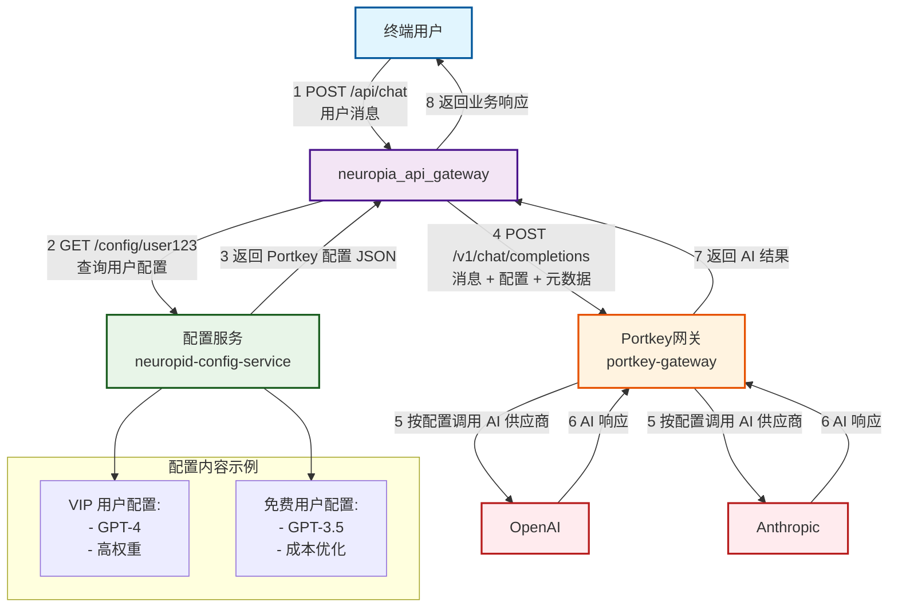

# portkey gateway 的 x-portkey-config 详解

## 主要配置

| 属性                        | 类型          | 描述                   | 约束/默认值                                                 | 示例                                                        |
| --------------------------- | ------------- | ---------------------- | ----------------------------------------------------------- | ----------------------------------------------------------- |
| `strategy.mode`             | string        | 路由策略模式           | 必须是 "loadbalance"、"fallback"、"conditional" 或 "single" | "loadbalance"                                               |
| `targets`                   | array         | 目标提供商配置列表     | 每个元素必须有 `provider`；支持嵌套                         | [{"provider": "openai", "weight": 1}]                       |
| `targets[].provider`        | string        | AI 提供商名称          | 必须在白名单中                                              | "openai"                                                    |
| `targets[].weight`          | number        | 负载均衡权重           | 默认 1；用于随机选择                                        | 0.75                                                        |
| `targets[].override_params` | object        | 覆盖参数（如 api_key） | 可选；用于提供商特定设置                                    | {"api_key": "sk-..."}                                       |
| `retry.attempts`            | number        | 最大重试次数           | 范围 1–5；默认 0（禁用）                                    | 3                                                           |
| `retry.on_status_codes`     | array<number> | 触发重试的状态码       | 默认 [429, 500, 502, 503]                                   | [429, 502]                                                  |
| `request_timeout`           | number        | 请求超时（ms）         | 可选                                                        | 30000                                                       |
| `cache.mode`                | string        | 缓存模式               | "simple"（开源版支持）；"semantic"（企业版）                | "simple"                                                    |
| `before_request_hooks`      | array<object> | 输入验证钩子           | 每个对象指定插件（如 "regexMatch"）                         | [{"plugin": "modelWhitelist", "allowed_models": ["gpt-4"]}] |
| `after_request_hooks`       | array<object> | 输出验证钩子           | 类似 before hooks                                           | [{"plugin": "jsonSchema", "schema": {...}}]                 |
| `metadata`                  | object        | 自定义元数据           | 用于追踪或条件路由                                          | {"user_id": "123"}                                          |

## 补充的配置

| 属性                        | 类型    | 描述                    | 约束/默认值                  | 示例                                                |
| --------------------------- | ------- | ----------------------- | ---------------------------- | --------------------------------------------------- |
| `strategy.on_status_codes`  | array   | 策略级触发状态码        | 可选                         | [429, 500, 502]                                     |
| `strategy.conditions`       | array   | 条件路由规则            | 仅 conditional 模式          | [{"query": {}, "then": "target"}]                   |
| `strategy.default`          | string  | 条件路由默认目标        | 仅 conditional 模式          | "fallback-target"                                   |
| `api_key`                   | string  | API 密钥                | 与 provider 配合使用         | "sk-..."                                            |
| `weight`                    | number  | 根级权重                | 默认 1                       | 0.5                                                 |
| `on_status_codes`           | array   | 根级触发状态码          | 默认 [429, 500, 502, 503]    | [429, 502]                                          |
| `custom_host`               | string  | 自定义 API 主机         | 可选；不能包含 'api.portkey' | "[https://api.custom.com](https://api.custom.com/)" |
| `forward_headers`           | array   | 转发头部列表            | 可选                         | ["x-user-id", "x-org"]                              |
| `strict_open_ai_compliance` | boolean | OpenAI 响应格式严格模式 | 默认 true                    | false                                               |
| `virtual_key`               | string  | 虚拟密钥标识            | 可选                         | "vk_..."                                            |

## 提供商特定字段

| 属性                                                       | 类型   | 描述                  | 适用提供商         |
| ---------------------------------------------------------- | ------ | --------------------- | ------------------ |
| `aws_access_key_id`, `aws_secret_access_key`, `aws_region` | string | AWS 认证信息          | bedrock, sagemaker |
| `vertex_project_id`, `vertex_region`                       | string | Vertex AI 项目和区域  | vertex-ai          |
| `vertex_service_account_json`                              | object | Vertex AI 服务账户    | vertex-ai          |
| `resource_name`, `deployment_id`, `api_version`            | string | Azure OpenAI 资源信息 | azure-openai       |
| `openai_organization`, `openai_project`                    | string | OpenAI 组织和项目     | openai             |
| `anthropic_beta`, `anthropic_version`                      | string | Anthropic 特定参数    | anthropic          |

## api_key 的作用

`api_key` 允许在配置中直接指定提供商的 API 密钥，无需通过 Authorization header 传递 requestBody.ts:50-51 ：

```
{  
  "provider": "openai",  
  "api_key": "sk-..."  
}
```

在配置构造过程中，如果没有提供 Authorization header，系统会使用配置中的 `api_key` 

## overrideParams

`overrideParams` 可以覆盖几乎所有 AI 请求参数，不仅仅是 `model`。

### 可覆盖的参数类型

根据 `Params` 接口定义，`overrideParams` 可以覆盖以下参数：

#### 基础模型参数

- `model` - 模型名称
- `messages` - 对话消息数组
- `prompt` - 提示文本
- `max_tokens` / `max_completion_tokens` - 最大生成令牌数
- `temperature` - 随机性控制 (0-2)
- `top_p` - 核采样参数 (0-1)
- `top_k` - 采样候选数量
- `stream` - 是否流式响应

#### 高级控制参数

- `stop` - 停止词/停止序列
- `presence_penalty` - 存在惩罚 (-2 到 2)
- `frequency_penalty` - 频率惩罚 (-2 到 2)
- `seed` - 随机种子
- `user` - 用户标识
- `n` - 生成候选数量

#### 工具和函数调用

- `tools` - 工具定义数组
- `tool_choice` - 工具选择策略
- `functions` - 函数定义（已弃用）
- `function_call` - 函数调用策略（已弃用）

#### 特殊格式参数

- `response_format` - 响应格式（JSON/文本）
- `logprobs` - 对数概率
- `top_logprobs` - 顶部对数概率
- `echo` - 是否回显输入

#### 提供商特定参数

- `safety_settings` - Google 安全设置
- `anthropic_beta` - Anthropic Beta 功能
- `anthropic_version` - Anthropic 版本
- `thinking` - Anthropic 思考模式
- `dimensions` - 嵌入维度
- `audio` - 音频参数 [1](#8-0) 

### 实际配置示例

#### 1. 基础参数覆盖

```json
{
  "x-portkey-config": {
    "strategy": { "mode": "loadbalance" },
    "targets": [
      {
        "provider": "openai",
        "overrideParams": {
          "model": "gpt-4",
          "temperature": 0.7,
          "max_tokens": 2000,
          "presence_penalty": 0.1,
          "frequency_penalty": 0.1
        },
        "weight": 0.6
      },
      {
        "provider": "anthropic",
        "overrideParams": {
          "model": "claude-3-sonnet",
          "temperature": 0.5,
          "max_tokens": 4000,
          "anthropic_version": "2023-06-01"
        },
        "weight": 0.4
      }
    ]
  }
}
```

#### 2. 工具调用覆盖

```json
{
  "x-portkey-config": {
    "targets": [
      {
        "provider": "openai",
        "overrideParams": {
          "model": "gpt-4",
          "tools": [
            {
              "type": "function",
              "function": {
                "name": "get_weather",
                "description": "Get weather information",
                "parameters": {
                  "type": "object",
                  "properties": {
                    "location": { "type": "string" }
                  }
                }
              }
            }
          ],
          "tool_choice": "auto"
        }
      }
    ]
  }
}
```

#### 3. 响应格式覆盖

```json
{
  "x-portkey-config": {
    "targets": [
      {
        "provider": "openai",
        "overrideParams": {
          "model": "gpt-4",
          "response_format": {
            "type": "json_schema",
            "json_schema": {
              "name": "weather_response",
              "schema": {
                "type": "object",
                "properties": {
                  "temperature": { "type": "number" },
                  "conditions": { "type": "string" }
                }
              }
            }
          }
        }
      }
    ]
  }
}
```

#### 4. 提供商特定参数

```json
{
  "x-portkey-config": {
    "targets": [
      {
        "provider": "google-vertex-ai",
        "overrideParams": {
          "model": "gemini-pro",
          "safety_settings": [
            {
              "category": "HARM_CATEGORY_HARASSMENT",
              "threshold": "BLOCK_MEDIUM_AND_ABOVE"
            }
          ]
        }
      },
      {
        "provider": "anthropic",
        "overrideParams": {
          "model": "claude-3-sonnet",
          "anthropic_beta": ["tools-2024-04-04"],
          "thinking": {
            "type": "enabled",
            "budget_tokens": 5000
          }
        }
      }
    ]
  }
}
```

## targets

- **Targets = Destinations**: They define where your requests go
- **Recursive**: Targets can contain other targets, creating routing trees
- **Inheritance**: Parent target settings flow down to child targets handlerUtils.ts:488-642
- **Strategy-driven**: The `strategy.mode` determines how to pick between targets

"targets" are essentially what your configuration "applies to" - they're the providers and routing paths that will handle your requests.

**Targets always eventually resolve to an AI provider** - the nested structure is just for routing decisions. The actual API call is made to the provider specified in the leaf target.

以下是 JSON 格式的配置示例：

### 1. loadbalance 模式示例

```json
{  
  "x-portkey-config": {  
    "strategy": {  
      "mode": "loadbalance"  
    },  
    "targets": [  
      {  
        "provider": "openai",  
        "overrideParams": { "model": "gpt-4" },  
        "weight": 60  
      },  
      {  
        "provider": "anthropic",  
        "overrideParams": { "model": "claude-3-sonnet" },  
        "weight": 40  
      }  
    ]  
  }  
}
```

**处理方式**：每10个请求中，大约6个会发给GPT-4，4个发给Claude-3，实现流量分发。

### 2. fallback 模式示例

```json
{
  "x-portkey-config": {
    "strategy": {
      "mode": "fallback"
    },
    "targets": [
      {
        "provider": "openai",
        "overrideParams": {"model": "gpt-4"},
      },
      {
        "provider": "anthropic",
        "overrideParams": {"model": "claude-3-sonnet"},
      },
      {
        "provider": "azure-openai", 
        "overrideParams": {"model": "gpt-35-turbo"}
      }
    ]
  }
}
```

**实际场景**：当OpenAI API出现故障时，系统会自动尝试Anthropic，再不成功则用Azure，确保服务不中断。**依赖数组顺序** - 按 targets 数组中的顺序进行故障转移

### 3. conditional 模式示例（与meta协同）

```json
{
  "x-portkey-config": {
    "strategy": {
      "mode": "conditional"
    },
    "targets": [
      {
        "provider": "openai",
        "overrideParams": {"model": "gpt-4"},
        "meta": {
          "condition": "${request.messages.length < 5}"
        }
      },
      {
        "provider": "anthropic",
        "overrideParams": {"model": "claude-3-sonnet"},
        "meta": {
          "condition": "${request.messages.length >= 5}"
        }
      },
      {
        "provider": "openai", 
        "overrideParams": {"model": "gpt-4-vision"},
        "meta": {
          "condition": "${request.messages[0].containsImage}"
        }
      }
    ]
  }
}
```

**处理机制**：根据消息长度和内容类型智能选择最合适的模型。按数组顺序评估条件，第一个匹配的条件生效.

### 4. single 模式示例

```json
{
  "x-portkey-config": {
    "strategy": {
      "mode": "single"
    },
    "targets": [
      {
        "provider": "openai",
        "overrideParams": {"model": "gpt-3.5-turbo"}
      }
    ]
  }
}
```

**含义**：所有请求都固定发送到GPT-3.5-Turbo，没有备选方案，适合简单应用或测试环境。

**关键点**：

- `targets` 是数组，保持元素顺序
- `fallback` 模式依赖数组顺序决定故障转移优先级
- `loadbalance` 使用 `weight` 字段控制比例
- `conditional` 按数组顺序评估条件
- `single` 使用数组第一个元素

## retry

`retry.on_status_codes` 用于指定在遇到哪些HTTP状态码时进行重试。以下是具体的用法示例：

### 1. 重试服务器错误 (5xx)

```json
{
  "x-portkey-config": {
    "strategy": {
      "mode": "single",
    },
    "targets": [
      {
        "provider": "openai",
        "overrideParams": {"model": "gpt-4"},
      }
    ],
    "retry": {
      "attempts": 3,
      "on_status_codes": [500, 502, 503, 504]
    }
  }
}
```

**场景**：当遇到服务器内部错误、网关错误、服务不可用或网关超时时，自动重试3次。

### 2. 重试限流错误 (429)

```json
{
  "x-portkey-config": {
    "strategy": {
      "mode": "fallback"
    },
    "targets": [
      {
        "provider": "openai",
        "overrideParams": {"model": "gpt-4"},
      },
      {
        "provider": "anthropic",
        "overrideParams": {"model": "claude-3-sonnet"}
      }
    ],
    "retry": {
      "attempts": 2,
      "on_status_codes": [429],
    }
  }
}
```

**场景**：当API返回429（请求过多）时，先重试2次，如果仍然失败则切换到备用提供商。

### 3. 混合错误重试策略

```json
{  
  "x-portkey-config": {  
    "strategy": {    
      "mode": "loadbalance"    
    },    
    "retry": {  
      "attempts": 3,  
      "on_status_codes": [429, 500, 502, 503]  
    },  
    "targets": [    
      {    
        "provider": "openai",    
        "overrideParams": { "model": "gpt-4" },    
        "weight": 40    
      },    
      {    
        "provider": "openai",     
        "overrideParams": { "model": "gpt-3.5-turbo" },    
        "weight": 30    
      },    
      {    
        "provider": "anthropic",    
        "overrideParams": { "model": "claude-3-sonnet" },    
        "weight": 30    
      }    
    ]    
  }  
}

```

**场景**：对限流错误和服务器错误都进行重试.

### 4. 客户端错误选择性重试

```json
{
  "x-portkey-config": {
    "strategy": {
      "mode": "single"
    },
    "targets": [
      {
        "provider": "openai",
        "overrideParams": {"model": "gpt-4"}
      }
    ],
    "retry": {
      "attempts": 1,
      "on_status_codes": [408, 429]
    }
  }
}
```

**场景**：只对请求超时(408)和限流(429)进行重试，其他4xx错误（如400、401）不重试。

### 实际工作流程示例

```json
{
  "x-portkey-config": {
    "retry": {
      "attempts": 3,
      "on_status_codes": [429, 500, 502, 503]
    }
  }
}
```

**执行过程**：

1. 首次请求 → 返回 `429 Too Many Requests`
2. 第1次重试（等待后）→ 返回 `502 Bad Gateway`  
3. 第2次重试（等待后）→ 返回 `200 OK` ✅
4. 重试成功，流程结束

**重要说明**：

- `on_status_codes` 数组明确指定了哪些状态码触发重试机制
- 对于4xx错误，通常只重试`429`（限流）和`408`（超时）
- 对于5xx错误，通常都会重试，因为这是服务器端问题

## strategy.loadbalance 负载均衡的粒度

在 `loadbalance` 模式下，每个 `target` 都是一个独立的负载均衡单元，可以包含：

- 不同的 `provider`
- 不同的 `model`（通过 `overrideParams` 指定）
- 不同的权重 `weight`

### 实际配置示例

#### 不同 Provider + 不同 Model

```json
{
  "strategy": { "mode": "loadbalance" },
  "targets": [
    {
      "provider": "openai",
      "weight": 0.7,
      "overrideParams": { "model": "gpt-4" }
    },
    {
      "provider": "anthropic", 
      "weight": 0.3,
      "overrideParams": { "model": "claude-3-opus-20240229" }
    }
  ]
}
```

#### 同一 Provider + 不同 Model

```json
{
  "strategy": { "mode": "loadbalance" },
  "targets": [
    {
      "provider": "openai",
      "weight": 0.5,
      "overrideParams": { "model": "gpt-4" }
    },
    {
      "provider": "openai",
      "weight": 0.5, 
      "overrideParams": { "model": "gpt-3.5-turbo" }
    }
  ]
}
```

## 配置继承的两个层面

### 1. 优先级层面：子目标覆盖父目标

在执行时，如果子目标定义了某个配置，会优先使用子目标的配置：

```
// 子目标有 retry 时，使用子目标的 retry  
retry: currentTarget.retry  
  ? { ...currentTarget.retry }      // 子目标配置  
  : { ...inheritedConfig.retry },   // 父目标配置
```

handlerUtils.ts:495-500

### 2. 传递方向层面：单向从父到子

配置只能从父目标传递给子目标，子目标的配置变化不会反向影响父目标

### 实际例子

```
{  
  "retry": { "attempts": 5 },        // 父目标配置  
  "targets": [  
    {  
      "retry": { "attempts": 2 },    // 子目标配置（覆盖父级）  
      "provider": "openai"  
    },  
    {  
      "provider": "anthropic"        // 使用父级配置（attempts: 5）  
    }  
  ]  
}
```

### 总结

- **覆盖关系**：子目标配置优先级更高，会"覆盖"父目标的同名配置
- **继承方向**：配置只能从父流向子，是单向的，子不能影响父

这就像 CSS 样式继承：子元素可以覆盖父元素的样式，但子元素的样式变化不会影响父元素。 handlerUtils.ts:488-504

## 配置继承示例

以下是 Portkey Gateway 中配置继承的实际应用示例：

### 1. 重试配置继承

```json
{
  "x-portkey-config": {
    "retry": { "attempts": 5 },           // 父级：默认重试5次
    "strategy": { "mode": "fallback" },
    "targets": [
      {
        "name": "OpenAI 集群",
        "retry": { "attempts": 2 },        // 子级：覆盖为2次
        "targets": [
          { "provider": "openai" },        // 继承：2次重试
          { "provider": "openai" }         // 继承：2次重试
        ]
      },
      {
        "name": "Anthropic 备用",
        "provider": "anthropic"            // 继承：5次重试
      }
    ]
  }
}
```

### 2. 缓存配置继承

```json
{
  "x-portkey-config": {
    "cache": { 
      "mode": "simple", 
      "max_age": 3600 
    },                                   // 父级：缓存1小时
    "strategy": { "mode": "loadbalance" },
    "targets": [
      {
        "provider": "openai",
        "weight": 0.6                     // 继承：缓存1小时
      },
      {
        "provider": "anthropic",
        "cache": { "max_age": 1800 },     // 子级：覆盖为30分钟
        "weight": 0.4
      }
    ]
  }
}
```

### 3. overrideParams 深度合并

```json
{
  "x-portkey-config": {
    "overrideParams": { 
      "temperature": 0.7,
      "max_tokens": 1000
    },                                   // 父级参数
    "strategy": { "mode": "fallback" },
    "targets": [
      {
        "provider": "openai",
        "overrideParams": { 
          "model": "gpt-4",
          "temperature": 0.9             // 子级：覆盖temperature
        }                                 // 合并后：{temperature: 0.9, max_tokens: 1000, model: "gpt-4"}
      },
      {
        "provider": "anthropic",
        "overrideParams": { 
          "model": "claude-3-sonnet"
        }                                 // 合并后：{temperature: 0.7, max_tokens: 1000, model: "claude-3-sonnet"}
      }
    ]
  }
}
```

### 4. 多层嵌套继承

```json
{
  "x-portkey-config": {
    "retry": { "attempts": 3 },
    "cache": { "mode": "simple", "max_age": 7200 },
    "request_timeout": 30000,            // 父级：30秒超时
    "strategy": { "mode": "fallback" },
    "targets": [
      {
        "name": "主要集群",
        "retry": { "attempts": 2 },      // 第一级子目标
        "strategy": { "mode": "loadbalance" },
        "targets": [
          {
            "provider": "openai",
            "weight": 0.7,
            "request_timeout": 15000     // 第二级子目标：覆盖为15秒
          },
          {
            "provider": "openai",
            "weight": 0.3                 // 继承：15秒超时，2次重试
          }
        ]
      },
      {
        "name": "备用集群",
        "provider": "anthropic"           // 继承：30秒超时，3次重试
      }
    ]
  }
}
```

### 5. Hooks 和 Guardrails 继承

```json
{
  "x-portkey-config": {
    "before_request_hooks": [
      { "id": "global-auth", "type": "mutator" }
    ],                                   // 父级：全局前置钩子
    "default_input_guardrails": [
      { "default.contains": {"words": ["spam"], "operator": "none"} }
    ],                                   // 父级：默认输入防护
    "strategy": { "mode": "loadbalance" },
    "targets": [
      {
        "provider": "openai",
        "weight": 0.5                     // 继承所有父级钩子和防护
      },
      {
        "provider": "anthropic",
        "before_request_hooks": [         // 子级：完全替换钩子
          { "id": "anthropic-specific", "type": "mutator" }
        ],
        "input_guardrails": [             // 子级：添加额外防护
          { "default.regexMatch": {"pattern": "\\d{3}-\\d{2}-\\d{4}"} }
        ],
        "weight": 0.5
      }
    ]
  }
}
```

### 6. 特殊字段继承行为

```json
{
  "x-portkey-config": {
    "custom_host": "https://api.primary.com",  // 父级自定义主机
    "forward_headers": ["x-user-id", "x-org"],  // 父级转发头
    "strict_open_ai_compliance": true,          // 父级严格模式
    "strategy": { "mode": "fallback" },
    "targets": [
      {
        "provider": "openai"                     // 继承所有父级配置
      },
      {
        "provider": "anthropic",
        "custom_host": "https://api.backup.com", // 子级：覆盖主机
        "forward_headers": ["x-api-key"],        // 子级：完全替换转发头
        "strict_open_ai_compliance": false        // 子级：关闭严格模式
      }
    ]
  }
}
```

### 继承规则总结

| 字段类型                                   | 继承行为 | 示例                                                         |
| ------------------------------------------ | -------- | ------------------------------------------------------------ |
| **标量字段** (`retry`, `cache`, `timeout`) | 子覆盖父 | 子目标设置 `retry: {attempts: 2}` 覆盖父级的 `retry: {attempts: 5}` |
| **对象字段** (`overrideParams`)            | 深度合并 | 父级 `{temperature: 0.7}` + 子级 `{model: "gpt-4"}` = `{temperature: 0.7, model: "gpt-4"}` |
| **数组字段** (`hooks`, `forwardHeaders`)   | 完全替换 | 子级设置新数组会完全替换父级数组                             |
| **布尔字段** (`strictOpenAiCompliance`)    | 子覆盖父 | 子级 `false` 覆盖父级 `true`                                 |

### Notes

- 配置继承是递归的，支持任意深度的嵌套
- 继承在 `tryTargetsRecursively` 函数的每次调用时发生
- 子目标配置优先级始终高于父目标
- 空值或未定义的字段会从父目标继承
- JSON 路径追踪帮助调试复杂的继承关系

## conditional

`strategy: "conditional"` 是 Portkey AI Gateway 中的一个路由策略，它允许您根据请求的元数据、参数或 URL 路径动态选择目标提供商。

### 基本用法

条件路由通过 `ConditionalRouter` 类实现 [1](#0-0) ，在 `tryTargetsRecursively` 函数中被调用 [2](#0-1) 。

### 配置结构

```json
{
  "strategy": {
    "mode": "conditional",
    "conditions": [
      {
        "query": { "条件表达式" },
        "then": "目标名称"
      }
    ],
    "default": "默认目标名称"
  },
  "targets": [
    {
      "name": "目标名称",
      "provider": "openai",
      "api_key": "..."
    }
  ]
}
```

### 支持的操作符

条件路由支持多种比较和逻辑操作符 [3](#0-2) ：

#### 比较操作符

- `$eq` - 等于
- `$ne` - 不等于  
- `$gt` - 大于
- `$gte` - 大于等于
- `$lt` - 小于
- `$lte` - 小于等于
- `$in` - 在数组中
- `$nin` - 不在数组中
- `$regex` - 正则匹配

#### 逻辑操作符

- `$and` - 逻辑与
- `$or` - 逻辑或

### 条件评估

条件可以基于以下上下文数据 [4](#0-3) ：

- `metadata` - 来自 `x-portkey-metadata` 头部的元数据
- `params` - 请求参数
- `url.pathname` - URL 路径

使用点号访问嵌套属性，如 `metadata.user_tier` [5](#0-4) 。

### 实际示例

```json
{
  "strategy": {
    "mode": "conditional",
    "conditions": [
      {
        "query": { 
          "metadata.user_tier": { "$eq": "premium" }
        },
        "then": "gpt4-target"
      },
      {
        "query": {
          "$or": [
            { "params.model": { "$regex": "gpt-4" } },
            { "metadata.region": { "$in": ["us", "eu"] } }
          ]
        },
        "then": "anthropic-target"
      }
    ],
    "default": "gpt35-target"
  },
  "targets": [
    {
      "name": "gpt4-target",
      "provider": "openai",
      "api_key": "sk-...",
      "override_params": { "model": "gpt-4" }
    },
    {
      "name": "anthropic-target", 
      "provider": "anthropic",
      "api_key": "sk-ant-..."
    },
    {
      "name": "gpt35-target",
      "provider": "openai", 
      "api_key": "sk-...",
      "override_params": { "model": "gpt-3.5-turbo" }
    }
  ]
}
```

### 执行流程

1. 解析 `x-portkey-metadata` 头部获取元数据 [6](#0-5) 
2. 创建 `ConditionalRouter` 实例 [7](#0-6) 
3. 按顺序评估每个条件 [8](#0-7) 
4. 返回第一个匹配条件的目标
5. 如果无匹配且有默认值，返回默认目标 [9](#0-8) 
6. 否则抛出错误 [10](#0-9) 

### Notes

- 条件按顺序评估，第一个匹配的条件生效
- 目标必须通过 `name` 字段在 `targets` 数组中定义
- 条件路由在 schema 验证中受支持 [11](#0-10) 
- 支持嵌套的逻辑操作符组合复杂条件

## 监控和可观测性

### response

需要解析响应体（response body）来获取``用量信息``。Portkey Gateway会将各个provider的用量字段统一转换为标准格式。 [1](#3-0) 

#### 统一的用量字段结构

所有provider的响应都会被转换为标准的`usage`结构 [2](#3-1) ：

```typescript
usage: {
  prompt_tokens: number;           // 输入token数
  completion_tokens: number;       // 输出token数  
  total_tokens: number;            // 总token数
  completion_tokens_details?: {    // 可选的输出详情
    reasoning_tokens?: number;
    audio_tokens?: number;
  };
  prompt_tokens_details?: {        // 可选的输入详情
    cached_tokens?: number;
    audio_tokens?: number;
  };
  // Anthropic缓存相关
  cache_read_input_tokens?: number;
  cache_creation_input_tokens?: number;
}
```

####  获取用量信息的代码

```javascript
const result = await response.json();
const usage = result.usage;

console.log('用量信息:', {
  prompt_tokens: usage.prompt_tokens,
  completion_tokens: usage.completion_tokens,
  total_tokens: usage.total_tokens,
  cached_tokens: usage.prompt_tokens_details?.cached_tokens || 0
});
```

#### Notes

1. **字段统一性**：经过Gateway转换后，所有provider的用量字段都遵循`CResponse`接口定义 [6](#3-5) ，确保客户端代码的一致性。

2. **特殊字段**：某些provider特有的字段（如Anthropic的缓存token、Google的reasoning token）会被保留在`_details`字段中 [7](#3-6) 。

3. **流式响应**：在流式响应中，usage信息可能在最后的chunk中返回 [8](#3-7) 。

4. **缺失处理**：如果provider不提供某些信息，对应字段会设为0或undefined [9](#3-8) 。

### headers

响应头信息非常有用，可以用于多种场景。Portkey Gateway的设计就是为了让这些元数据能够被客户端和中间件利用。 [1](#4-0) 

#### Portkey Gateway 可观测性响应头表格

| 响应头名称 | 来源 | 应用场景 | 说明 |
|-----------|------|----------|------|
| `x-portkey-cache-status` | Portkey Gateway | 缓存监控、性能优化 | 指示缓存状态（DISABLED/HIT等） [1](#5-0)  |
| `x-portkey-last-used-option-index` | Portkey Gateway | 配置调试、路由分析 | 显示使用的配置目标路径 [2](#5-1)  |
| `x-portkey-provider` | Portkey Gateway | 成本分析、提供商监控 | 标识实际调用的AI提供商 [3](#5-2)  |
| `x-portkey-retry-attempt-count` | Portkey Gateway | 稳定性监控、故障分析 | 记录重试次数，0表示首次成功 [4](#5-3)  |
| `x-portkey-trace-id` | Portkey Gateway | 分布式追踪、日志关联 | 用于跨服务请求追踪 [5](#5-4)  |
| `req-arrive-time` | 基础设施 | 性能监控、延迟分析 | 请求到达网关的Unix时间戳（毫秒） |
| `req-cost-time` | 基础设施 | 性能监控、SLA监控 | 请求总处理时间（毫秒） |
| `resp-start-time` | 基础设施 | 性能分析、延迟分解 | 响应开始发送的时间戳（毫秒） |
| `x-envoy-upstream-service-time` | 基础设施 | 上游服务监控 | Envoy代理记录的上游服务处理时间 |
| `x-request-id` | 基础设施 | 请求追踪、日志关联 | 请求的唯一标识符 |

#### 如何获取响应头

头部访问时机：必须在调用 response.json() 或 response.text() 之前访问头部，因为这些方法会消费响应流。 globals.ts:13-28

头部名称格式：所有 Portkey 头部都使用 x-portkey- 前缀，在 HEADER_KEYS 中定义

Gateway 添加的响应头

根据代码，Gateway 会添加以下响应头：

 * x-portkey-retry-attempt-count: 重试次数
 * x-portkey-trace-id: 追踪ID
 * x-portkey-last-used-option-index: 使用的选项索引
 * x-portkey-cache-status: 缓存状态（如果有）
 * x-portkey-provider: 使用的提供商

#### 主要利用场景

##### 1. 监控和可观测性

- **性能监控**：`req-cost-time`、`x-envoy-upstream-service-time` 可用于分析请求延迟
- **缓存效果**：`x-portkey-cache-status` 监控缓存命中率
- **重试统计**：`x-portkey-retry-attempt-count` 跟踪系统稳定性

##### 2. 调试和故障排查

- **请求追踪**：`x-portkey-trace-id` 用于分布式追踪，关联多个服务调用 [2](#4-1) 
- **配置路径**：`x-portkey-last-used-option-index` 帮助定位使用了哪个配置目标
- **提供商识别**：`x-portkey-provider` 快速识别实际调用的AI服务

##### 3. 业务统计和成本分析

```javascript
// 示例：利用响应头进行统计
const stats = {
  provider: response.headers.get('x-portkey-provider'),
  cacheHit: response.headers.get('x-portkey-cache-status') !== 'DISABLED',
  retryCount: parseInt(response.headers.get('x-portkey-retry-attempt-count')),
  latency: parseInt(response.headers.get('req-cost-time')),
  configPath: response.headers.get('x-portkey-last-used-option-index')
};

// 发送到监控系统或写入日志
analytics.track('api_request', stats);
```

##### 4. 插件系统集成

插件系统可以利用这些头部信息：
- **安全插件**：使用 `x-portkey-trace-id` 进行安全审计追踪 [3](#4-2) 
- **日志插件**：记录完整的请求上下文信息 [4](#4-3) 

##### 5. 动态路由决策

基于响应头信息可以做出实时决策：
```javascript
// 根据缓存状态调整策略
if (response.headers.get('x-portkey-cache-status') === 'DISABLED') {
  // 启用缓存或调整配置
}

// 根据重试次数判断提供商健康度
const retryCount = parseInt(response.headers.get('x-portkey-retry-attempt-count'));
if (retryCount > 2) {
  // 标记提供商为不健康，切换到备用提供商
}
```

#### Notes

1. **性能考虑**：响应头信息轻量且实时，无需解析响应体即可获取关键指标
2. **标准化**：所有 `x-portkey-` 前缀的头部在 `RESPONSE_HEADER_KEYS` 中统一定义 [5](#4-4) 
3. **扩展性**：插件系统可以访问完整的请求上下文，包括这些响应头信息
4. **日志集成**：`LogsService` 会自动收集这些信息用于请求日志记录 [4](#4-3) 

这些响应头设计为可被客户端、监控系统和插件充分利用，是Gateway可观测性架构的重要组成部分。

### model 信息

model 信息在 **响应体（response body）** 中，不在响应头里。 [1](#8-0) 

#### 响应体中的 model 字段

在 Portkey Gateway 返回的标准响应格式中，model 字段位于响应体的根级别：

```json
{
  "id": "chatcmpl-dbe92584-24c0-4236-aed4-e8de588afa2e",
  "object": "chat.completion", 
  "created": 1764438958,
  "model": "qwen-turbo",
  "choices": [...],
  "usage": {...},
  "provider": "dashscope"
}
```

#### Model 字段的来源

Gateway 在响应转换过程中会设置 model 字段，通常从请求参数中获取： [2](#8-1) 

```javascript
model: requestBody.model
```

#### 标准化响应结构

所有 provider 的响应都会被转换为包含 model 字段的标准格式： [3](#8-2) 

```typescript
interface CResponse {
  id: string;
  object: string;
  created: number;
  model: string;  // 标准的 model 字段
  choices: any[];
  usage?: {
    prompt_tokens: number;
    completion_tokens: number;
    total_tokens: number;
  };
}
```

####  Notes

1. **响应头中没有 model 信息**：Portkey Gateway 的响应头主要包含可观测性信息（如 `x-portkey-provider`、`x-portkey-cache-status` 等），不包含 model 字段 [4](#8-3) 

2. **Provider 字段区别**：响应体中同时包含 `model` 和 `provider` 字段：
   - `model`：具体的模型名称（如 "qwen-turbo"）
   - `provider`：提供商名称（如 "dashscope"）

3. **获取方式**：您需要通过 `await response.json()` 解析响应体来获取 model 信息 [5](#8-4) 

4. **统一性**：经过 Gateway 转换后，所有 provider 的响应都遵循相同的结构，确保客户端代码的一致性。

# Neuropia AI 聚合平台配置系统和架构设计

## 1️⃣ 数据库部分

```postgresql
-- DDL generated by Postico 2.3
-- Not all database features are supported. Do not use for backup.

-- Table Definition ----------------------------------------------

CREATE TABLE data.config_nodes (
    id uuid DEFAULT gen_random_uuid() PRIMARY KEY,
    name text NOT NULL UNIQUE,
    description text,
    parent_id uuid REFERENCES data.config_nodes(id) ON DELETE CASCADE,
    config_data jsonb NOT NULL DEFAULT '{}'::jsonb,
    mount_policy text DEFAULT 'leaf_only'::text CHECK (mount_policy = ANY (ARRAY['leaf_only'::text, 'any_node'::text, 'none'::text])),
    is_active boolean DEFAULT true,
    created_at timestamp with time zone DEFAULT now(),
    updated_at timestamp with time zone DEFAULT now(),
    computed_config jsonb,
    CONSTRAINT config_nodes_id_not_null ,
    CONSTRAINT config_nodes_name_not_null ,
    CONSTRAINT config_nodes_config_data_not_null 
);

-- Indices -------------------------------------------------------

CREATE UNIQUE INDEX config_nodes_pkey ON data.config_nodes(id uuid_ops);
CREATE UNIQUE INDEX config_nodes_name_key ON data.config_nodes(name text_ops);
CREATE INDEX idx_config_nodes_parent ON data.config_nodes(parent_id uuid_ops) WHERE parent_id IS NOT NULL;
CREATE INDEX idx_config_nodes_active ON data.config_nodes(is_active bool_ops) WHERE is_active = true;
CREATE INDEX idx_config_nodes_name ON data.config_nodes(name text_ops);

-- Triggers -------------------------------------------------------

CREATE TRIGGER trg_refresh_node
  AFTER INSERT OR UPDATE OF parent_id, config_data ON data.config_nodes
  FOR EACH ROW
  EXECUTE FUNCTION data.on_node_change();

CREATE OR REPLACE TRIGGER notify_node_changed_trigger
    AFTER UPDATE OF parent_id, config_data
    ON data.config_nodes
    FOR EACH ROW
    EXECUTE FUNCTION data.notify_node_changed();
  
CREATE OR REPLACE FUNCTION data.on_node_change()
    RETURNS trigger
    LANGUAGE 'plpgsql'
    COST 100
    VOLATILE NOT LEAKPROOF
AS $BODY$
BEGIN
    -- ⚡ 注意这里用 PERFORM，而不是 SELECT
    PERFORM data.refresh_node_and_descendants(NEW.id);
    RETURN NEW;
END;
$BODY$;

-- 通知 Node.js（用于 Redis 缓存失效）
CREATE OR REPLACE FUNCTION data.notify_node_changed()
    RETURNS trigger
    LANGUAGE 'plpgsql'
    COST 100
    VOLATILE NOT LEAKPROOF
AS $BODY$
 DECLARE vk_ids text[]; BEGIN SELECT array_agg(id) INTO vk_ids FROM data.virtual_key WHERE primary_config_node_id = NEW.id; PERFORM pg_notify( 'node_changed', json_build_object( 'node_id', NEW.id, 'virtual_key_ids', COALESCE(vk_ids, ARRAY[]::text[]) )::text ); RETURN NEW; END; 
$BODY$;
```

```postgresql
-- DDL generated by Postico 2.3
-- Not all database features are supported. Do not use for backup.

-- Table Definition ----------------------------------------------

CREATE TABLE data.virtual_key (
    id uuid DEFAULT gen_random_uuid() PRIMARY KEY,
    user_id uuid NOT NULL REFERENCES data.user_profile(user_id),
    virtual_key text NOT NULL UNIQUE,
    name text NOT NULL,
    description text,
    is_active boolean DEFAULT true,
    created_at timestamp with time zone DEFAULT now(),
    updated_at timestamp with time zone DEFAULT now(),
    key_type_id uuid REFERENCES data.virtual_key_types(id),
    key_prefix text,
    primary_config_node_id uuid REFERENCES data.config_nodes(id),
    config_data jsonb NOT NULL DEFAULT '{}'::jsonb,
    computed_config jsonb,
    CONSTRAINT virtual_key_id_not_null ,
    CONSTRAINT virtual_key_user_id_not_null ,
    CONSTRAINT virtual_key_virtual_key_not_null ,
    CONSTRAINT virtual_key_name_not_null ,
    CONSTRAINT virtual_key_config_data_not_null 
);

-- Indices -------------------------------------------------------

CREATE UNIQUE INDEX virtual_key_pkey ON data.virtual_key(id uuid_ops);
CREATE UNIQUE INDEX virtual_key_virtual_key_key ON data.virtual_key(virtual_key text_ops);

-- Triggers -------------------------------------------------------

CREATE TRIGGER compute_virtual_key_config_trigger
  BEFORE INSERT OR UPDATE OF primary_config_node_id, config_data ON data.virtual_key
  FOR EACH ROW
  EXECUTE FUNCTION data.compute_virtual_key_config_trigger_func();

CREATE OR REPLACE FUNCTION data.compute_virtual_key_config_trigger_func()
    RETURNS trigger
    LANGUAGE 'plpgsql'
    COST 100
    VOLATILE NOT LEAKPROOF
AS $BODY$
BEGIN
    NEW.computed_config :=
        data.refresh_virtual_key_computed_config(NEW.id);

    PERFORM pg_notify('virtual_key_config_changed', NEW.id::text);
    RETURN NEW;
END;
$BODY$;
```

## 2️⃣ Node.js + Redis 缓存逻辑

```
const { Client } = require('pg');
const Redis = require('ioredis');
import { createClient } from '@supabase/postgrest-js';


const redis = new Redis();

const pgClient = new Client({ /* connection config */ });
const redis = new Redis({ /* connection config */ });

await pgClient.connect();
await redis.connect();

// 监听 pg_notify
pgClient.query('LISTEN virtual_key_config_changed');
pgClient.query('LISTEN node_changed');

// 启动时刷新: 刷新 node → virtual_key 映射
async function refreshNodeVKMapping(nodeId) {
  // 从 PG 查出所有 virtual_key
  const res = await pgClient.query(
    `SELECT id FROM data.virtual_key WHERE primary_config_node_id = $1`,
    [nodeId]
  );
  const vkIds = res.rows.map(r => r.id);

  await redis.set(`node_vk_mapping:${nodeId}`, JSON.stringify(vkIds));
  return vkIds;
}

pgClient.on('notification', async (msg) => {
  if (msg.channel === 'node_changed') {
    const nodeId = msg.payload;

    // 先从 Redis 拿映射
    let vkIds = await redis.get(`node_vk_mapping:${nodeId}`);
    if (vkIds) {
      vkIds = JSON.parse(vkIds);
    } else {
      // 缓存没命中，刷新映射
      vkIds = await refreshNodeVKMapping(nodeId);
    }

    // 清理每个 virtual_key 的 config 缓存
    for (const vkId of vkIds) {
      await redis.del(`vk_config:${vkId}`);
    }
  } else if (msg.channel === 'user_config_changed') {
    const userId = msg.payload;
    await redis.del(`user_computed_config:${userId}`);
  }
});

// 获得virtual_key 的config
async function getUserConfig(userId) {
  const cacheKey = `user_computed_config:${userId}`;
  const cached = await redis.get(cacheKey);
  if (cached) return JSON.parse(cached);

  // 调用 PostgREST 暴露的数据库函数 api.getVirtualKeyConfig
  const { data, error } = await postgrest
    .rpc('getVirtualKeyConfig', { p_user_id: userId });

  if (error) {
    console.error('PostgREST get_virtualkey_config error:', error);
    throw error;
  }

  // 函数返回结构必须由你在数据库里定义
  const config = data ?? {};

  await redis.set(cacheKey, JSON.stringify(config));
  return config;
}

export { getUserConfig };
```

**用户修改 config_data → 触发器自动刷新 computed_config + pg_notify**

**节点修改 → pg_notify → Node.js 清理受影响用户缓存**

**用户请求 → Redis 缓存命中直接返回，否则按 computed_config 返回并写缓存**

**无需全表刷新用户，性能友好**

## virtual key

virtual key 应在业务流程中体现, 登陆->注册-建立/删除/更新

```postgresql
CREATE TABLE IF NOT EXISTS data.virtual_key
(
    id uuid NOT NULL DEFAULT gen_random_uuid(),
    user_id uuid NOT NULL,
    virtual_key text COLLATE pg_catalog."default" NOT NULL,
    name text COLLATE pg_catalog."default" NOT NULL,
    description text COLLATE pg_catalog."default",
    is_active boolean DEFAULT true,
    created_at timestamp with time zone DEFAULT now(),
    updated_at timestamp with time zone DEFAULT now(),
    key_type_id uuid,
    key_prefix text COLLATE pg_catalog."default",
    CONSTRAINT virtual_key_pkey PRIMARY KEY (id),
    CONSTRAINT virtual_key_virtual_key_key UNIQUE (virtual_key),
    CONSTRAINT virtual_key_key_type_id_fkey FOREIGN KEY (key_type_id)
        REFERENCES data.virtual_key_types (id) MATCH SIMPLE
        ON UPDATE NO ACTION
        ON DELETE NO ACTION,
    CONSTRAINT virtual_key_user_id_fkey FOREIGN KEY (user_id)
        REFERENCES data.user_profile (user_id) MATCH SIMPLE
        ON UPDATE NO ACTION
        ON DELETE NO ACTION
)
```

```postgresql
CREATE OR REPLACE FUNCTION api.activate_virtual_key(
	p_virtual_key text,
	p_reason text DEFAULT NULL::text)
    RETURNS void
    LANGUAGE 'plpgsql'
```

```postgresql
CREATE OR REPLACE FUNCTION api.create_virtual_key(
	p_user_id uuid,
	p_name text,
	p_description text DEFAULT NULL::text,
	p_key_type_id uuid DEFAULT NULL::uuid,
	p_key_prefix text DEFAULT NULL::text)
```

```postgresql
CREATE OR REPLACE VIEW api.virtual_keys
 AS
 SELECT vk.id,
    vk.user_id,
    vk.virtual_key,
    vk.name,
    vk.description,
    vk.is_active,
    vk.created_at,
    vk.updated_at,
    up.username,
    up.tenant_id
   FROM data.virtual_key vk
     JOIN data.user_profile up ON vk.user_id = up.user_id;

ALTER TABLE api.virtual_keys
    OWNER TO api_views_owner;

GRANT ALL ON TABLE api.virtual_keys TO api_views_owner;
GRANT SELECT ON TABLE api.virtual_keys TO sys_admin;
```

# Neuropia_API_GATEWAY

## 目前设计



```
neuropia_api_gateway/
├── src
│   ├── middleware
│   │   ├── auth.js
│   │   └── virtualKey.js
│   ├── routes
│   │   ├── chat.js
│   │   ├── config.js
│   │   └── users.js
│   ├── services
│   │   ├── billingService.js
│   │   ├── configService.js
│   │   └── userService.js
│   ├── app.js
│   └── server.js
├── Dockerfile
├── package-lock.json
└── package.json
```

```js
// neuropia_api_gateway/src/app.js
const express = require("express");
const cors = require("cors");
// const { AuthMiddleware } = require("./middleware/auth");
const { VirtualKeyMiddleware } = require("./middleware/virtualKey");
const chatRoutes = require("./routes/chat");
const configRoutes = require("./routes/config");
const userRoutes = require("./routes/users");
const RedisService = require("@shared/clients/redis");

class NeuropiaGateway {
  constructor() {
    this.app = express();
    // 不在构造函数中初始化
  }

  async initialize() {
    try {
      console.log("Initializing Neuropia API Gateway...");

      // 1. 先连接 Redis
      await RedisService.connect();
      console.log("Redis connected successfully");

      // 2. 设置中间件
      this.setupMiddleware();

      // 3. 设置路由
      this.setupRoutes();

      console.log("Neuropia API Gateway initialized successfully");
    } catch (error) {
      console.error("Initialization failed:", error);
      throw error;
    }
  }

  setupMiddleware() {
    this.app.use(cors());
    this.app.use(express.json());

    // 全局认证中间件（健康检查除外）
    // this.app.use(AuthMiddleware.authenticate);
  }

  setupRoutes() {
    // 只有聊天路由需要 Virtual Key 验证
    this.app.use("/api/chat", VirtualKeyMiddleware.validate, chatRoutes);

    // 配置和用户路由只需要认证，不需要 Virtual Key
    this.app.use("/api/config", configRoutes);
    this.app.use("/api/users", userRoutes);

    // 健康检查 - 完全公开（包含 Redis 状态）
    this.app.get("/health", async (req, res) => {
      const redisHealth = await RedisService.healthCheck();

      res.json({
        status: "ok",
        service: "neuropia_api_gateway",
        redis: redisHealth ? "connected" : "disconnected",
        timestamp: new Date().toISOString(),
      });
    });

    // 404 处理
    this.app.use("*", (req, res) => {
      res.status(404).json({
        error: "Route not found",
        code: "ROUTE_NOT_FOUND",
      });
    });

    // 全局错误处理
    this.app.use((err, req, res, next) => {
      console.error("Unhandled error:", err);
      res.status(500).json({
        error: "Internal server error",
        code: "INTERNAL_ERROR",
      });
    });
  }

  async start(port = 3001) {
    try {
      // 异步初始化
      await this.initialize();

      this.server = this.app.listen(port, () => {
        console.log(`Neuropia API Gateway running on port ${port}`);
      });

      // 优雅关闭处理
      this.setupGracefulShutdown();

      return this.server;
    } catch (error) {
      console.error("Failed to start Neuropia API Gateway:", error);
      // 不要调用 process.exit(1)，让测试框架处理错误
      throw error;
    }
  }

  setupGracefulShutdown() {
    const gracefulShutdown = async (signal) => {
      console.log(`Received ${signal}, shutting down gracefully...`);

      if (this.server) {
        this.server.close(() => {
          console.log("HTTP server closed");
        });
      }

      if (RedisService.client) {
        await RedisService.client.quit();
        console.log("Redis connection closed");
      }
    };

    process.on("SIGTERM", () => gracefulShutdown("SIGTERM"));
    process.on("SIGINT", () => gracefulShutdown("SIGINT"));
  }
}

module.exports = NeuropiaGateway;

```

```js
// neuropia_api_gateway/src/server.js
require('module-alias/register');
require("dotenv").config();

const NeuropiaGateway = require("./app");

async function startServer() {
  try {
    console.log("🚀 Starting Neuropia API Gateway...");

    const gateway = new NeuropiaGateway();
    const server = await gateway.start(process.env.PORT || 3001);

    console.log("✅ Neuropia API Gateway started successfully");

    return server;
  } catch (error) {
    console.error("❌ Failed to start Neuropia API Gateway:", error);
    // 不要调用 process.exit，让调用方处理错误
    throw error;
  }
}

// 只有直接运行此文件时才启动服务器
if (require.main === module) {
  startServer().catch((error) => {
    console.error("Server startup failed:", error);
    process.exit(1);
  });
}

module.exports = startServer;

```

```js
// neuropia_api_gateway/src/routes/chat.js
const express = require('express');
const { BillingService } = require('../services/billingService');
const { ConfigService } = require('../services/configService');
const { RedisService } = require('@shared/clients/redis');
const router = express.Router();

// neuropia_api_gateway/src/routes/chat.js
router.post('/completions', async (req, res) => {
    try {
        const { userContext } = req;
        const requestBody = req.body;

        console.log('🎯 用户上下文:', userContext);

        // 🎯 新增：获取完整配置（包含 model_access 和 rate_limits）
        let allConfigs;
        try {
            allConfigs = await ConfigService.getAllConfigs(userContext, requestBody);
            console.log('✅ Config Service 返回完整配置:', JSON.stringify(allConfigs, null, 2));

            // 🎯 新增：业务逻辑检查
            await validateBusinessRules(allConfigs, userContext, requestBody);

        } catch (error) {
            console.warn('Config Service unavailable, using fallback config');
            allConfigs = getFallbackConfig(userContext, requestBody);
        }

        // 🎯 修改：使用 allConfigs.portkey_config
        const portkeyConfig = allConfigs.config || allConfigs;

        // 验证配置结构
        if (!portkeyConfig.targets || !Array.isArray(portkeyConfig.targets) || portkeyConfig.targets.length === 0) {
            throw new Error('Invalid config from Config Service');
        }

        // 5. 调用 Portkey Gateway
        const portkeyResponse = await callPortkeyGateway(portkeyConfig, requestBody, userContext);

        res.json(portkeyResponse);
    } catch (error) {
        console.error('Chat completion error:', error);
        res.status(500).json({
            error: 'Internal server error',
            details: error.message
        });
    }
});

async function validateBusinessRules(allConfigs, userContext, requestBody) {
    const { model_access, rate_limits } = allConfigs;

    // 1. 检查模型权限
    if (model_access?.allowed_models) {
        if (!model_access.allowed_models.includes(requestBody.model)) {
            throw new Error(`模型 ${requestBody.model} 不在允许列表中。允许的模型: ${model_access.allowed_models.join(', ')}`);
        }
    }

    // 2. 检查频率限制
    if (rate_limits) {
        await checkRateLimits(userContext, rate_limits, requestBody);
    }

    // 3. 检查内容过滤（如果有）
    if (model_access?.blocked_content_types) {
        await checkContentSafety(requestBody, model_access.blocked_content_types);
    }
}

// 🎯 新增：频率限制检查
async function checkRateLimits(userContext, rateLimits, requestBody) {
    const { user_id, virtual_key } = userContext;

    // 检查每分钟请求数
    if (rateLimits.requests_per_minute) {
        const requestsKey = `rate_limit:requests:${user_id}:${virtual_key}`;
        const currentRequests = await RedisService.incr(requestsKey);

        if (currentRequests === 1) {
            await RedisService.expire(requestsKey, 60); // 设置过期时间
        }

        if (currentRequests > rateLimits.requests_per_minute) {
            throw new Error(`请求频率超限。限制: ${rateLimits.requests_per_minute} 次/分钟`);
        }
    }

    // 检查Token限制
    if (rateLimits.max_tokens && requestBody.max_tokens > rateLimits.max_tokens) {
        throw new Error(`单次请求Token数超限。限制: ${rateLimits.max_tokens}，请求: ${requestBody.max_tokens}`);
    }
}

async function callPortkeyGateway(config, requestBody, userContext) {
    const target = config.targets[0];
    if (!target.provider || !target.api_key) {
        throw new Error('Invalid target configuration: missing provider or api_key');
    }

    const response = await fetch(`${process.env.PORTKEY_GATEWAY_URL}/v1/chat/completions`, {
        method: 'POST',
        headers: {
            'Authorization': `Bearer ${config.apikey}`,
            'Content-Type': 'application/json',
            'x-portkey-config': JSON.stringify(config),
            'x-portkey-provider': target.provider,
            'x-portkey-metadata': JSON.stringify({
                user_id: userContext.user_id,
                virtual_key: userContext.virtual_key,
                tier_name: userContext.tier_name,
                environment: process.env.NODE_ENV || 'development'
            })
        },
        body: JSON.stringify(requestBody)
    });

    console.log('📡 Portkey Gateway 响应状态:', response.status);

    if (!response.ok) {
        const errorText = await response.text();
        console.error('❌ Portkey Gateway 错误:', errorText);
        throw new Error(`Portkey Gateway error: ${response.status} ${response.statusText}`);
    }

    const result = await response.json();
    console.log('✅ Portkey Gateway 成功响应');
    return result;
}

// 辅助函数
function estimateTokenCount(messages, max_tokens) {
    const totalChars = messages.reduce((sum, msg) => sum + msg.content.length, 0);
    return {
        input: Math.ceil(totalChars / 4),
        output: max_tokens || 1000
    };
}

function extractUsageFromResponse(response) {
    return response.usage || { prompt_tokens: 0, completion_tokens: 0 };
}

function inferProviderFromModel(model) {
    if (model.includes('qwen')) return 'dashscope';
    if (model.includes('gpt')) return 'openai';
    if (model.includes('claude')) return 'anthropic';
    return 'dashscope'; // 默认
}

function generatePromptHash(messages) {
    // 简化的哈希生成
    return require('crypto')
        .createHash('md5')
        .update(JSON.stringify(messages))
        .digest('hex');
}

// 当 Config Service 不可用时，提供一个最基本的备用配置。
function getFallbackConfig(userContext, requestBody) {
    const provider = inferProviderFromModel(requestBody.model);

    return {
        // 🎯 Portkey 配置（保证AI服务可用）
        portkey_config: {
            strategy: { mode: "fallback" },
            targets: [{
                provider: provider,
                api_key: getRealApiKey(provider),
                override_params: {
                    model: requestBody.model,
                    max_tokens: 2000,
                    temperature: 0.7
                }
            }]
        },
        // 🎯 业务配置（保守的默认值）
        rate_limits: {
            max_tokens: 4000,           // 保守的token限制
            requests_per_minute: 30     // 较低的频率限制（保护系统）
        },
        model_access: {
            allowed_models: ['gpt-3.5-turbo', 'qwen-turbo'] // 只允许基础模型
        }
    };
}

// 🎯 添加获取真实API Key的函数
function getRealApiKey(provider) {
    const providerKeys = {
        'dashscope': process.env.DASHSCOPE_API_KEY,
        'openai': process.env.OPENAI_API_KEY,
        'anthropic': process.env.ANTHROPIC_API_KEY
    };

    const apiKey = providerKeys[provider];
    if (!apiKey) {
        throw new Error(`No API key configured for provider: ${provider}`);
    }
    return apiKey;
}

module.exports = router;

```

```js
// neuropia_api_gateway/src/routes/config.js
const express = require("express");
const { RedisService } = require("@shared/clients/redis");
const router = express.Router();

/**
 * 配置管理路由
 * 提供配置查询、验证和重新加载功能
 */

/**
 * 🆕 解析特定配置类型
 */
router.post("/resolve-config", async (req, res) => {
  try {
    const { config_type, target_level, scope_id, context } = req.body;

    const config = await PortkeyConfigGenerator.resolveConfig(
      config_type,
      target_level,
      scope_id,
      context,
    );

    res.json({
      success: true,
      config_type,
      config,
    });
  } catch (error) {
    console.error("Resolve config error:", error);
    res.status(500).json({
      success: false,
      error: error.message,
    });
  }
});

/**
 * 🆕 生成动态 Portkey 配置
 */
router.post("/generate-dynamic-config", async (req, res) => {
  try {
    const { userContext, virtualKeyConfig, requestBody } = req.body;

    // 验证必要参数
    if (!userContext?.user_id || !userContext?.virtual_key) {
      return res.status(400).json({
        success: false,
        error: "Missing required user context",
      });
    }

    // 生成配置
    const portkeyConfig = await PortkeyConfigGenerator.generateConfig(
      userContext,
      virtualKeyConfig,
      requestBody,
    );

    res.json({
      success: true,
      config: portkeyConfig,
      generated_at: new Date().toISOString(),
    });
  } catch (error) {
    console.error("Generate dynamic config error:", error);
    res.status(500).json({
      success: false,
      error: error.message,
    });
  }
});

// 获取 Virtual Key 配置
router.get("/virtual-keys/:virtualKey", async (req, res) => {
  try {
    const { virtualKey } = req.params;

    const config = await RedisService.getVirtualKey(virtualKey);
    if (!config) {
      return res.status(404).json({
        error: "Virtual key not found",
        code: "VIRTUAL_KEY_NOT_FOUND",
      });
    }

    // 过滤敏感信息
    const safeConfig = {
      virtual_key: config.virtual_key,
      name: config.name,
      description: config.description,
      rate_limits: {
        rpm: config.rate_limit_rpm,
        tpm: config.rate_limit_tpm,
      },
      allowed_models: config.allowed_models,
      is_active: config.is_active,
      created_at: config.created_at,
    };

    res.json(safeConfig);
  } catch (error) {
    console.error("Get virtual key config error:", error);
    res.status(500).json({
      error: "Failed to get virtual key configuration",
      details: error.message,
    });
  }
});

// 验证 Virtual Key
router.post("/virtual-keys/validate", async (req, res) => {
  try {
    const { virtual_key, model } = req.body;

    if (!virtual_key) {
      return res.status(400).json({
        error: "Virtual key is required",
        code: "MISSING_VIRTUAL_KEY",
      });
    }

    const config = await RedisService.getVirtualKey(virtual_key);
    if (!config) {
      return res.status(401).json({
        error: "Invalid virtual key",
        code: "INVALID_VIRTUAL_KEY",
      });
    }

    if (!config.is_active) {
      return res.status(403).json({
        error: "Virtual key is inactive",
        code: "INACTIVE_VIRTUAL_KEY",
      });
    }

    // 检查模型权限
    if (model && config.allowed_models && config.allowed_models.length > 0) {
      if (!config.allowed_models.includes(model)) {
        return res.status(403).json({
          error: `Model ${model} not allowed for this virtual key`,
          code: "MODEL_NOT_ALLOWED",
          allowed_models: config.allowed_models,
        });
      }
    }

    res.json({
      valid: true,
      virtual_key: config.virtual_key,
      name: config.name,
      rate_limits: {
        rpm: config.rate_limit_rpm,
        tpm: config.rate_limit_tpm,
      },
      allowed_models: config.allowed_models,
    });
  } catch (error) {
    console.error("Validate virtual key error:", error);
    res.status(500).json({
      error: "Validation failed",
      details: error.message,
    });
  }
});

// 获取用户配置上下文
router.get("/user-context/:userId", async (req, res) => {
  try {
    const { userId } = req.params;

    // 调用 PostgREST 获取用户完整上下文
    const response = await fetch(
      `${process.env.POSTGREST_URL}/rpc/get_user_context?p_user_id=eq.${userId}`,
      {
        headers: {
          Authorization: req.headers.authorization,
          "Content-Type": "application/json",
        },
      },
    );

    if (!response.ok) {
      throw new Error(`PostgREST error: ${response.statusText}`);
    }

    const userContext = await response.json();

    if (!userContext || userContext.length === 0) {
      return res.status(404).json({
        error: "User context not found",
        code: "USER_CONTEXT_NOT_FOUND",
      });
    }

    res.json(userContext[0]);
  } catch (error) {
    console.error("Get user context error:", error);
    res.status(500).json({
      error: "Failed to get user context",
      details: error.message,
    });
  }
});

// 重新加载配置到 Redis
router.post("/reload", async (req, res) => {
  try {
    const { config_type, config_id } = req.body;

    // 调用配置服务重新加载配置
    const response = await fetch(`${process.env.CONFIG_SERVICE_URL}/reload`, {
      method: "POST",
      headers: {
        "Content-Type": "application/json",
      },
      body: JSON.stringify({ config_type, config_id }),
    });

    if (!response.ok) {
      throw new Error(`Config service error: ${response.statusText}`);
    }

    const result = await response.json();

    res.json({
      success: true,
      message: "Configuration reloaded successfully",
      ...result,
    });
  } catch (error) {
    console.error("Reload config error:", error);
    res.status(500).json({
      error: "Failed to reload configuration",
      details: error.message,
    });
  }
});

// 获取系统状态
router.get("/status", async (req, res) => {
  try {
    const status = {
      service: "neuropia_api_gateway",
      timestamp: new Date().toISOString(),
      environment: process.env.NODE_ENV || "development",
      redis: {
        connected: RedisService.client?.isOpen || false,
      },
      config_service: "unknown",
    };

    // 检查配置服务状态
    try {
      const configServiceResponse = await fetch(
        `${process.env.CONFIG_SERVICE_URL}/health`,
      );
      status.config_service = configServiceResponse.ok
        ? "healthy"
        : "unhealthy";
    } catch (error) {
      status.config_service = "unreachable";
    }

    res.json(status);
  } catch (error) {
    console.error("Get status error:", error);
    res.status(500).json({
      error: "Failed to get system status",
      details: error.message,
    });
  }
});

module.exports = router;

```

```js
// neuropia_api_gateway/src/routes/users.js
const express = require("express");
const { UserService } = require("../services/userService");
const router = express.Router();

/**
 * 用户管理路由
 * 提供用户信息查询、Virtual Key 管理等功能
 */

// 获取用户信息
router.get("/:userId", async (req, res) => {
  try {
    const { userId } = req.params;

    const userContext = await UserService.getUserContext(userId);
    if (!userContext) {
      return res.status(404).json({
        success: false,
        error: "User not found",
      });
    }

    res.json({
      success: true,
      data: userContext,
    });
  } catch (error) {
    console.error("Get user error:", error);
    res.status(500).json({
      success: false,
      error: "Failed to get user information",
    });
  }
});

// 获取用户 Virtual Key 列表
router.get("/:userId/virtual-keys", async (req, res) => {
  try {
    const { userId } = req.params;

    const virtualKeys = await UserService.getUserVirtualKeys(userId);

    res.json({
      success: true,
      data: virtualKeys,
    });
  } catch (error) {
    console.error("Get user virtual keys error:", error);
    res.status(500).json({
      success: false,
      error: "Failed to get virtual keys",
    });
  }
});

// 创建 Virtual Key
router.post("/:userId/virtual-keys", async (req, res) => {
  try {
    const { userId } = req.params;
    const keyData = req.body;

    // 验证必要字段
    if (!keyData.name) {
      return res.status(400).json({
        success: false,
        error: "Virtual key name is required",
      });
    }

    const virtualKey = await UserService.createVirtualKey(userId, keyData);

    res.json({
      success: true,
      data: {
        virtual_key: virtualKey,
        message: "Virtual key created successfully",
      },
    });
  } catch (error) {
    console.error("Create virtual key error:", error);
    res.status(500).json({
      success: false,
      error: "Failed to create virtual key",
    });
  }
});

// 获取用户使用统计
router.get("/:userId/usage-stats", async (req, res) => {
  try {
    const { userId } = req.params;
    const { start_date, end_date } = req.query;

    const stats = await UserService.getUserUsageStats(
      userId,
      start_date,
      end_date,
    );

    res.json({
      success: true,
      data: stats,
    });
  } catch (error) {
    console.error("Get usage stats error:", error);
    res.status(500).json({
      success: false,
      error: "Failed to get usage statistics",
    });
  }
});

// 检查用户访问权限
router.get("/:userId/access", async (req, res) => {
  try {
    const { userId } = req.params;

    const access = await UserService.checkUserAccess(userId);

    res.json({
      success: true,
      data: access,
    });
  } catch (error) {
    console.error("Check user access error:", error);
    res.status(500).json({
      success: false,
      error: "Failed to check user access",
    });
  }
});

// 获取用户余额
router.get("/:userId/balance", async (req, res) => {
  try {
    const { userId } = req.params;

    const balance = await UserService.getUserBalance(userId);

    res.json({
      success: true,
      data: balance,
    });
  } catch (error) {
    console.error("Get user balance error:", error);
    res.status(500).json({
      success: false,
      error: "Failed to get user balance",
    });
  }
});

module.exports = router;

```

```js
// neuropia_api_gateway/src/services/configService.js
class ConfigService {
    static async getAllConfigs(userContext, requestBody) {
        try {
            console.log('🔧 调用 Config Service 获取完整配置...', {
                user_id: userContext.user_id,
                virtual_key: userContext.virtual_key,
                model: requestBody.model
            });

            const response = await fetch(
                `${process.env.CONFIG_SERVICE_URL}/generate-config`,
                {
                    method: 'POST',
                    headers: {
                        'Content-Type': 'application/json'
                    },
                    body: JSON.stringify({
                        userContext: {
                            user_id: userContext.user_id,
                            virtual_key: userContext.virtual_key,
                            tier_name: userContext.tier_name
                        },
                        requestBody: requestBody
                    })
                }
            );

            if (!response.ok) {
                throw new Error(`Config Service 响应错误: ${response.status}`);
            }

            const data = await response.json();

            if (!data.success) {
                throw new Error(`Config Service 返回错误: ${data.error}`);
            }

            return data.config; // 返回完整的配置对象
        } catch (error) {
            console.error('❌ Failed to get configs:', error.message);
            throw error;
        }
    }

    // 保持向后兼容
    static async getPortkeyConfig(userContext, requestBody) {
        const allConfigs = await this.getAllConfigs(userContext, requestBody);
        return { success: true, config: allConfigs };
    }
}

module.exports = { ConfigService };

```

## 新设计思路

去掉``neuropia_config_service``, 因为配置极大简化, 通过数据库的hierarchy结构自动形成继承关系,  在``neuropia_api_gateway``直接请求数据库获取配置, 转发给``portkey_gateway``

需要一个pgListener:

```js
// neuropia_config_service/src/listeners/pgListener.js
const { Client } = require("pg");
const { ConfigManager } = require("../services/configManager");
const {
  PortkeyConfigGenerator,
} = require("../services/portkeyConfigGenerator");
const redisService = require("@shared/clients/redis");

class PGListener {
  constructor() {
    this.client = null;
    this.listeners = new Map();
  }

  async connect() {
    this.client = new Client({
      connectionString: process.env.DATABASE_URL,
      ssl:
        process.env.NODE_ENV === "production"
          ? { rejectUnauthorized: false }
          : false,
    });

    await this.client.connect();
    console.log("✅ PostgreSQL listener connected");

    // 🎯 监听新的统一配置更新频道
    await this.client.query("LISTEN config_updates");

    // 保持对旧频道的兼容
    await this.client.query("LISTEN config_update");
    await this.client.query("LISTEN virtual_key_update");

    this.client.on("notification", (msg) => {
      console.log(`📢 Received notification on channel: ${msg.channel}`);
      this.handleNotification(msg);
    });

    this.client.on("error", (err) => {
      console.error("❌ PostgreSQL listener error:", err);
    });
  }

  handleNotification(msg) {
    try {
      const payload = JSON.parse(msg.payload);

      switch (msg.channel) {
        case "config_updates":
          this.handleConfigUpdate(payload);
          break;
        case "config_update":
          ConfigManager.handleConfigUpdate(payload);
          break;
        case "virtual_key_update":
          ConfigManager.handleVirtualKeyUpdate(payload);
          break;
        default:
          console.log("Unknown notification channel:", msg.channel);
      }
    } catch (error) {
      console.error("❌ Error handling notification:", error);
    }
  }

  /**
   * 🆕 处理新的统一配置更新
   */
  async handleConfigUpdate(payload) {
    try {
      console.log("🔄 Handling config update:", payload);

      const { table, action } = payload;

      switch (table) {
        case "unified_config_store":
          await this.handleUnifiedConfigUpdate(payload);
          break;

        case "tier_feature_mappings":
          await this.handleTierFeatureUpdate(payload);
          break;

        case "inheritance_rules":
        case "config_levels":
          await this.handleStructuralUpdate(payload);
          break;

        case "config_types":
          await this.handleConfigTypeUpdate(payload);
          break;

        default:
          console.warn(`Unknown table in config update: ${table}`);
      }
    } catch (error) {
      console.error("❌ Failed to handle config update:", error);
    }
  }

  /**
   * 处理 unified_config_store 更新
   */
  async handleUnifiedConfigUpdate(payload) {
    const { virtual_key, scope_id } = payload;

    if (virtual_key) {
      // 🎯 清理具体虚拟密钥的缓存
      const pattern = `portkey_config:*:${virtual_key}:*`;
      const keys = await redisService.keys(pattern);
      if (keys.length > 0) {
        await redisService.del(...keys);
        console.log(
          `🧹 Cleared ${keys.length} caches for virtual_key: ${virtual_key}`,
        );
      }
    } else if (scope_id) {
      // 尝试使用 scope_id 作为 virtual_key
      const pattern = `portkey_config:*:${scope_id}:*`;
      const keys = await redisService.keys(pattern);
      if (keys.length > 0) {
        await redisService.del(...keys);
        console.log(
          `🧹 Cleared ${keys.length} caches for scope_id: ${scope_id}`,
        );
      }
    } else {
      // 🎯 保守策略：清理所有缓存
      await this.clearAllConfigCache();
    }
  }

  /**
   * 处理 tier_feature_mappings 更新
   */
  async handleTierFeatureUpdate(payload) {
    const { tier_name } = payload;

    if (tier_name) {
      // 🎯 清理该套餐的所有用户缓存
      const pattern = `portkey_config:*:*:${tier_name}:*`;
      const keys = await redisService.keys(pattern);
      if (keys.length > 0) {
        await redisService.del(...keys);
        console.log(`🍰 Cleared ${keys.length} caches for tier: ${tier_name}`);
      }
    } else {
      // 🎯 保守策略：清理所有缓存
      await this.clearAllConfigCache();
    }
  }

  /**
   * 处理结构变更（继承规则、层级）
   */
  async handleStructuralUpdate(payload) {
    // 🎯 结构变更影响所有配置，清理所有缓存
    await this.clearAllConfigCache();
    console.log("🌍 Structural change - cleared all config caches");
  }

  /**
   * 处理配置类型更新
   */
  async handleConfigTypeUpdate(payload) {
    const { type_name } = payload;

    if (type_name) {
      // 🎯 清理该配置类型的所有缓存
      const pattern = `config_resolution:${type_name}:*`;
      const keys = await redisService.keys(pattern);
      if (keys.length > 0) {
        await redisService.del(...keys);
        console.log(
          `📝 Cleared ${keys.length} caches for config_type: ${type_name}`,
        );
      }
    } else {
      // 🎯 保守策略：清理所有配置解析缓存
      const pattern = `config_resolution:*`;
      const keys = await redisService.keys(pattern);
      if (keys.length > 0) {
        await redisService.del(...keys);
        console.log(`📝 Cleared all config resolution caches`);
      }
    }
  }

  /**
   * 清理所有配置缓存
   */
  async clearAllConfigCache() {
    const portkeyKeys = await redisService.keys("portkey_config:*");
    const configResolutionKeys = await redisService.keys("config_resolution:*");

    const allKeys = [...portkeyKeys, ...configResolutionKeys];

    if (allKeys.length > 0) {
      await redisService.del(...allKeys);
      console.log(`🌍 Cleared all ${allKeys.length} config caches`);
    }
  }

  on(event, callback) {
    if (!this.listeners.has(event)) {
      this.listeners.set(event, []);
    }
    this.listeners.get(event).push(callback);
  }

  emit(event, data) {
    const callbacks = this.listeners.get(event) || [];
    callbacks.forEach((callback) => {
      try {
        callback(data);
      } catch (error) {
        console.error(`Error in event listener for ${event}:`, error);
      }
    });
  }

  async disconnect() {
    if (this.client) {
      await this.client.end();
      console.log("PostgreSQL listener disconnected");
    }
  }
}

module.exports = new PGListener();

```

封装好的两个clients:

```js
// neuropia_config_service/src/clients/postgrest.js
const { PostgrestClient } = require('@supabase/postgrest-js');

// 直接使用环境变量中的固定token
const postgrestToken = process.env.POSTGREST_TOKEN;

if (!postgrestToken) {
  throw new Error('POSTGREST_TOKEN environment variable is required');
}

// 直接导出配置好的客户端实例
module.exports = new PostgrestClient(
  process.env.POSTGREST_URL || 'http://localhost:3000',
  {
    headers: {
      'Content-Type': 'application/json',
      'Accept': 'application/json',
      'Authorization': `Bearer ${postgrestToken}`
    }
  }
);

```

```js
// src/services/redisService.js
/*
缓存策略说明
永久缓存（不设置过期时间）：
virtual_key:{key} - Virtual Key 配置（变更时手动删除）
portkey_config:{id} - Portkey 配置（变更时手动删除）

有时效的缓存：
provider_rates - 提供商费率（1小时过期）
usage:{key} - 使用量统计（24小时过期）
 */
const redis = require("redis");
const postgrestClient = require("./postgrest");

class RedisService {
  constructor() {
    this.client = null;
  }

  async get(key) {
    try {
      return await this.client.get(key);
    } catch (error) {
      console.error(`❌ Redis get error for key ${key}:`, error);
      return null;
    }
  }

  async keys(pattern) {
    try {
      return await this.client.keys(pattern);
    } catch (error) {
      console.error(`❌ Redis keys error for pattern ${pattern}:`, error);
      return [];
    }
  }

  async del(...keys) {
    try {
      return await this.client.del(keys);
    } catch (error) {
      console.error(`❌ Redis del error for keys ${keys}:`, error);
      return 0;
    }
  }

  async setex(key, seconds, value) {
    try {
      await this.client.setEx(key, seconds, value);
      return true;
    } catch (error) {
      console.error(`❌ Redis setex error for key ${key}:`, error);
      return false;
    }
  }

  async connect() {
    this.client = redis.createClient({
      url: process.env.REDIS_URL || "redis://localhost:6379",
    });

    this.client.on("error", (err) => console.error("Redis Client Error", err));
    await this.client.connect();
    console.log("Connected to Redis");
  }

  // 🟢 Virtual Key 相关方法
  async cacheVirtualKey(virtualKey, config) {
    const key = `virtual_key:${virtualKey}`;
    // 🟢 修复：不设置过期时间，配置变更时手动删除
    await this.client.set(key, JSON.stringify(config));
    console.log(`Cached virtual key: ${virtualKey}`);
  }

  async getVirtualKey(virtualKey) {
    try {
      const key = `virtual_key:${virtualKey}`;

      // 1. 先尝试从Redis获取
      const data = await this.client.get(key);
      if (data) {
        console.log(`📦 Redis缓存命中: ${virtualKey}`);
        const parsed = JSON.parse(data);
        console.log("📊 缓存数据:", parsed); // 🎯 检查缓存数据结构
        return parsed;
      }

      // 2. 缓存没命中，去数据库查询
      console.log(`🔍 缓存未命中，查询数据库: ${virtualKey}`);
      const vkConfig = await this.fetchVirtualKeyFromDB(virtualKey);

      console.log("📊 数据库查询结果:", vkConfig); // 🎯 检查数据库数据结构

      if (vkConfig) {
        // 🎯 验证数据结构
        if (!vkConfig.user_id || vkConfig.is_active === undefined) {
          console.error("❌ 数据库返回的数据结构不完整:", vkConfig);
        }

        // 3. 异步缓存结果
        this.client
          .set(key, JSON.stringify(vkConfig), { ex: 300 })
          .then(() => console.log(`💾 缓存virtual_key: ${virtualKey}`))
          .catch((err) => console.warn("缓存写入失败:", err));
      }

      return vkConfig;
    } catch (error) {
      console.error("RedisService.getVirtualKey error:", error);
      return await this.fetchVirtualKeyFromDB(virtualKey);
    }
  }

  async fetchVirtualKeyFromDB(virtualKey) {
    try {
      const { data, error, status } = await postgrestClient
        .from("virtual_keys")
        .select("user_id, virtual_key, is_active")
        .eq("virtual_key", virtualKey);

      if (error) {
        console.error(`数据库查询失败: ${status}`, error.message);
        return null;
      }

      return data?.[0] || null;
    } catch (err) {
      console.error("数据库查询异常:", err);
      return null;
    }
  }

  async deleteVirtualKey(virtualKey) {
    const key = `virtual_key:${virtualKey}`;
    await this.client.del(key);
    console.log(`Deleted virtual key from cache: ${virtualKey}`);
  }

  // 🟢 Portkey 配置相关方法
  async cachePortkeyConfig(configId, configJson) {
    const key = `portkey_config:${configId}`;
    // 🟢 修复：不设置过期时间
    await this.client.set(key, JSON.stringify(configJson));
    console.log(`Cached portkey config: ${configId}`);
  }

  async getPortkeyConfig(configId) {
    const key = `portkey_config:${configId}`;
    const data = await this.client.get(key);
    return data ? JSON.parse(data) : null;
  }

  async deletePortkeyConfig(configId) {
    const key = `portkey_config:${configId}`;
    await this.client.del(key);
    console.log(`Deleted portkey config from cache: ${configId}`);
  }

  // 🟢 提供商费率（可以设置过期时间，因为变化不频繁）
  async cacheProviderRates(rates) {
    await this.client.set("provider_rates", JSON.stringify(rates), {
      EX: 3600, // 1小时过期，费率变化不频繁
    });
  }

  async getProviderRates() {
    const data = await this.client.get("provider_rates");
    return data ? JSON.parse(data) : [];
  }

  // 🟢 使用量统计（需要过期时间，避免无限增长）
  async incrementVirtualKeyUsage(virtualKey, tokensUsed = 0) {
    const key = `usage:${virtualKey}`;
    await this.client
      .multi()
      .hIncrBy(key, "request_count", 1)
      .hIncrBy(key, "token_count", tokensUsed)
      .hSet(key, "last_used", new Date().toISOString())
      .expire(key, 86400) // 24小时过期
      .exec();
  }

  // 🟢 新增：批量删除（用于服务重启或清理）
  async clearAllConfigs() {
    const configKeys = await this.client.keys("portkey_config:*");
    const virtualKeys = await this.client.keys("virtual_key:*");

    if (configKeys.length > 0) {
      await this.client.del(configKeys);
    }
    if (virtualKeys.length > 0) {
      await this.client.del(virtualKeys);
    }

    console.log(
      `Cleared ${configKeys.length} portkey configs and ${virtualKeys.length} virtual keys`,
    );
  }
}

module.exports = new RedisService();

```

## api_gateway 的用量统计

参见portkey gateway的说明, api_gateway 请求portkey gateway返回的响应中包含可统计, 计量信息. api_gateway 应该利用这个特性实现相应功能.

