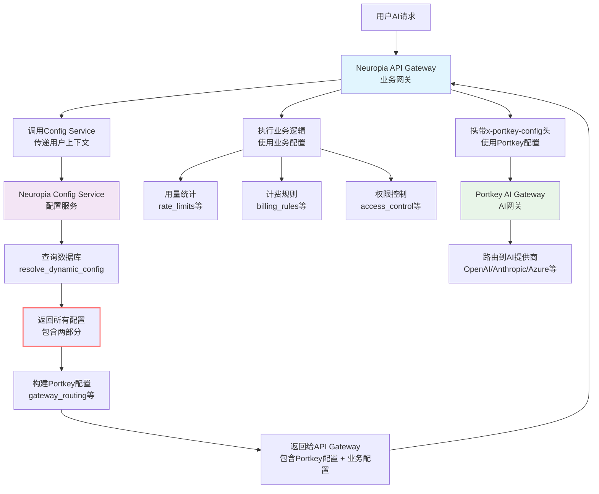

# portkey gateway 配置说明
Portkey Gateway（开源版）对 schema 有明确的要求和规则，主要涉及两个方面：一是 `x-portkey-config` header 中的 JSON 配置 schema（使用 Zod 进行验证），二是 `jsonSchema` 插件用于输出验证的 JSON Schema（基于标准 JSON Schema 规范）。这些规则确保配置的安全性、一致性和有效性。下面我基于文档详细说明，包括要求、规则、示例和潜在约束。

### 1. `x-portkey-config` 的 Schema 要求
这是 Portkey Gateway 的核心配置，通过 HTTP header 传递一个 JSON 字符串。Gateway 在请求处理管道的验证阶段使用 **Zod**（一个 TypeScript 类型安全的 schema 验证库）来解析和验证这个 JSON（具体在 `src/middlewares/requestValidator.ts` 中定义的 `configSchema`）。如果不符合 schema，请求会失败（通常返回错误响应）。

#### 主要规则和要求：
- **整体结构**：必须是一个有效的 JSON 对象，支持递归嵌套（例如 `targets` 可以嵌套策略）。
- **必填字段**：某些字段如 `targets[].provider` 是必需的，其他如 `retry.attempts` 有默认值。
- **类型严格**：Zod 强制类型检查（例如 `weight` 必须是 number）。
- **值约束**：
  - 枚举值：如 `strategy.mode` 必须是特定字符串。
  - 范围：如 `retry.attempts` 限制在 1–5。
  - 数组元素：如 `on_status_codes` 必须是 HTTP 状态码数组。
- **提供商白名单**：`targets[].provider` 必须在 `VALID_PROVIDERS` 常量中（例如 "openai"、"anthropic"、"azure-openai" 等），否则验证失败。
- **忽略未知字段**：Zod 通常宽松处理未知字段，但核心字段必须符合。
- **安全验证**：额外检查 SSRF（服务器端请求伪造）风险，例如：
  - 禁止元数据端点（如 "169.254.169.254"）。
  - 过滤私有 IP 范围（如 10.0.0.0/8）。
  - 拒绝内部 TLD（如 .local）。
- **Header 和 Content-Type**：必须有正确的 `Content-Type`（如 application/json），否则无法解析。

#### 详细 Schema 属性（表格形式，便于参考）：
| 属性                        | 类型          | 描述                   | 约束/默认值                                                 | 示例                                                        |
| --------------------------- | ------------- | ---------------------- | ----------------------------------------------------------- | ----------------------------------------------------------- |
| `strategy.mode`             | string        | 路由策略模式           | 必须是 "loadbalance"、"fallback"、"conditional" 或 "single" | "loadbalance"                                               |
| `targets`                   | array         | 目标提供商配置列表     | 每个元素必须有 `provider`；支持嵌套                         | [{"provider": "openai", "weight": 1}]                       |
| `targets[].provider`        | string        | AI 提供商名称          | 必须在白名单中                                              | "openai"                                                    |
| `targets[].weight`          | number        | 负载均衡权重           | 默认 1；用于随机选择                                        | 0.75                                                        |
| `targets[].override_params` | object        | 覆盖参数（如 api_key） | 可选；用于提供商特定设置                                    | {"api_key": "sk-..."}                                       |
| `retry.attempts`            | number        | 最大重试次数           | 范围 1–5；默认 0（禁用）                                    | 3                                                           |
| `retry.on_status_codes`     | array<number> | 触发重试的状态码       | 默认 [429, 500, 502, 503]                                   | [429, 502]                                                  |
| `request_timeout`           | number        | 请求超时（ms）         | 可选                                                        | 30000                                                       |
| `cache.mode`                | string        | 缓存模式               | "simple"（开源版支持）；"semantic"（企业版）                | "simple"                                                    |
| `before_request_hooks`      | array<object> | 输入验证钩子           | 每个对象指定插件（如 "regexMatch"）                         | [{"plugin": "modelWhitelist", "allowed_models": ["gpt-4"]}] |
| `after_request_hooks`       | array<object> | 输出验证钩子           | 类似 before hooks                                           | [{"plugin": "jsonSchema", "schema": {...}}]                 |
| `metadata`                  | object        | 自定义元数据           | 用于追踪或条件路由                                          | {"user_id": "123"}                                          |

#### 示例完整配置（符合 schema）：
```json
{
  "strategy": { "mode": "fallback" },
  "targets": [
    { "provider": "openai", "override_params": { "api_key": "sk-..." } },
    { "provider": "anthropic", "override_params": { "api_key": "sk-..." } }
  ],
  "retry": { "attempts": 3, "on_status_codes": [429, 502] },
  "cache": { "mode": "simple" },
  "before_request_hooks": [{ "plugin": "modelWhitelist", "allowed_models": ["gpt-4"] }],
  "after_request_hooks": [{ "plugin": "jsonSchema", "schema": { "type": "object", "properties": { "answer": { "type": "string" } } } }],
  "metadata": { "env": "prod" }
}
```

如果配置无效（如 mode 不是枚举值），Gateway 会返回错误，通常是 400 Bad Request 或类似。

- **开源版局限**：semantic 缓存或高级 schema 特性（如动态 schema）是企业版独有；开源版保持简单。
- **来源和调试**：这些规则来自 GitHub 仓库的 `requestValidator.ts`、`plugins/` 和 README。如果实现时出错，检查日志（设置 `LOG_LEVEL=debug`）或查看源代码。

## valid providers

```js
export const OPEN_AI: string = 'openai';
export const COHERE: string = 'cohere';
export const AZURE_OPEN_AI: string = 'azure-openai';
export const AZURE_AI_INFERENCE: string = 'azure-ai';
export const ANTHROPIC: string = 'anthropic';
export const ANYSCALE: string = 'anyscale';
export const PALM: string = 'palm';
export const TOGETHER_AI: string = 'together-ai';
export const GOOGLE: string = 'google';
export const GOOGLE_VERTEX_AI: string = 'vertex-ai';
export const HUGGING_FACE: string = 'huggingface';
export const PERPLEXITY_AI: string = 'perplexity-ai';
export const REKA_AI: string = 'reka-ai';
export const MISTRAL_AI: string = 'mistral-ai';
export const DEEPINFRA: string = 'deepinfra';
export const NCOMPASS: string = 'ncompass';
export const STABILITY_AI: string = 'stability-ai';
export const NOMIC: string = 'nomic';
export const OLLAMA: string = 'ollama';

```

###  fallback 模式示例

```json
{
  "x-portkey-config": {
    "strategy": {
      "mode": "fallback"
    },
    "targets": [
      {
        "provider": "openai",
        "overrideParams": {"model": "gpt-4"},
      },
      {
        "provider": "anthropic",
        "overrideParams": {"model": "claude-3-sonnet"},
      },
      {
        "provider": "azure-openai", 
        "overrideParams": {"model": "gpt-35-turbo"}
      }
    ]
  }
}
```

**实际场景**：当OpenAI API出现故障时，系统会自动尝试Anthropic，再不成功则用Azure，确保服务不中断。**依赖数组顺序** - 按 targets 数组中的顺序进行故障转移

## strategy.loadbalance 负载均衡的粒度

在 `loadbalance` 模式下，每个 `target` 都是一个独立的负载均衡单元，可以包含：

- 不同的 `provider`
- 不同的 `model`（通过 `overrideParams` 指定）
- 不同的权重 `weight`

### 实际配置示例

#### 不同 Provider + 不同 Model

```json
{
  "strategy": { "mode": "loadbalance" },
  "targets": [
    {
      "provider": "openai",
      "weight": 0.7,
      "overrideParams": { "model": "gpt-4" }
    },
    {
      "provider": "anthropic", 
      "weight": 0.3,
      "overrideParams": { "model": "claude-3-opus-20240229" }
    }
  ]
}
```

#### 同一 Provider + 不同 Model

```json
{
  "strategy": { "mode": "loadbalance" },
  "targets": [
    {
      "provider": "openai",
      "weight": 0.5,
      "overrideParams": { "model": "gpt-4" }
    },
    {
      "provider": "openai",
      "weight": 0.5, 
      "overrideParams": { "model": "gpt-3.5-turbo" }
    }
  ]
}
```

## 配置继承的两个层面

### 1. 优先级层面：子目标覆盖父目标

在执行时，如果子目标定义了某个配置，会优先使用子目标的配置：

```
// 子目标有 retry 时，使用子目标的 retry  
retry: currentTarget.retry  
  ? { ...currentTarget.retry }      // 子目标配置  
  : { ...inheritedConfig.retry },   // 父目标配置
```

handlerUtils.ts:495-500

### 2. 传递方向层面：单向从父到子

配置只能从父目标传递给子目标，子目标的配置变化不会反向影响父目标

### 实际例子

```
{  
  "retry": { "attempts": 5 },        // 父目标配置  
  "targets": [  
    {  
      "retry": { "attempts": 2 },    // 子目标配置（覆盖父级）  
      "provider": "openai"  
    },  
    {  
      "provider": "anthropic"        // 使用父级配置（attempts: 5）  
    }  
  ]  
}
```

# conditional

`strategy: "conditional"` 是 Portkey AI Gateway 中的一个路由策略，它允许您根据请求的元数据、参数或 URL 路径动态选择目标提供商。

## 基本用法

条件路由通过 `ConditionalRouter` 类实现 [1](#0-0) ，在 `tryTargetsRecursively` 函数中被调用 [2](#0-1) 。

### 配置结构

```json
{
  "strategy": {
    "mode": "conditional",
    "conditions": [
      {
        "query": { "条件表达式" },
        "then": "目标名称"
      }
    ],
    "default": "默认目标名称"
  },
  "targets": [
    {
      "name": "目标名称",
      "provider": "openai",
      "api_key": "..."
    }
  ]
}
```

## 支持的操作符

条件路由支持多种比较和逻辑操作符 [3](#0-2) ：

### 比较操作符
- `$eq` - 等于
- `$ne` - 不等于  
- `$gt` - 大于
- `$gte` - 大于等于
- `$lt` - 小于
- `$lte` - 小于等于
- `$in` - 在数组中
- `$nin` - 不在数组中
- `$regex` - 正则匹配

### 逻辑操作符
- `$and` - 逻辑与
- `$or` - 逻辑或

## 条件评估

条件可以基于以下上下文数据 [4](#0-3) ：
- `metadata` - 来自 `x-portkey-metadata` 头部的元数据
- `params` - 请求参数
- `url.pathname` - URL 路径

使用点号访问嵌套属性，如 `metadata.user_tier` [5](#0-4) 。

## 实际示例

```json
{
  "strategy": {
    "mode": "conditional",
    "conditions": [
      {
        "query": { 
          "metadata.user_tier": { "$eq": "premium" }
        },
        "then": "gpt4-target"
      },
      {
        "query": {
          "$or": [
            { "params.model": { "$regex": "gpt-4" } },
            { "metadata.region": { "$in": ["us", "eu"] } }
          ]
        },
        "then": "anthropic-target"
      }
    ],
    "default": "gpt35-target"
  },
  "targets": [
    {
      "name": "gpt4-target",
      "provider": "openai",
      "api_key": "sk-...",
      "override_params": { "model": "gpt-4" }
    },
    {
      "name": "anthropic-target", 
      "provider": "anthropic",
      "api_key": "sk-ant-..."
    },
    {
      "name": "gpt35-target",
      "provider": "openai", 
      "api_key": "sk-...",
      "override_params": { "model": "gpt-3.5-turbo" }
    }
  ]
}
```

## 执行流程

1. 解析 `x-portkey-metadata` 头部获取元数据 [6](#0-5) 
2. 创建 `ConditionalRouter` 实例 [7](#0-6) 
3. 按顺序评估每个条件 [8](#0-7) 
4. 返回第一个匹配条件的目标
5. 如果无匹配且有默认值，返回默认目标 [9](#0-8) 
6. 否则抛出错误 [10](#0-9) 

# cache

### 1. disable 状态的处理

是的，disable 状态意味着不写 `cache` 属性或设置为 `false`。从 `conf.example.json` 可以看到全局缓存设置为 `false` [1](#15-0) 。

### 2. 开源版的缓存模式和 Redis 依赖

开源版支持 `simple` 模式，但不强制要求 Redis。

#### 支持的缓存后端
从 `cache/index.ts` 可以看到，系统支持多种缓存后端 [3](#15-2) ：

- **memory** - 内存缓存（默认本地选项）
- **redis** - Redis 缓存（可选）
- **file** - 文件缓存
- **cloudflareKV** - Cloudflare KV（仅 Workers 环境）

#### Redis 初始化条件
Redis 只在满足条件时才初始化 [4](#15-3) ：

```typescript
export function createCacheBackendsRedis(redisUrl: string): void {
  // 只有在提供 redisUrl 时才使用 Redis
  defaultCache = new CacheService({
    backend: 'redis',
    redisUrl: redisUrl,
    // ...
  });
}
```

#### 本地缓存选项
如果不使用 Redis，系统会创建本地缓存后端 [5](#15-4) ：

```typescript
export async function createCacheBackendsLocal(): Promise<void> {
  defaultCache = new CacheService({
    backend: 'memory',  // 使用内存缓存
    defaultTtl: MS['5_MINUTES'],
    maxSize: 1000,
  });
}
```

### 其他控制字段

除了 `mode`，还有以下控制字段：

#### 1. `max_age` 参数

- 可选参数，用于设置缓存过期时间 
- 在 `requestContext.ts` 中会被转换为数字类型的毫秒值 requestContext.ts:167-171

#### 2. 缓存状态

系统内部维护多种缓存状态 index.ts:5-12

- 可以通过 `x-portkey-cache-force-refresh` 头强制刷新缓存

## 详细说明

### 缓存配置选项

| 模式       | 描述           | Redis 依赖 |
| ---------- | -------------- | ---------- |
| 不设置     | 禁用缓存       | 无         |
| `simple`   | 简单键值缓存   | 可选       |
| `semantic` | 语义相似性缓存 | 可选       |

### 部署场景

#### 无 Redis 环境
```json
{
  "cache": {
    "mode": "simple",
    "max_age": 3600
  }
}
```
- 使用内存缓存
- 数据存储在进程内存中
- 重启后缓存丢失

#### 有 Redis 环境
```json
{
  "cache": {
    "mode": "simple", 
    "max_age": 3600
  }
}
```
- 设置环境变量 `REDIS_CONNECTION_STRING`
- 使用 Redis 作为缓存后端
- 支持分布式部署

## Notes

- `simple` 模式在开源版中完全可用，不依赖 Redis
- Redis 是可选的分布式缓存解决方案，主要用于生产环境和多实例部署
- 内存缓存适合单实例开发环境
- `semantic` 模式可能需要额外的向量存储支持

# 基于portkey gateway 的配置系统设计

# 表

```postgresql
-- 核心元数据表（定义系统本身）
CREATE TABLE data.config_levels (
    level_name TEXT PRIMARY KEY,        -- 'global', 'tenant', 'user', 'virtual_key'
    display_name TEXT NOT NULL,         -- 显示名称
    parent_level TEXT REFERENCES data.config_levels(level_name), -- 父级层级
    inherit_priority INTEGER NOT NULL,  -- 继承优先级（数字越小优先级越高）
    description TEXT,
    is_system_level BOOLEAN DEFAULT false, -- 系统层级不可删除
    created_at TIMESTAMPTZ DEFAULT NOW()
);

-- 配置类型定义（所有可配置项）
CREATE TABLE data.config_types (
    type_name TEXT PRIMARY KEY,           -- 'rate_limits', 'model_access', 'billing_rules'
    display_name TEXT NOT NULL,           -- 显示名称
    value_schema JSONB NOT NULL,          -- JSON Schema验证规则
    default_value JSONB,                  -- 全局默认值
    merge_strategy TEXT NOT NULL,         -- 'override', 'deep_merge', 'array_append'
    description TEXT,
    is_system_type BOOLEAN DEFAULT false, -- 系统类型不可删除
    created_at TIMESTAMPTZ DEFAULT NOW(),
    supports_tier_entitlements boolean DEFAULT true
);

-- 合并策略定义（可扩展的合并逻辑）
CREATE TABLE data.merge_strategies (
    strategy_name TEXT PRIMARY KEY,       -- 'override', 'deep_merge', 'array_append'
    description TEXT NOT NULL,
    implementation_function TEXT,         -- 实现函数名（可自定义）
    is_builtin BOOLEAN DEFAULT true,
    created_at TIMESTAMPTZ DEFAULT NOW()
);

-- 动态继承规则系统
-- 层级间继承规则（完全可配置）
CREATE TABLE data.inheritance_rules (
    id UUID DEFAULT gen_random_uuid() PRIMARY KEY,
    parent_level TEXT NOT NULL REFERENCES data.config_levels(level_name),
    child_level TEXT NOT NULL REFERENCES data.config_levels(level_name),
    config_type TEXT NOT NULL REFERENCES data.config_types(type_name),
    
    -- 继承控制
    is_inheritance_enabled BOOLEAN DEFAULT true,
    custom_merge_strategy TEXT REFERENCES data.merge_strategies(strategy_name),
    conflict_resolution TEXT DEFAULT 'child_wins', -- 'parent_wins', 'child_wins', 'merge'
    
    -- 条件继承
    condition_expression JSONB, -- {"field": "tier_name", "operator": "in", "value": ["premium", "enterprise"]}
    condition_description TEXT,
    
    -- 生效控制
    is_active BOOLEAN DEFAULT true,
    effective_from TIMESTAMPTZ DEFAULT NOW(),
    effective_to TIMESTAMPTZ,
    
    UNIQUE(parent_level, child_level, config_type)
);
CREATE OR REPLACE TRIGGER prevent_inheritance_cycle_trigger
    BEFORE INSERT OR UPDATE 
    ON data.inheritance_rules
    FOR EACH ROW
    EXECUTE FUNCTION data.prevent_inheritance_cycle();

-- 套餐定义（业务模型核心）
CREATE TABLE data.tier_definitions (
    tier_name TEXT PRIMARY KEY,
    display_name TEXT NOT NULL,
    description TEXT,
    
    -- 定价信息
    pricing_model TEXT DEFAULT 'monthly', -- 'monthly', 'pay_as_you_go', 'custom'
    base_price NUMERIC(10,4),
    currency TEXT DEFAULT 'CNY',
    
    -- 业务逻辑
    is_public BOOLEAN DEFAULT true,
    is_active BOOLEAN DEFAULT true,
    display_order INTEGER DEFAULT 1,
    
    -- 元数据
    created_at TIMESTAMPTZ DEFAULT NOW(),
    updated_at TIMESTAMPTZ DEFAULT NOW()
);

-- 套餐特性映射（套餐与配置的关联）
CREATE TABLE data.tier_feature_mappings (
    id UUID DEFAULT gen_random_uuid() PRIMARY KEY,
    tier_name TEXT NOT NULL REFERENCES data.tier_definitions(tier_name),
    config_type TEXT NOT NULL REFERENCES data.config_types(type_name),
    
    -- 特性配置
    feature_value JSONB NOT NULL,           -- 该套餐的配置值
    is_default_for_tier BOOLEAN DEFAULT true, -- 是否套餐默认特性
    
    -- 条件特性
    condition_expression JSONB,             -- 满足条件时才生效
    condition_description TEXT,
    
    -- 生效控制
    is_active BOOLEAN DEFAULT true,
    effective_from TIMESTAMPTZ DEFAULT NOW(),
    effective_to TIMESTAMPTZ,
    
    UNIQUE(tier_name, config_type) -- 一个套餐一个配置类型只能有一条有效记录
);
CREATE OR REPLACE TRIGGER prevent_unsupported_tier_features_trigger
    BEFORE INSERT OR UPDATE 
    ON data.tier_feature_mappings
    FOR EACH ROW
    EXECUTE FUNCTION data.prevent_unsupported_tier_features();

-- 统一配置存储（所有配置都在这里）
CREATE TABLE IF NOT EXISTS data.unified_config_store
(
    id uuid NOT NULL DEFAULT gen_random_uuid(),
    config_type text COLLATE pg_catalog."default" NOT NULL,
    level_name text COLLATE pg_catalog."default" NOT NULL,
    scope_id uuid,
    config_value jsonb NOT NULL,
    version integer DEFAULT 1,
    version_notes text COLLATE pg_catalog."default",
    effective_from timestamp with time zone DEFAULT now(),
    effective_to timestamp with time zone,
    applied_tier text COLLATE pg_catalog."default",
    condition_context jsonb,
    created_by uuid,
    created_at timestamp with time zone DEFAULT now(),
    updated_at timestamp with time zone DEFAULT now(),
    CONSTRAINT unified_config_store_pkey PRIMARY KEY (id),
    CONSTRAINT unified_config_store_applied_tier_fkey FOREIGN KEY (applied_tier)
        REFERENCES data.tier_definitions (tier_name) MATCH SIMPLE
        ON UPDATE NO ACTION
        ON DELETE NO ACTION,
    CONSTRAINT unified_config_store_config_type_fkey FOREIGN KEY (config_type)
        REFERENCES data.config_types (type_name) MATCH SIMPLE
        ON UPDATE NO ACTION
        ON DELETE NO ACTION,
    CONSTRAINT unified_config_store_created_by_fkey FOREIGN KEY (created_by)
        REFERENCES auth.login (id) MATCH SIMPLE
        ON UPDATE NO ACTION
        ON DELETE NO ACTION,
    CONSTRAINT unified_config_store_level_name_fkey FOREIGN KEY (level_name)
        REFERENCES data.config_levels (level_name) MATCH SIMPLE
        ON UPDATE NO ACTION
        ON DELETE NO ACTION,
    CONSTRAINT scope_constraint CHECK ((level_name = ANY (ARRAY['global'::text, 'test_global'::text])) AND scope_id IS NULL OR (level_name <> ALL (ARRAY['global'::text, 'test_global'::text])) AND scope_id IS NOT NULL)
)
CREATE OR REPLACE TRIGGER check_scope_trigger
    BEFORE INSERT OR UPDATE 
    ON data.unified_config_store
    FOR EACH ROW
    EXECUTE FUNCTION data.check_scope_constraint();

-- Trigger: prevent_unsupported_tier_references_trigger
CREATE OR REPLACE TRIGGER prevent_unsupported_tier_references_trigger
    BEFORE INSERT OR UPDATE 
    ON data.unified_config_store
    FOR EACH ROW
    EXECUTE FUNCTION data.prevent_unsupported_tier_references();

-- Trigger: validate_config_effective_period_trigger
CREATE OR REPLACE TRIGGER validate_config_effective_period_trigger
    BEFORE INSERT OR UPDATE 
    ON data.unified_config_store
    FOR EACH ROW
    EXECUTE FUNCTION data.validate_config_effective_period();

-- Trigger: validate_config_schema_trigger
CREATE OR REPLACE TRIGGER validate_config_schema_trigger
    BEFORE INSERT OR UPDATE 
    ON data.unified_config_store
    FOR EACH ROW
    EXECUTE FUNCTION data.validate_config_schema();

-- 高性能索引
CREATE INDEX idx_unified_config_lookup ON data.unified_config_store(level_name, scope_id, config_type) 
WHERE effective_to IS NULL;

CREATE INDEX idx_unified_config_tier ON data.unified_config_store(applied_tier);
CREATE INDEX idx_unified_config_effective ON data.unified_config_store(effective_from, effective_to);


```

# 函数

```postgresql
-- 增强版配置解析函数（支持完整动态性）
CREATE OR REPLACE FUNCTION api.resolve_dynamic_config(
	p_config_type text,
	p_target_level text,
	p_target_scope_id uuid,
	p_context jsonb DEFAULT '{}'::jsonb)
    RETURNS jsonb
    LANGUAGE 'plpgsql'
    COST 100
    VOLATILE PARALLEL UNSAFE
AS $BODY$
DECLARE
    v_result JSONB;
    v_inheritance_path TEXT[];
    v_current_config JSONB;
    v_i INTEGER;
    v_found_any_config BOOLEAN := false;
    v_current_level TEXT;
    v_tier_config JSONB;
    v_has_specific_config BOOLEAN := false;
BEGIN
 
    -- 🟢 先获取套餐配置
IF p_context ? 'tier_name' THEN
    -- 🟢 新增检查
    IF EXISTS (
        SELECT 1 FROM data.config_types 
        WHERE type_name = p_config_type 
        AND supports_tier_entitlements = true
    ) THEN
        v_tier_config := api.get_tier_default_config(p_config_type, p_context->>'tier_name', p_context);
        RAISE NOTICE '🎯 套餐权益: %', v_tier_config;
    ELSE
        v_tier_config := NULL;
        RAISE NOTICE '⚠️ 配置类型"%s"不支持套餐权益', p_config_type;
    END IF;
ELSE
    v_tier_config := NULL;
END IF;

    -- 1. 构建继承路径
    RAISE NOTICE '📋 步骤1: 构建继承路径...';
    WITH RECURSIVE inheritance_path AS (
        SELECT 
            level_name,
            parent_level,
            inherit_priority,
            1 as depth,
            level_name as start_level
        FROM data.config_levels 
        WHERE level_name = p_target_level
        
        UNION ALL
        
        SELECT 
            parent.level_name,
            parent.parent_level,
            parent.inherit_priority,
            ip.depth + 1,
            ip.start_level
        FROM data.config_levels parent
        INNER JOIN inheritance_path ip ON parent.level_name = ip.parent_level
        WHERE ip.parent_level IS NOT NULL
          AND ip.depth < 10     -- 深度限制              -- 继承完整性保障
          AND EXISTS (          -- 确保继承规则存在且有效
            SELECT 1 FROM data.inheritance_rules ir
            WHERE ir.parent_level = parent.level_name
              AND ir.child_level = ip.level_name
              AND ir.config_type = p_config_type
              AND ir.is_inheritance_enabled = true
              AND ir.is_active = true
              AND (ir.effective_to IS NULL OR ir.effective_to > NOW())
          )
    )
    SELECT ARRAY_AGG(ip.level_name ORDER BY ip.inherit_priority ASC, ip.depth ASC) 
    INTO v_inheritance_path
    FROM inheritance_path ip;
    
    IF v_inheritance_path IS NULL THEN
        v_inheritance_path := ARRAY[p_target_level];
    END IF;
    
    RAISE NOTICE '✅ 继承路径: %', v_inheritance_path;

    -- 2. 按路径顺序合并配置
    RAISE NOTICE '🔄 步骤2: 合并配置...';
    v_result := NULL;
    v_found_any_config := false;
    v_has_specific_config := false;
    
    FOR v_i IN 1..array_length(v_inheritance_path, 1) LOOP
        v_current_level := v_inheritance_path[v_i];
        RAISE NOTICE '  处理层级 %/%: %', v_i, array_length(v_inheritance_path, 1), v_current_level;
        
        v_current_config := api.get_level_config_with_context(
            p_config_type,
            v_current_level,
            CASE 
                WHEN v_current_level = p_target_level THEN p_target_scope_id
                ELSE NULL
            END,
            p_context
        );
        
        RAISE NOTICE '  配置结果: %', v_current_config;
        
        IF v_current_config IS NOT NULL THEN
            v_found_any_config := true;
            
            IF v_current_level = p_target_level AND p_target_scope_id IS NOT NULL THEN
                v_has_specific_config := true;
                RAISE NOTICE '  🎯 找到特定配置，标记为已找到特定配置';
            END IF;
            
            IF v_result IS NULL THEN
                v_result := v_current_config;
                RAISE NOTICE '  初始配置: %', v_result;
            ELSE
                v_result := api.dynamic_merge_config(
                    v_result, 
                    v_current_config, 
                    p_config_type,
                    v_current_level,
                    p_context
                );
                RAISE NOTICE '  合并后结果: %', v_result;
            END IF;
        END IF;
    END LOOP;

    RAISE NOTICE '📊 合并完成结果: %, 找到配置: %, 有特定配置: %', v_result, v_found_any_config, v_has_specific_config;
    
    -- 🟢 步骤3: 简化的套餐应用逻辑
    IF v_tier_config IS NOT NULL THEN
        -- 情况1: 没有找到任何配置 → 直接使用套餐
        IF v_result IS NULL THEN
            RAISE NOTICE '🍰 情况1: 无任何配置，直接使用套餐';
            v_result := v_tier_config;
        
        -- 🟢 情况2: 有配置但没有特定配置 → 强制使用套餐配置
        ELSIF NOT v_has_specific_config THEN
            RAISE NOTICE '🍰 情况2: 有默认配置但无特定配置，强制使用套餐配置';
            v_result := v_tier_config;  -- 🟢 直接使用套餐，忽略默认配置
            RAISE NOTICE '  🎯 套餐配置覆盖默认配置: %', v_result;
        
        -- 情况3: 有特定配置 → 保持现有逻辑（特定配置优先）
        ELSE
            RAISE NOTICE '🍰 情况3: 有特定配置，保持现有结果（特定配置优先）';
            -- 不修改 v_result
        END IF;
    END IF;
    
    -- 4. 如果还是没有配置，使用全局默认值
    IF v_result IS NULL THEN
        RAISE NOTICE '🌍 步骤4: 使用全局默认值';
        SELECT default_value INTO v_result
        FROM data.config_types
        WHERE type_name = p_config_type;
        RAISE NOTICE '  全局默认值: %', v_result;
    END IF;
    
    RAISE NOTICE '🎯 最终结果: %', v_result;
    RETURN v_result;
END;
$BODY$;

CREATE OR REPLACE FUNCTION api.get_level_config_with_context(
	p_config_type text,
	p_level_name text,
	p_scope_id uuid DEFAULT NULL::uuid,
	p_context jsonb DEFAULT '{}'::jsonb)
    RETURNS jsonb
    LANGUAGE 'plpgsql'
    COST 100
    STABLE PARALLEL UNSAFE
AS $BODY$
DECLARE
    v_config JSONB;
    v_tier_name TEXT;
BEGIN
    v_tier_name := p_context->>'tier_name';
    
    RAISE NOTICE '    🔍 查询配置: type=%, level=%, scope_id=%, tier=%', 
        p_config_type, p_level_name, p_scope_id, v_tier_name;
    
    -- 🟢 明确区分两种情况：
    IF p_scope_id IS NOT NULL THEN
        -- 情况1：查询特定实体的配置（精确匹配 scope_id）
        SELECT ucs.config_value INTO v_config
        FROM data.unified_config_store ucs
        WHERE ucs.config_type = p_config_type
          AND ucs.level_name = p_level_name
          AND ucs.scope_id = p_scope_id  -- 🟢 精确匹配
          AND (ucs.effective_to IS NULL OR ucs.effective_to > NOW())
          AND (ucs.applied_tier IS NULL OR ucs.applied_tier = v_tier_name)
          AND (ucs.condition_context IS NULL OR api.evaluate_condition(ucs.condition_context, p_context))
        ORDER BY 
            CASE WHEN ucs.applied_tier = v_tier_name THEN 1 ELSE 2 END,
            ucs.version DESC
        LIMIT 1;
    ELSE
        -- 情况2：查询默认配置（用于继承），只找 scope_id IS NULL 的记录
        SELECT ucs.config_value INTO v_config
        FROM data.unified_config_store ucs
        WHERE ucs.config_type = p_config_type
          AND ucs.level_name = p_level_name
          AND ucs.scope_id IS NULL  -- 🟢 只找默认配置
          AND (ucs.effective_to IS NULL OR ucs.effective_to > NOW())
          AND (ucs.applied_tier IS NULL OR ucs.applied_tier = v_tier_name)
          AND (ucs.condition_context IS NULL OR api.evaluate_condition(ucs.condition_context, p_context))
        ORDER BY 
            CASE WHEN ucs.applied_tier = v_tier_name THEN 1 ELSE 2 END,
            ucs.version DESC
        LIMIT 1;
    END IF;
    
    RAISE NOTICE '    📦 找到配置: %', v_config;
    
    RETURN v_config;
END;
$BODY$;


CREATE OR REPLACE FUNCTION api.get_tier_default_config(
	p_config_type text,
	p_tier_name text,
	p_context jsonb DEFAULT '{}'::jsonb)
    RETURNS jsonb
    LANGUAGE 'plpgsql'
    COST 100
    STABLE PARALLEL UNSAFE
AS $BODY$
DECLARE
    v_config JSONB;
BEGIN
    RAISE NOTICE '    🍰 查询套餐默认配置: type=%, tier=%', p_config_type, p_tier_name;
    
    -- 查询套餐特性映射，考虑条件和生效时间
    SELECT tfm.feature_value INTO v_config
    FROM data.tier_feature_mappings tfm
    WHERE tfm.tier_name = p_tier_name
      AND tfm.config_type = p_config_type
      AND tfm.is_active = true
      AND (tfm.effective_to IS NULL OR tfm.effective_to > NOW())
      AND (
        -- 条件匹配
        tfm.condition_expression IS NULL 
        OR api.evaluate_condition(tfm.condition_expression, p_context)
      )
    ORDER BY 
        -- 优先级：有条件匹配的 > 无条件默认的
        CASE WHEN tfm.condition_expression IS NULL THEN 2 ELSE 1 END,
        tfm.effective_from DESC
    LIMIT 1;
    
    RAISE NOTICE '    📦 套餐配置结果: %', v_config;
    RETURN v_config;
END;
$BODY$;


CREATE OR REPLACE FUNCTION api.dynamic_merge_config(
	parent_config jsonb,
	child_config jsonb,
	p_config_type text,
	current_level text,
	context jsonb)
    RETURNS jsonb
    LANGUAGE 'plpgsql'
    COST 100
    STABLE PARALLEL UNSAFE
AS $BODY$
DECLARE
    v_merge_strategy TEXT;
    v_custom_strategy TEXT;
    v_default_strategy TEXT;
BEGIN
    -- 如果父配置为空，直接返回子配置
    IF parent_config IS NULL THEN
        RETURN child_config;
    END IF;
    
    -- 如果子配置为空，直接返回父配置
    IF child_config IS NULL THEN
        RETURN parent_config;
    END IF;
    
    -- 查找配置类型的默认合并策略
    SELECT merge_strategy INTO v_default_strategy
    FROM data.config_types
    WHERE type_name = p_config_type;
    
    -- 查找继承规则中的自定义策略
    SELECT ir.custom_merge_strategy INTO v_custom_strategy
    FROM data.inheritance_rules ir
    WHERE ir.config_type = p_config_type
      AND ir.child_level = current_level
      AND ir.is_active = true
      AND (ir.effective_to IS NULL OR ir.effective_to > NOW())
      AND (ir.condition_expression IS NULL OR api.evaluate_condition(ir.condition_expression, context));
    
    -- 确定使用的合并策略（优先使用自定义策略）
    v_merge_strategy := COALESCE(v_custom_strategy, v_default_strategy, 'override');
    
    RAISE NOTICE '    🎯 合并策略: % (自定义: %, 默认: %)', 
        v_merge_strategy, v_custom_strategy, v_default_strategy;
    
    -- 执行合并
    CASE v_merge_strategy
        WHEN 'override' THEN
            RAISE NOTICE '    🔄 使用覆盖策略';
            RETURN child_config;
            
        WHEN 'deep_merge' THEN
            RAISE NOTICE '    🔄 使用深度合并策略';
            RETURN parent_config || child_config;
            
        WHEN 'array_append' THEN
            RAISE NOTICE '    🔄 使用数组追加策略';
            -- 智能数组合并：合并所有数组字段，其他字段使用子配置
            RETURN jsonb_build_object(
                'allowed_models', 
                COALESCE(parent_config->'allowed_models', '[]'::jsonb) || 
                COALESCE(child_config->'allowed_models', '[]'::jsonb)
            ) || (child_config - 'allowed_models');
            
        WHEN 'array_merge' THEN
            RAISE NOTICE '    🔄 使用数组合并策略';
            -- 与 array_append 相同
            RETURN jsonb_build_object(
                'allowed_models', 
                COALESCE(parent_config->'allowed_models', '[]'::jsonb) || 
                COALESCE(child_config->'allowed_models', '[]'::jsonb)
            ) || (child_config - 'allowed_models');
            
        ELSE
            RAISE NOTICE '    ⚠️ 使用默认覆盖策略';
            RETURN child_config;
    END CASE;
END;
$BODY$;


CREATE OR REPLACE FUNCTION api.evaluate_condition(
	condition_expression jsonb,
	context jsonb)
    RETURNS boolean
    LANGUAGE 'plpgsql'
    COST 100
    STABLE PARALLEL UNSAFE
AS $BODY$
DECLARE
    v_field TEXT;
    v_operator TEXT;
    v_value JSONB;
    v_context_value JSONB;
    v_result BOOLEAN := false;
BEGIN
    -- 参数验证
    IF condition_expression IS NULL OR context IS NULL THEN
        RETURN false;
    END IF;
    
    -- 提取字段
    BEGIN
        v_field := condition_expression->>'field';
        v_operator := condition_expression->>'operator';
        v_value := condition_expression->'value';
        v_context_value := context->v_field;
    EXCEPTION
        WHEN OTHERS THEN
            RAISE NOTICE '    ⚠️ 条件表达式格式错误: %', condition_expression;
            RETURN false;
    END;
    
    -- 验证必需字段
    IF v_field IS NULL OR v_operator IS NULL THEN
        RAISE NOTICE '    ⚠️ 缺少必需字段: field=%, operator=%', v_field, v_operator;
        RETURN false;
    END IF;
    
    RAISE NOTICE '    🎯 条件评估: field=%, operator=%, value=%, context_value=%', 
        v_field, v_operator, v_value, v_context_value;
    
    -- 健壮的条件评估
    BEGIN
        CASE v_operator
            WHEN 'equals' THEN
                v_result := (v_context_value = v_value);
                
            WHEN 'in' THEN
                IF jsonb_typeof(v_value) = 'array' AND v_context_value IS NOT NULL THEN
                    v_result := EXISTS (
                        SELECT 1 
                        FROM jsonb_array_elements(v_value) AS elem
                        WHERE elem = v_context_value
                    );
                ELSE
                    v_result := false;
                END IF;
                
            WHEN 'not_in' THEN
                IF jsonb_typeof(v_value) = 'array' AND v_context_value IS NOT NULL THEN
                    v_result := NOT EXISTS (
                        SELECT 1 
                        FROM jsonb_array_elements(v_value) AS elem
                        WHERE elem = v_context_value
                    );
                ELSE
                    v_result := false;
                END IF;
                
            WHEN 'greater_than' THEN
                BEGIN
                    v_result := (v_context_value::NUMERIC) > (v_value::NUMERIC);
                EXCEPTION
                    WHEN OTHERS THEN
                        v_result := false;
                END;
                
            WHEN 'less_than' THEN
                BEGIN
                    v_result := (v_context_value::NUMERIC) < (v_value::NUMERIC);
                EXCEPTION
                    WHEN OTHERS THEN
                        v_result := false;
                END;
                
            WHEN 'exists' THEN
                v_result := (context ? v_field);
                
            ELSE
                RAISE NOTICE '    ⚠️ 未知操作符: %', v_operator;
                v_result := false;
        END CASE;
    EXCEPTION
        WHEN OTHERS THEN
            RAISE NOTICE '    ⚠️ 条件评估出错: %', SQLERRM;
            v_result := false;
    END;
    
    RETURN v_result;
END;
$BODY$;

```

# config service 的 portkey config builder

另外, 我们另一个组件: neuriopia_config_service, 负责接收网关过来的客户AI请求, 并在通过配置系统的resolve_dynamic_config 函数返回配置. 然后建立builder来建立符合portkey gateway要求的请求:

```js
static buildPortkeyConfig(dynamicConfigs, context, requestBody) {
    const { model, temperature = 0.7, top_p = 0.8 } = requestBody || {};  // 默认值 + 解构校验
    if (!model) throw new Error('❌ requestBody缺少model字段');

    const provider = this.inferProvider(model);
    const apiKey = this.getRealApiKey(model);
    if (!provider || !apiKey) throw new Error(`❌ 无效model: ${model} (provider或apiKey缺失)`);

    const routing = dynamicConfigs?.gateway_routing || {};
    const rateLimits = dynamicConfigs?.rate_limits || {};
    const cacheStrategy = dynamicConfigs?.cache_strategy || {};
    const hooks = dynamicConfigs?.hooks || {};  // 未用，可扩展为before/after hooks

    // 🎯 strategy.mode 校验
    const validModes = ["loadbalance", "fallback", "conditional", "single"];
    const strategyMode = validModes.includes(routing.routing_strategy) ? routing.routing_strategy : "fallback";

    // 🎯 retry.attempts 校验
    const rawAttempts = routing.retry_attempts ?? 0;
    const attempts = Number.isFinite(Number(rawAttempts)) ? Number(rawAttempts) : 0;
    if (attempts < 0 || attempts > 5) throw new Error(`❌ retry.attempts 超出范围: ${attempts}`);

    // 🎯 retry.on_status_codes 默认值
    const onStatusCodes = Array.isArray(routing.retry_status_codes) && routing.retry_status_codes.length > 0
        ? routing.retry_status_codes
        : [429, 500, 502, 503];

    // 🎯 支持多targets（从dynamicConfigs扩展）
    const targets = dynamicConfigs.targets?.length > 0
        ? dynamicConfigs.targets.map(target => ({
            provider: target.provider || provider,
            weight: target.weight || 1,
            api_key: target.api_key || apiKey,
            override_params: {
                model: target.model || model,
                max_tokens: target.max_tokens || rateLimits.max_tokens || 2000,
                temperature: target.temperature || temperature,
                top_p: target.top_p || top_p
            }
        }))
        : [{
            provider,
            weight: 1,
            api_key: apiKey,
            override_params: { model, max_tokens: rateLimits.max_tokens || 2000, temperature, top_p }
        }];

    // 🎯 构建配置对象
    const portkeyConfig = {
        strategy: { mode: strategyMode, on_status_codes: onStatusCodes },
        targets,
        retry: { attempts, on_status_codes: onStatusCodes },
        cache: cacheStrategy.enabled ? {
            mode: cacheStrategy.mode || "simple",
            max_age: cacheStrategy.max_age || 300
        } : undefined,  // 如果!enabled，删除cache（禁用）
        before_request_hooks: hooks.before || [],  // 扩展hooks
        after_request_hooks: hooks.after || [],
        metadata: {
            user_id: context.user_id,
            virtual_key: context.virtual_key,
            tier_name: context.tier_name,
            environment: process.env.NODE_ENV || 'development',
            resolved_at: new Date().toISOString(),
            config_source: 'neuropia_dynamic_config'
        }
    };

    // 🎯 日志优化（结构化）
    const logData = {
        dynamicConfigs,
        portkeyConfig,
        summary: { provider, model, strategy: portkeyConfig.strategy.mode, has_api_key: !!apiKey }
    };
    console.log('✅ Generated Portkey Config:', JSON.stringify(logData, null, 2));

    return { apikey: apiKey, ...portkeyConfig };
}
```

## 🎯 核心问题：配置项从哪来？

**答案是：配置项完全由你的 `PortkeyConfigBuilder` 决定！**

你的 builder 代码明确要求这些配置项：

```javascript
// 你的builder代码明确需要这些配置：
const routing = dynamicConfigs?.gateway_routing || {};
const rateLimits = dynamicConfigs?.rate_limits || {};
const cacheStrategy = dynamicConfigs?.cache_strategy || {};
const hooks = dynamicConfigs?.hooks || {};
```

## 📋 必须的配置项清单

基于你的 builder，你必须提供这些配置：

### 1. `gateway_routing` - 网关路由配置
```json
{
  "routing_strategy": "fallback",  // 或 "loadbalance", "conditional", "single"
  "retry_attempts": 3,
  "retry_status_codes": [429, 500, 502, 503]
}
```

### 2. `rate_limits` - 频率限制  
```json
{
  "max_tokens": 4000,
  "requests_per_minute": 60
}
```

### 3. `cache_strategy` - 缓存策略
```json
{
  "enabled": true,
  "mode": "simple", 
  "max_age": 300
}
```

### 4. `hooks` - 钩子（可选）
```json
{
  "before": [],
  "after": []
}
```

### 5. `targets` - 多目标路由（可选）
```json
{
  "targets": [
    {
      "provider": "openai",
      "weight": 1,
      "model": "gpt-4",
      "max_tokens": 8000
    }
  ]
}
```

## 🔄 这些配置项的含义

### `gateway_routing.routing_strategy`
- `"fallback"` - 故障转移：第一个失败时用第二个
- `"loadbalance"` - 负载均衡：按权重分配请求  
- `"single"` - 单目标：只用第一个提供商
- `"conditional"` - 条件路由：根据条件选择

### `rate_limits`
- `max_tokens` - 每次请求最大token数
- `requests_per_minute` - 每分钟请求数限制

### `cache_strategy`  
- `enabled` - 是否启用缓存
- `mode` - 缓存模式（"simple"）
- `max_age` - 缓存有效期（秒）

## 🚀 最简单的实施方法

### 步骤1：在数据库定义这些配置类型
```sql
INSERT INTO data.config_types (type_name, display_name, value_schema, default_value, merge_strategy) VALUES
('gateway_routing', '网关路由', '{"type": "object"}', '{"routing_strategy": "fallback", "retry_attempts": 2}', 'override'),
('rate_limits', '频率限制', '{"type": "object"}', '{"max_tokens": 4000, "requests_per_minute": 60}', 'deep_merge'),
('cache_strategy', '缓存策略', '{"type": "object"}', '{"enabled": false, "mode": "simple"}', 'override');
```

### 步骤2：设置全局默认配置
```sql
-- 全局默认路由配置
INSERT INTO data.unified_config_store (level_name, config_type, config_value) VALUES
('global', 'gateway_routing', '{"routing_strategy": "fallback", "retry_attempts": 3}'),
('global', 'rate_limits', '{"max_tokens": 4000, "requests_per_minute": 60}'),
('global', 'cache_strategy', '{"enabled": true, "mode": "simple", "max_age": 300}');
```

### 步骤3：为不同套餐设置不同配置
```sql
-- 基础版套餐
INSERT INTO data.tier_feature_mappings (tier_name, config_type, feature_value) VALUES
('basic', 'rate_limits', '{"max_tokens": 4000, "requests_per_minute": 60}'),
('basic', 'gateway_routing', '{"routing_strategy": "single", "retry_attempts": 2}');

-- 专业版套餐  
INSERT INTO data.tier_feature_mappings (tier_name, config_type, feature_value) VALUES
('premium', 'rate_limits', '{"max_tokens": 16000, "requests_per_minute": 300}'),
('premium', 'gateway_routing', '{"routing_strategy": "loadbalance", "retry_attempts": 3}');
```

## 💡 关键理解

1. **配置项来源**：完全由你的 `PortkeyConfigBuilder` 代码决定
2. **配置项含义**：对应 Portkey Gateway 的功能需求
3. **配置系统作用**：只是存储和管理这些配置项的值
4. **套餐系统作用**：为不同用户提供不同的配置值

## 🎯 最简单的测试

```javascript
// 当用户请求时，你的config_service这样做：
const dynamicConfigs = {
  gateway_routing: {
    routing_strategy: "fallback",
    retry_attempts: 3,
    retry_status_codes: [429, 500, 502, 503]
  },
  rate_limits: {
    max_tokens: 4000,
    requests_per_minute: 60
  },
  cache_strategy: {
    enabled: true,
    mode: "simple", 
    max_age: 300
  }
};

// 然后调用你的builder
const portkeyConfig = PortkeyConfigBuilder.buildPortkeyConfig(
  dynamicConfigs, 
  context, 
  requestBody
);
```

# 配置构成

## 🏗️ 配置系统的两个基础层面

### 1. **Portkey Gateway**（AI 网关层）
- **角色**：开源 AI Gateway 服务
- **职责**：AI 请求的路由、重试、缓存、负载均衡
- **配置项来源**：Portkey 自身的功能需求
- **执行位置**：Portkey Gateway 内部

### 2. **Neuropia API Gateway**（你的业务网关层）  
- **角色**：你的请求中继和业务入口
- **职责**：用户认证、权限检查、业务逻辑、计费、限流
- **配置项来源**：你的业务需求
- **执行位置**：你的业务代码中

## 🔄 清晰的配置项划分

### Portkey Gateway 配置项
```javascript
// 控制 Portkey 内部行为
{
  "strategy": { "mode": "loadbalance" },     // 路由策略
  "retry": { "attempts": 3 },                // 重试机制
  "cache": { "mode": "simple" },             // 缓存策略
  "targets": [{ "provider": "openai" }]      // 后端目标
}
// → 直接传递给 Portkey Gateway 的 header
```

### Neuropia API Gateway 配置项
```javascript
// 控制你的业务逻辑
{
  "billing_rules": {                         // 计费逻辑
    "price_per_token": 0.002,
    "monthly_limit": 1000000
  },
  "access_control": {                        // 权限逻辑
    "allowed_models": ["gpt-3.5-turbo"],
    "blocked_content": true
  },
  "feature_flags": {                         // 功能开关
    "enable_chat_history": true
  }
}
// → 在你的 Config Service 业务代码中使用
```

## 🎯 架构职责清晰分离

### Neuropia API Gateway 的工作流程：
```javascript
class NeuropiaGateway {
  async handleRequest(userRequest) {
    // 1. 身份认证和基础验证
    const context = await this.authenticate(userRequest);
    
    // 2. 解析业务配置（你的配置系统）
    const businessConfigs = await this.resolveBusinessConfigs(context);
    
    // 3. 执行业务逻辑检查（使用业务配置）
    await this.validateBusinessRules(userRequest, businessConfigs);
    
    // 4. 解析 Portkey 配置（你的配置系统）  
    const portkeyConfig = await this.resolvePortkeyConfig(context);
    
    // 5. 转发到 Portkey Gateway（携带 Portkey 配置）
    return await this.forwardToPortkey(userRequest, portkeyConfig);
  }
}
```

### 配置系统(Neuropia config service)的双重角色：
```javascript
// 为两个层面提供配置
const configSystem = {
  // 为 Portkey Gateway 提供配置
  resolvePortkeyConfig: (context) => ({
    gateway_routing: {...},
    cache_strategy: {...},
    // → 这些最终变成 x-portkey-config header
  }),
  
  // 为 Neuropia Gateway 提供配置  
  resolveBusinessConfigs: (context) => ({
    billing_rules: {...},
    access_control: {...},
    feature_flags: {...}
    // → 这些在你的业务代码中使用
  })
};
```

# 参考表

### 状态码参考表

| 状态码  | 类别       | 含义           | 在Portkey中的处理                 |
| ------- | ---------- | -------------- | --------------------------------- |
| **429** | 客户端错误 | 请求频率超限   | 触发重试/故障转移，建议等待后重试 |
| **500** | 服务器错误 | 服务器内部错误 | 触发重试/故障转移，可能瞬时错误   |
| **502** | 服务器错误 | 网关错误       | 触发重试/故障转移，网络问题       |
| **503** | 服务器错误 | 服务不可用     | 触发重试/故障转移，服务过载       |
| **446** | 专用状态码 | Hook拒绝请求   | Guardrail明确拒绝，不重试         |

# 系统服务架构



## 各组件职责

### 1. **Neuropia API Gateway** (业务网关)

- 接收用户AI API请求
- 用户认证、权限检查
- 调用 Config Service 获取 Portkey 配置
- **自己执行 rate_limits 等业务限流**
- 携带 x-portkey-config 转发到 Portkey AI Gateway

### 2. **Neuropia Config Service** (配置服务)

- 接收 API Gateway 的配置请求
- 查询数据库解析动态配置
- 构建符合 Portkey Gateway 格式的配置
- 返回 x-portkey-config 内容

### 3. **Portkey AI Gateway** (AI网关)

- 只处理 AI 请求路由、重试、缓存、负载均衡
- 不处理业务逻辑，只认 x-portkey-config

# Gateway_routing 初始化数据(根据gateway 文档要求)

```postgresql
-- 更新 config_types 中的 gateway_routing 配置
UPDATE data.config_types 
SET 
    value_schema = '{
        "type": "object",
        "properties": {
            "strategy": {
                "type": "object",
                "properties": {
                    "mode": {
                        "type": "string",
                        "enum": ["loadbalance", "fallback", "conditional", "single"]
                    }
                },
                "required": ["mode"]
            },
            "targets": {
                "type": "array",
                "items": {
                    "type": "object", 
                    "properties": {
                        "provider": {"type": "string"},
                        "weight": {"type": "number", "minimum": 0},
                        "override_params": {
                            "type": "object",
                            "properties": {
                                "model": {"type": "string"},
                                "max_tokens": {"type": "integer", "minimum": 1},
                                "temperature": {"type": "number", "minimum": 0, "maximum": 2},
                                "top_p": {"type": "number", "minimum": 0, "maximum": 1},
                                "max_completion_tokens": {"type": "integer", "minimum": 1}
                            }
                        }
                    },
                    "required": ["provider"]
                }
            },
            "retry": {
                "type": "object", 
                "properties": {
                    "attempts": {"type": "integer", "minimum": 0, "maximum": 5},
                    "on_status_codes": {
                        "type": "array",
                        "items": {"type": "integer"}
                    }
                }
            },
            "cache": {
                "type": "object",
                "properties": {
                    "mode": {
                        "type": "string", 
                        "enum": ["simple", "semantic"]
                    },
                    "max_age": {"type": "integer", "minimum": 0}
                }
            },
            "request_timeout": {"type": "integer", "minimum": 0}
        },
        "required": ["strategy", "targets"]
    }'::jsonb,
    
    default_value = '{
        "strategy": {
            "mode": "fallback"
        },
        "targets": [
            {
                "provider": "openai",
                "weight": 1,
                "override_params": {
                    "model": "gpt-3.5-turbo",
                    "max_tokens": 1000,
                    "temperature": 0.7
                }
            }
        ],
        "retry": {
            "attempts": 3,
            "on_status_codes": [429, 500, 502, 503]
        },
        "cache": {
            "mode": "simple",
            "max_age": 300
        },
        "request_timeout": 30000
    }'::jsonb,
    
    description = 'Portkey网关路由配置 - 包含策略模式、目标提供商、重试机制、缓存设置等'
    
WHERE type_name = 'gateway_routing';
```

